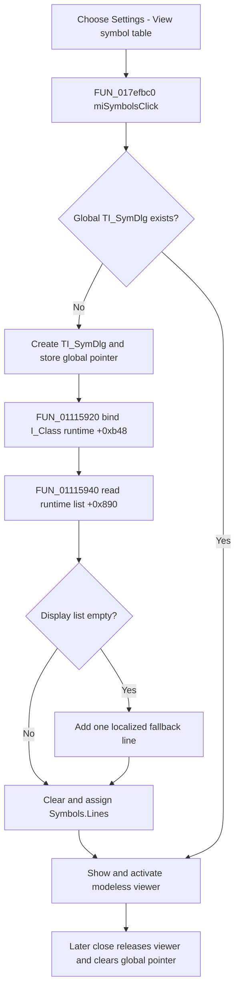

# View the Interpreter symbol table

> Analysis status: Complete source review.

## Control

| Property | Recovered value |
| --- | --- |
| Form | I_Class |
| Form caption | Interpreter-<%s> |
| Component path | I_Class.MainMenu.miSettings.miSymbol |
| Control class | TMenuItem |
| Caption | &View symbol table |
| Handler name | miSymbolsClick |
| Handler address | 017efbc0 |
| Graph node | `resource:dfm:I_Class/I_Class.MainMenu.miSettings.miSymbol` |
| Handler node | `function:017efbc0` |
| Graph layer | UI |

The menu item has no recovered hint, image, glyph, shortcut, checked state, or
modal result. Its target is the recovered `TI_SymDlg` form. That form contains
one client-aligned `TMemo` named `Symbols`, and the DFM marks the memo as
read-only.

## First click

`FUN_017efbc0` tests the global symbol-window pointer. If it is null, the
handler performs these operations in order:

1. It creates one `TI_SymDlg` form and stores the result in the global pointer.
2. It passes the current `I_Class` Interpreter runtime/session at form offset
   `+0xb48` to `FUN_01115920`.
3. The binder stores that runtime pointer at symbol-window offset `+0x6b8` and
   calls `FUN_01115940`.
4. The refresh function reads the runtime's symbol-display string list at
   runtime offset `+0x890`. If that list is empty, it loads one localized line
   and adds it to the list.
5. It clears `I_SymDlg.Symbols.Lines` and assigns the runtime string list to
   the memo's line collection.
6. The click handler shows the symbol window and invokes the shared VCL
   activation path.

The assignment copies the current display strings into the memo. The memo is
not an editor for the runtime symbol model. The click does not change the
Interpreter source editor, selection, caret, run state, or document-modified
state.

The empty-list fallback is the only data mutation in this first-open path. It
adds a localized display line to the runtime's symbol-string list; it does not
create a user symbol or write Interpreter source.

## Repeat click and refresh behavior

The viewer is a global singleton. When its pointer is already non-null,
`FUN_017efbc0` skips creation, runtime binding, and memo refresh. It only shows
and activates the existing form. Therefore:

- a repeat click does not rebuild or recopy the list;
- the window remains bound to the runtime selected on its first creation;
- if another application form created the shared viewer first, this command
  does not switch it to the current `I_Class` runtime.

The broader Interpreter symbol-list builder `FUN_01115c40` refreshes an open
viewer after it rebuilds the display list. This is how later symbol or numeric
format updates can reach the visible memo. That builder is not called by this
menu handler.

## Close, Cancel, and persistence

This command uses a modeless viewer. There is no OK, Cancel, Apply, modal
result, or staged list to commit. Closing `I_SymDlg` selects Delphi close
action value `2`, releases the form, and clears the global pointer. A later
click then creates a new viewer, binds it to the current Interpreter runtime,
and copies the list again.

Destroying the owning `I_Class` form also destroys and clears the shared
symbol-window pointer. The click itself does not save an IPR file and does not
write an INI, registry, project, or editor setting. Closing the viewer also
does not persist symbol data.

## Error and partial-state behavior

The recovered handler, binder, and refresh function have no local exception
handler or rollback.

- The path assumes that the `I_Class` runtime pointer and its symbol-display
  list are valid. A null or invalid object is not converted into a no-op.
- If form creation fails before the global assignment, the pointer remains
  null and the normal open does not complete.
- The handler stores the created form globally before it binds and populates
  it. If binding, list allocation, or memo assignment fails, the created form
  can remain stored without a completed refresh. A later click sees the
  non-null pointer and skips binding and refresh.
- A failure in the final VCL show or activation call also propagates. The
  handler does not report a separate success value.

## Click flow

## Source evidence

- Menu handler: [FUN_017efbc0](../../../DecompiledSources/Tina16/functions/00000000017EFBC0__FUN_017efbc0.c)
- Runtime binder: [FUN_01115920](../../../DecompiledSources/Tina16/functions/0000000001115920__FUN_01115920.c)
- Memo refresh: [FUN_01115940](../../../DecompiledSources/Tina16/functions/0000000001115940__FUN_01115940.c)
- Symbol-list builder and open-view refresh: [FUN_01115c40](../../../DecompiledSources/Tina16/functions/0000000001115C40__FUN_01115c40.c)
- Symbol-window close action: [FUN_01115910](../../../DecompiledSources/Tina16/functions/0000000001115910__FUN_01115910.c)
- Interpreter destruction: [FUN_017f0730](../../../DecompiledSources/Tina16/functions/00000000017F0730__FUN_017f0730.c)
- Other shared-viewer opener: [FUN_01498800](../../../DecompiledSources/Tina16/functions/0000000001498800__FUN_01498800.c)
- Generic VCL show and activation path: [FUN_008059a0](../../../DecompiledSources/Tina16/functions/00000000008059A0__FUN_008059a0.c)
- Recovered form and menu evidence: [ui-evidence.json](../../../DecompiledSources/Tina16/resources/dfm/ui-evidence.json)

The graph classifies `FUN_017efbc0` as a complex function in the `UI` layer
with three distinct direct calls. The DFM identifies `I_SymDlg.Symbols` as a
read-only memo and binds the symbol form's create, show, and close events.

## Analysis ownership

- This analysis owns `FUN_017efbc0`, `FUN_01115920`, and `FUN_01115940`.
- The broad runtime symbol-list builder `FUN_01115c40` and the symbol-window
  close handler `FUN_01115910` are evidence-only here.
- The sibling Interpreter close analysis owns `FUN_017f0730`.
- Generic form creation, VCL show, activation, list, string, and object-lifetime
  helpers remain evidence-only.

## Analysis limits

- The localized line inserted for an empty display list is not recovered as a
  direct text literal, so this article does not assign it a caption or meaning.
- The source identifies the runtime, viewer, memo, and display-list fields by
  their use and offsets. Their original Delphi field names are not recovered.
- A separate Design Tool menu opens the same global viewer. Its extra runtime
  rebuild operations are not attributed to this `I_Class` click.
