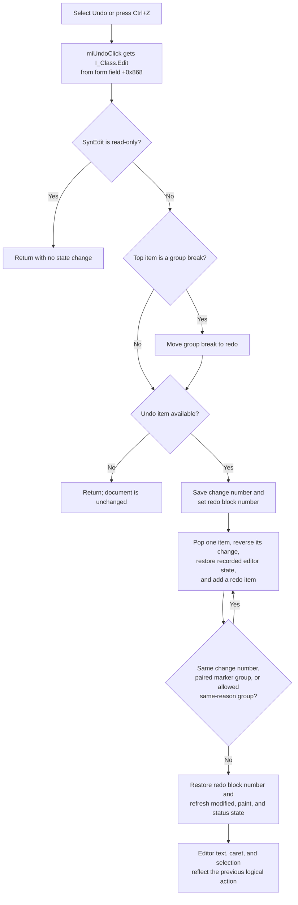

# Undo an Interpreter editor change

> Analysis status: Complete for the target editor, SynEdit command identity, undo grouping, read-only and empty-stack behavior, caret and selection restoration, modified state, errors, and persistence.

## Control

| Property | Recovered value |
| --- | --- |
| Form | I_Class |
| Form caption | Interpreter-<%s> |
| Component path | I_Class.MainMenu.mEdit.miUndo |
| Control class | TMenuItem |
| Caption | &Undo |
| Shortcut | Ctrl+Z (`16474`) |
| Handler name | miUndoClick |
| Handler address | 017ef910 |
| Graph node | `resource:dfm:I_Class/I_Class.MainMenu.mEdit.miUndo` |
| Handler node | `function:017ef910` |
| Graph layer | UI |

The menu item has no hint, action, image reference, glyph, checked state, or initial disabled state. Its caption and shortcut agree with the handler, but the handler and shared editor implementation provide the behavioral evidence.

## What happens when selected

`FUN_017ef910` reads the form field at `+0x868` and passes it to `FUN_00c00ff0`. The DFM identifies the field as `I_Class.Edit`, the form's only `TSynEdit` control. The neighboring Cut, Copy, Paste, Delete, and Select All wrappers use the same field, and the IPR load and save paths use its `Lines` object. This proves that Undo targets the Interpreter source editor, not another text control or the diagram model.

`FUN_00c00ff0` is the recovered `TCustomSynEdit.Undo` implementation. Two independent details establish this identity:

- The SynEdit command dispatcher sends command `0x259` (decimal `601`) to this routine. Public SynEdit command definitions name `601` as `ecUndo`.
- Its control flow matches the public `TCustomSynEdit.Undo` routine: read-only guard, group-break transfer, undo-item loop, paired group markers, `eoGroupUndo` handling, redo block-number preservation, and modified-state refresh.

The menu wrapper does not use `Sender`, change focus, save a file, or update another I_Class field.

## Undo-stack grouping

The shared routine reverses one logical edit, which can contain several stored items:

1. It first checks the editor's virtual `ReadOnly` property. If true, it returns before touching either stack.
2. If the top undo item is a group-break marker, it removes that marker and adds an equivalent break to the redo stack while preserving its change number.
3. It peeks at the next undo item. If there is none, it returns without changing the document.
4. It saves that item's change number and temporarily applies it as the redo list's block number.
5. `FUN_00c01280` pops one undo item, applies its inverse to the editor, and adds the reciprocal item to the redo stack.
6. The loop continues for items with the same change number.
7. Four paired begin/end marker families also keep their complete multi-item operation together. The recovered source proves their numeric pairs but does not name every family.
8. When the `eoGroupUndo` option is set, adjacent items with the same change reason can also remain in the same command. Indent and unindent reasons are explicitly excluded from that extension.
9. After the group is complete, the routine restores the previous redo block number.

Thus, one click can undo one character, a selection change, a multiline edit, or a larger grouped action. It does not mean “remove one character.” A repeated click processes the next logical group and adds another group to the redo stack.

## Text, caret, selection, and display state

Each undo item contains a change reason, selection mode, start and end coordinates, change number, and optional text. The item-specific routine uses these values to reverse the change:

- Caret records restore the saved caret coordinate.
- Selection records restore the saved selection range while retaining the current caret where the recorded command requires it.
- Insert records remove the inserted range and move the caret to its recorded start.
- Delete records reinsert their saved text and restore the affected caret or selection range.
- Line-break, indent, unindent, and other recorded reasons have their own inverse branches.

The routine creates matching redo records from the state that it replaces. It restores the recorded normal, line, or column selection mode. SynEdit temporarily permits positions past the end of a line while it restores stored coordinates, restores that editor option afterward, refreshes paint and status state, and makes the cursor visible in the branches that require it. The exact final caret and selection therefore depend on the type of edit that is undone.

## Read-only, empty, and repeated behavior

- A read-only editor is a strict no-op. Text, caret, selection, undo stack, redo stack, and modified state remain unchanged.
- An empty undo stack is also a no-op. The menu handler shows no message and reports no result.
- If only a group-break marker is on top, SynEdit transfers that marker to redo and then stops. This changes stack bookkeeping but not editor content or caret state.
- Repeated use walks backward through logical undo groups until no item remains. The routine has no wraparound and does not repeat the oldest change.
- Undo does not read or alter the Windows clipboard. It does not invoke the I_Class Cut, Copy, Paste, Delete, or Select All handlers.

## Modified state and persistence

The SynEdit undo and redo lists track an initial-state change number. As reciprocal redo items are added, the editor recalculates `Modified` from whether the undo list is back at that initial state. Undo can therefore clear the modified flag when it returns exactly to the loaded or saved baseline. Undoing to other content keeps or sets the flag.

I_Class uses that same `Modified` byte at editor offset `+0x5e0` when it asks whether an unsaved Interpreter file can be replaced or closed. New, Open, Save, and Save As mark the editor clean through the shared SynEdit modified-state setter after their normal content or file operation.

This menu action changes only in-memory editor and undo/redo state. It does not write the `.IPR` file. A later Save path writes the current editor lines and establishes the new clean baseline. If the post-undo state remains modified, the normal I_Class close query can prompt before the form discards it.

## Selection flow

## Error and partial-change behavior

- The I_Class wrapper has no null check, exception handler, retry, confirmation, or user-facing status message. Normal DFM construction supplies the `TSynEdit` field.
- The shared SynEdit routine restores its temporary redo block number and editor options through its framework cleanup paths. The menu wrapper does not add an application-level rollback transaction around the group.
- If a lower editor operation raises after one or more items have been reversed, the wrapper has no code that reapplies those items. The recovered source does not prove a whole-group rollback or a dedicated I_Class error dialog.
- Undo has no external file, registry, DLL, device, or network side effect. Its failure boundary is the in-memory editor framework.

## Source evidence

- [I_Class Undo wrapper `FUN_017ef910`](../../../DecompiledSources/Tina16/functions/00000000017EF910__FUN_017ef910.c) passes form field `+0x868` to the shared undo routine.
- [Shared SynEdit undo `FUN_00c00ff0`](../../../DecompiledSources/Tina16/functions/0000000000C00FF0__FUN_00c00ff0.c) implements the read-only guard, group-break handling, grouped-item loop, paired markers, and redo block-number management.
- [SynEdit undo-item executor `FUN_00c01280`](../../../DecompiledSources/Tina16/functions/0000000000C01280__FUN_00c01280.c) reverses recorded text, caret, selection, line, and indentation changes and creates redo entries.
- [SynEdit command dispatcher `FUN_00c03d20`](../../../DecompiledSources/Tina16/functions/0000000000C03D20__FUN_00c03d20.c) routes command `0x259` to the same undo routine.
- [Modified-state recalculator `FUN_00c0ea50`](../../../DecompiledSources/Tina16/functions/0000000000C0EA50__FUN_00c0ea50.c) compares the undo list with its initial state, and [modified-state setter `FUN_00c0dad0`](../../../DecompiledSources/Tina16/functions/0000000000C0DAD0__FUN_00c0dad0.c) records the clean baseline.
- [I_Class Cut `FUN_017ef980`](../../../DecompiledSources/Tina16/functions/00000000017EF980__FUN_017ef980.c), [Copy `FUN_017ef9a0`](../../../DecompiledSources/Tina16/functions/00000000017EF9A0__FUN_017ef9a0.c), [Delete `FUN_017efa10`](../../../DecompiledSources/Tina16/functions/00000000017EFA10__FUN_017efa10.c), and [Select All `FUN_017efa30`](../../../DecompiledSources/Tina16/functions/00000000017EFA30__FUN_017efa30.c) wrappers independently identify field `+0x868` as the common editor.
- [I_Class Save coordinator `FUN_017ef6c0`](../../../DecompiledSources/Tina16/functions/00000000017EF6C0__FUN_017ef6c0.c), [IPR writer `FUN_017ef620`](../../../DecompiledSources/Tina16/functions/00000000017EF620__FUN_017ef620.c), and [close guard `FUN_017f1540`](../../../DecompiledSources/Tina16/functions/00000000017F1540__FUN_017f1540.c) establish the file and unsaved-change boundaries.
- The matching public [SynEdit-2 `TCustomSynEdit.Undo` source](https://github.com/pyscripter/SynEdit-2/blob/master/Source/SynEdit.pas#L6092-L6176) supplies the recovered framework name, and its [command constants](https://github.com/pyscripter/SynEdit-2/blob/master/Source/SynEditKeyCmds.pas#L174-L175) identify command `601` as `ecUndo`.
- [Recovered Delphi resource evidence](../../../DecompiledSources/Tina16/resources/dfm/ui-evidence.json) identifies the I_Class form, `TSynEdit`, menu item, Ctrl+Z shortcut, and OnClick binding.

## Annotation ownership and limits

- `.639` owns unique I_Class wrapper `FUN_017ef910` and canonical shared SynEdit Undo routine `FUN_00c00ff0`.
- Undo-item execution, undo-list storage, modified-state helpers, paint/status helpers, I_Class file operations, and other forms' Undo wrappers remain evidence-only here.
- The public SynEdit-2 source matches the recovered structure and constants, but TINA's exact vendor revision is unavailable. The article relies on the recovered machine code when the public source differs or names an item family that the decompiler cannot recover.
