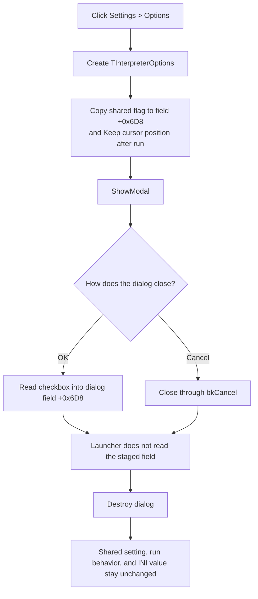

# Options

> Analysis status: Evidence-backed source review complete.

## Control

| Property | Recovered value |
| --- | --- |
| Form | I_Class |
| Component path | I_Class.MainMenu.miSettings.mnOptions |
| Control class | TMenuItem |
| Caption | Options |
| Hint | Not present in the recovered resource. |
| Text | Not present in the recovered resource. |
| Handler name | mnOptionsClick |
| Handler address | 017ef930 |
| Graph node | `resource:dfm:I_Class/I_Class.MainMenu.miSettings.mnOptions` |
| Handler node | `function:017ef930` |
| Graph layer | UI |

## What happens when clicked

The command opens the Interpreter Options dialog. The dialog contains one option, **Keep cursor position after run**. However, this I_Class command does not copy the accepted value back to the shared application setting.

[`FUN_017ef930`](../../../DecompiledSources/Tina16/functions/00000000017EF930__FUN_017ef930.c) creates `TInterpreterOptions`. It calls [`FUN_017ec230`](../../../DecompiledSources/Tina16/functions/00000000017EC230__FUN_017ec230.c) with the shared keep-cursor flag. The initializer copies that Boolean to dialog field `+0x6D8` and sets `cbKeepCursorPosition.Checked` to the same value. The launcher then calls `ShowModal`.

The dialog's **OK** handler [`FUN_017ec290`](../../../DecompiledSources/Tina16/functions/00000000017EC290__FUN_017ec290.c) reads the checkbox back into dialog field `+0x6D8`. This is only dialog-local staging. After `ShowModal` returns, `FUN_017ef930` does not inspect the modal result, does not read field `+0x6D8`, and does not write the shared flag. It only destroys the dialog. Therefore, selecting **OK** loses the edited value. The **Cancel** button has VCL kind `bkCancel` and no custom handler, so it also closes without changing the shared flag.

This missing copy-back is specific to this launcher. The separate [Design Tool Options launcher](../../../DecompiledSources/Tina16/functions/0000000001499560__FUN_01499560.c) calls an extraction helper after its modal dialog and writes the returned keep-cursor value to the same shared flag. No equivalent call exists in `FUN_017ef930`.

## Click flow

## Effect of the underlying setting

The control caption and runtime consumers establish the setting's meaning. During an Interpreter run, [`FUN_017f17c0`](../../../DecompiledSources/Tina16/functions/00000000017F17C0__FUN_017f17c0.c) records the current editor line. After the run, a clear shared flag selects [`FUN_017efd70`](../../../DecompiledSources/Tina16/functions/00000000017EFD70__FUN_017efd70.c), which moves the caret to the last editor line. A set flag selects [`FUN_017f2b70`](../../../DecompiledSources/Tina16/functions/00000000017F2B70__FUN_017f2b70.c), which restores the saved line and adjusts the top line to center it. The cleanup path in [`FUN_017f1fa0`](../../../DecompiledSources/Tina16/functions/00000000017F1FA0__FUN_017f1fa0.c) applies the same choice.

The Options command does not trigger a run or refresh the editor. Because it does not change the shared flag, it cannot change either cursor path.

## Persistence and repeated use

[`FUN_017e1500`](../../../DecompiledSources/Tina16/functions/00000000017E1500__FUN_017e1500.c) loads the shared flag from `TINA.INI`, section `designtool`, key `Keep cursor pos after run`, with a false default. The later settings writer [`FUN_01c85f70`](../../../DecompiledSources/Tina16/functions/0000000001C85F70__FUN_01c85f70.c) writes that same shared flag. The menu handler calls neither function and does not update the value that the writer will save.

Each new dialog instance is seeded from the unchanged shared flag. Therefore, reopening the command discards a selection that the user previously accepted in this dialog.

## Boundaries and errors

- There is no value validation. The dialog stages one Boolean checkbox.
- **OK** and **Cancel** both leave the application and persisted setting unchanged through this command.
- The handler has no message, recovery, or rollback branch. A constructor or modal-dialog exception propagates; normal completion destroys the dialog.
- The recovered path does not call an editor, Interpreter execution, cursor, or INI function.
- The menu resource has no hint, action, image reference, or extracted glyph. Its caption identifies only the entry point; the source proves the behavior.

## Handler evidence

- Source: [DecompiledSources/Tina16/functions/00000000017EF930__FUN_017ef930.c](../../../DecompiledSources/Tina16/functions/00000000017EF930__FUN_017ef930.c)
- Recovered role: Open Interpreter Options without copying the staged result to live settings.
- Current graph summary: Handles `I_Class.MainMenu.miSettings.mnOptions.OnClick`.
- Complexity: complex
- Distinct outgoing calls: 3

## Direct calls

- `function:007fc180` constructs the Delphi form instance.
- `function:017ec230` initializes the dialog-local Boolean and checkbox from the shared flag.
- `function:00410f20` destroys the dialog after normal modal completion.

## Resource evidence

- The menu caption is `Options`.
- The created form caption is `Options`.
- `InterpreterOptions.cbKeepCursorPosition` is a `TCheckBox` with caption `Keep cursor position after run`.
- `InterpreterOptions.bOK` is a `TBitBtn` with kind `bkOK` and handler `FUN_017ec290`.
- `InterpreterOptions.bCancel` is a `TBitBtn` with kind `bkCancel` and no custom event handler.
- No extracted glyph is available for this menu item or these buttons.

## Analysis limits

- The recovered names of the shared flag and dialog field are unknown. This article identifies them by their references and by dialog offset `+0x6D8`.
- The source proves that the I_Class launcher omits copy-back. It does not establish whether this was intentional or a defect.
- Runtime cursor consumers and INI functions are supporting evidence for the shared flag. They are not called by this menu handler.
