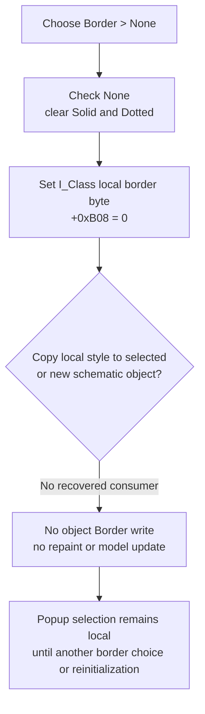

# Select no border in the Interpreter style menu

> Analysis status: Source reviewed. The menu checks and form-local border value are proven. No recovered path applies this local value to the selected or newly placed schematic object.

## Control

| Property | Recovered value |
| --- | --- |
| Form | I_Class |
| Component path | I_Class.pmBackground.Border1.NoneMnu |
| Control class | TMenuItem |
| Parent menu | Border |
| Caption | None |
| Related commands | Solid and Dotted |
| Handler name | NoneMnuClick |
| Handler address | `017f2d20` |
| Graph node | `resource:dfm:I_Class/I_Class.pmBackground.Border1.NoneMnu` |
| Handler node | `function:017f2d20` |
| Graph layer | UI |

## What happens when clicked

[`FUN_017f2d20`](../../../DecompiledSources/Tina16/functions/00000000017F2D20__FUN_017f2d20.c) performs four direct state changes:

1. It checks **None**.
2. It clears the **Solid** check.
3. It clears the **Dotted** check.
4. It writes border-style value `0` to the `I_Class` field at `+0xB08`.

The handler calls the menu-item checked setter separately for all three items. It does not depend on a recovered DFM radio-item or group property to make the selection one-hot. A repeated click writes `0` to `+0xB08` again. The checked setter skips its native menu update when each requested state already matches.

The related handlers establish the value mapping. `FUN_017f2d60` selects **Solid** and writes `1`; `FUN_017f2da0` selects **Dotted** and writes `2`. The shared initializer [`FUN_017f2de0`](../../../DecompiledSources/Tina16/functions/00000000017F2DE0__FUN_017f2de0.c) uses the same `0`, `1`, and `2` mapping when it restores all three checks.

## Local state and selected-object boundary

The style popup is part of the `I_Class` Interpreter editor. Its **Set Background** speed button opens this popup; the popup is not an OK/Cancel editor and has no Apply command.

When an existing schematic Interpreter text object is opened, [`FUN_0149e460`](../../../DecompiledSources/Tina16/functions/000000000149E460__FUN_0149e460.c) stores the edit owner at `I_Class +0xB58`. It reads the object's background mode at `+0x99`, color at `+0x9C`, and border at `+0xA0`, then passes those values to the shared style initializer. The initializer copies the border into the form-local `+0xB08` byte and synchronizes the checks. Thus, **None** can start as a view of the selected object's current border state.

The click path does not perform the reverse operation:

- `FUN_017f2d20` does not read the selected-object field at `+0xB58`.
- It does not write the object's named `Border` field at `+0xA0`.
- The Close and Update path copies editor text, Interpreter configuration, and font, but not `+0xB08`.
- The Place-to-Schematic path does not read `+0xB08` before it creates a new object.
- The recovered source has no other reader that copies the I_Class `+0xB08` value to a model object.

Therefore, the proven result is a form-local border selection and updated menu checks. A visual border removal from the current or next schematic object is not proven.

## Background and color interaction

The Border and Background menu groups use separate fields.

- **Transparent** and **Opaque...** use background-mode byte `+0xB00`.
- **Opaque...** can also replace local color `+0xB04` through a color dialog.
- **None**, **Solid**, and **Dotted** use border byte `+0xB08`.

The None handler does not read or change `+0xB00` or `+0xB04`, and it does not change the Transparent or Opaque checks. No-border local state can therefore coexist with either local background mode and any retained background color.

## Click flow

## Undo, modified state, errors, and persistence

- The handler does not change SynEdit text, caret, selection, undo history, or `Edit.Modified`.
- It does not create a schematic undo record, mark the schematic as changed, request repaint, or invalidate an object rectangle.
- It does not save an `.ipr` file, circuit file, INI setting, or other preference. The system-text serializer can persist a model object's `Border` field, but this handler does not update that field or call the serializer.
- There is no selected-object guard because the handler changes only form-owned state and menu items.
- There is no validation, user message, allocation, modal result, local exception handler, transaction, or rollback in the click path.
- If the form is reinitialized for another selected object, the shared initializer replaces `+0xB08` and the checks with that object's stored border value. Form creation initializes the local value to `0`, which selects None.

## Evidence

- [None handler `FUN_017f2d20`](../../../DecompiledSources/Tina16/functions/00000000017F2D20__FUN_017f2d20.c) sets the three checks and writes local value `0`.
- [Solid handler `FUN_017f2d60`](../../../DecompiledSources/Tina16/functions/00000000017F2D60__FUN_017f2d60.c) writes value `1`; [Dotted handler `FUN_017f2da0`](../../../DecompiledSources/Tina16/functions/00000000017F2DA0__FUN_017f2da0.c) writes value `2`.
- [Shared style initializer `FUN_017f2de0`](../../../DecompiledSources/Tina16/functions/00000000017F2DE0__FUN_017f2de0.c) stores background mode, color, and border in the I_Class fields and maps border values `0`, `1`, and `2` to the three checks. Bead `.652` owns its function annotation.
- [Selected-object activation `FUN_0149e460`](../../../DecompiledSources/Tina16/functions/000000000149E460__FUN_0149e460.c) supplies model fields `+0x99`, `+0x9C`, and `+0xA0` to the initializer.
- [Named-field reader `FUN_01a601e0`](../../../DecompiledSources/Tina16/functions/0000000001A601E0__FUN_01a601e0.c) identifies model offset `+0xA0` as `Border`.
- [Renderer preparation `FUN_01294700`](../../../DecompiledSources/Tina16/functions/0000000001294700__FUN_01294700.c) passes the model object's `+0xA0` value to its `border` output attribute. It does not read the I_Class local field.
- [System-text writer `FUN_01a61fe0`](../../../DecompiledSources/Tina16/functions/0000000001A61FE0__FUN_01a61fe0.c) serializes the model object's `+0xA0` value. It is not called by this click.
- [Close and Update `FUN_017f28b0`](../../../DecompiledSources/Tina16/functions/00000000017F28B0__FUN_017f28b0.c) and its copy helper update text, configuration, and font, but not border style.
- [Place path `FUN_017f2a50`](../../../DecompiledSources/Tina16/functions/00000000017F2A50__FUN_017f2a50.c) creates and places a new system-text object without reading `+0xB08`.
- [Menu checked setter `FUN_007e2d20`](../../../DecompiledSources/Tina16/functions/00000000007E2D20__FUN_007e2d20.c) avoids a native update when the checked byte already has the requested value.
- [Recovered UI evidence](../../../DecompiledSources/Tina16/resources/dfm/ui-evidence.json) binds **None**, **Solid**, and **Dotted** to their three handlers under the **Border** parent menu.

## Resource evidence and limits

- The None item has no hint, glyph, image, action, shortcut, or recovered initial checked state.
- The DFM does not expose a radio-item or group-index property for the three border items. Their handlers and initializer explicitly maintain the one-hot checks.
- The paired captions and the model's named `Border` field establish the style meaning. The missing local-to-model consumer prevents a claim that this click changes a rendered object.
- The source proves that no recovered direct path consumes `I_Class +0xB08`. It cannot establish whether the original Delphi source intended an additional write-back path that is absent from this binary.
