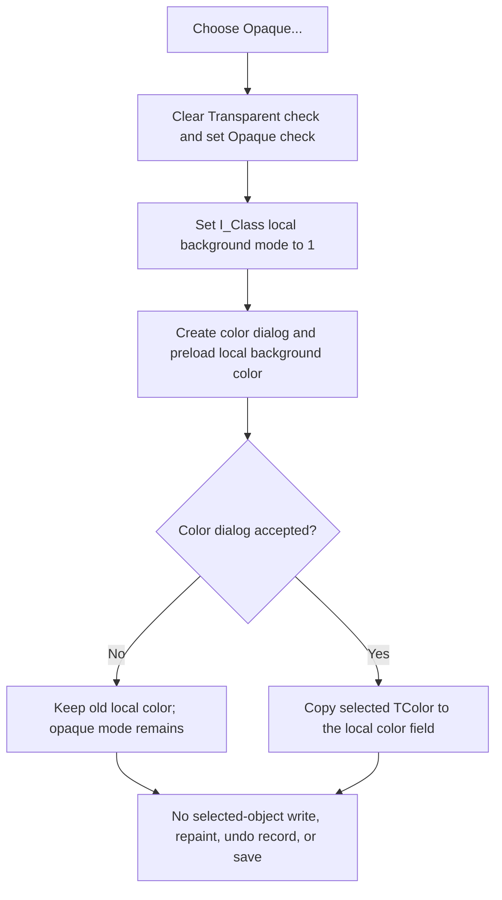

# Select an opaque background in the Interpreter editor

> Analysis status: Complete. This command selects the local opaque-background state and opens a color dialog. It does not directly change the selected schematic object.

## Control

| Property | Recovered value |
| --- | --- |
| Form | I_Class |
| Component path | I_Class.pmBackground.Background1.OpaqueMnu |
| Control class | TMenuItem |
| Parent menu | Background |
| Caption | Opaque... |
| Paired command | Transparent |
| Handler name | OpaqueMnuClick |
| Handler address | 017f2c90 |
| Graph node | `resource:dfm:I_Class/I_Class.pmBackground.Background1.OpaqueMnu` |
| Handler node | `function:017f2c90` |
| Graph layer | UI |

## What happens when clicked

`FUN_017f2c90` performs these operations in order:

1. It clears the **Transparent** menu check at I_Class offset `+0x840`.
2. It sets the **Opaque...** menu check at `+0x848`.
3. It writes background mode `1` to the I_Class field at `+0xB00`.
4. It creates a VCL color dialog and initializes its `Color` value from the
   current 32-bit field at `+0xB04`.
5. It executes the dialog. If the user accepts it, the handler copies the
   selected `TColor` back to `+0xB04`.
6. It destroys the temporary dialog.

The mode change occurs before the dialog result is known. Color-dialog Cancel
therefore keeps the old color, but it does not restore Transparent mode. A
second click opens the color dialog again. The menu checked-state helper can
skip a redundant low-level menu update, but the handler does not skip dialog
execution when Opaque mode is already selected.

## Target and state ownership

The command belongs to the I_Class Interpreter source editor. Its
**Set Background** speed button opens `pmBackground`; this menu is not the
schematic canvas background menu.

The recovered system-text activation path `FUN_0149e460` establishes the
object context. For the supported selected item type, it stores the selected
item at I_Class offset `+0xB58` and calls `FUN_017f2de0` with the item's fields
at `+0x99`, `+0x9C`, and `+0xA0`. The shared initializer stores these as the
I_Class background mode, background color, and border style, then synchronizes
the five Transparent, Opaque, None, Solid, and Dotted menu checks.

`OpaqueMnuClick` does not read `+0xB58`, does not write the selected item's
fields, and does not call a model updater. It changes only the I_Class fields
at `+0xB00` and, after color-dialog acceptance, `+0xB04`. The recovered source
contains no later reader that copies these I_Class fields back to the selected
system-text item. A model commit from this command is therefore not proven.

## Transparent, rendering, and persistence

The sibling `FUN_017f2c50` applies the opposite local state: it checks
**Transparent**, clears **Opaque...**, and writes mode `0` to `+0xB00`. It does
not open a color dialog.

The selected system-text model has equivalent named fields. The recovered
named-field reader identifies item offsets `+0x99` and `+0x9C` as `BgrndMode`
and `BgrndColor`. The system-text renderer treats mode `0` as transparent and
uses the stored background color for the other mode. The binary writer also
serializes the model item's mode, color, and border fields.

These consumers establish the meaning of the values that
`FUN_0149e460` supplies to I_Class. They do not establish a write-back path
from this handler. `OpaqueMnuClick` does not call the renderer, serializer,
file save path, repaint path, or invalidation path. It also does not modify the
SynEdit text.

## Undo, modified state, and errors

- The handler does not create a SynEdit undo item and does not change the
  source editor's text, caret, or selection.
- It does not set the I_Class source-modified flags at `+0xB60` or `+0xB61`.
- It does not create a diagram-model undo record or mark a schematic model as
  modified.
- Color-dialog Cancel keeps opaque mode and the previous local color.
- There is no no-selection guard in this handler. It can update the local
  fields without accessing a selected object.
- The handler has no local validation, error message, exception handler, or
  rollback. If dialog construction or execution raises an exception, opaque
  mode was already selected. The recovered path does not prove restoration.
- No file or preference write occurs in this click path.

## Click flow

## Evidence

- [Opaque handler `FUN_017f2c90`](../../../DecompiledSources/Tina16/functions/00000000017F2C90__FUN_017f2c90.c) updates the two checks and local mode before it creates and executes the color dialog; it copies the color only on acceptance.
- [Transparent handler `FUN_017f2c50`](../../../DecompiledSources/Tina16/functions/00000000017F2C50__FUN_017f2c50.c) applies the opposite checks and mode without a dialog.
- [Shared style initializer `FUN_017f2de0`](../../../DecompiledSources/Tina16/functions/00000000017F2DE0__FUN_017f2de0.c) stores the supplied mode, color, and border style and maps their values to all five menu checks.
- [Selected system-text activation `FUN_0149e460`](../../../DecompiledSources/Tina16/functions/000000000149E460__FUN_0149e460.c) supplies item fields `+0x99`, `+0x9C`, and `+0xA0` to the initializer and stores the selected item at I_Class offset `+0xB58`.
- [Set Background handler `FUN_017f2be0`](../../../DecompiledSources/Tina16/functions/00000000017F2BE0__FUN_017f2be0.c) opens the background popup menu at the toolbar button; it does not apply a style.
- [Menu checked setter `FUN_007e2d20`](../../../DecompiledSources/Tina16/functions/00000000007E2D20__FUN_007e2d20.c) avoids a native menu update when the requested checked state already matches.
- [Color-dialog constructor `FUN_00724d70`](../../../DecompiledSources/Tina16/functions/0000000000724D70__FUN_00724d70.c) creates the recovered VCL dialog type used by the handler.
- [System-text named-field reader `FUN_01a601e0`](../../../DecompiledSources/Tina16/functions/0000000001A601E0__FUN_01a601e0.c) maps `BgrndMode`, `BgrndColor`, and `Border` to item offsets `+0x99`, `+0x9C`, and `+0xA0`.
- [System-text renderer preparation `FUN_01294700`](../../../DecompiledSources/Tina16/functions/0000000001294700__FUN_01294700.c) maps background mode `0` to the transparent sentinel and otherwise supplies the stored background color.
- [System-text binary writer `FUN_01a61fe0`](../../../DecompiledSources/Tina16/functions/0000000001A61FE0__FUN_01a61fe0.c) serializes those model-item fields. It is not called by this handler.

## Direct calls

- `function:007e2d20` sets the two menu-item checked states.
- `function:00724d70` constructs the recovered VCL color dialog.
- `function:00410f20` destroys the temporary dialog through the nil-safe
  Delphi object-destruction helper.
- The dialog `Execute` call uses virtual dispatch at slot `+0xA8` and is not a
  direct graph call edge.

## Resource evidence and limits

- The `TMenuItem` caption is **Opaque...** under **Background**. The ellipsis
  agrees with the recovered color-dialog path.
- The sibling caption is **Transparent**.
- Neither item has a recovered hint, glyph, image, action, initial checked
  value, radio-item flag, or group index. The handlers set the visible checks
  explicitly.
- The original Delphi enum type name is not recovered. The paired handlers,
  initializer, named fields, and renderer establish mode `0` as transparent
  and mode `1` as opaque.
- No recovered reader consumes I_Class offsets `+0xB00` or `+0xB04` after this
  command. This article does not infer an unobserved commit or persistence
  path.
