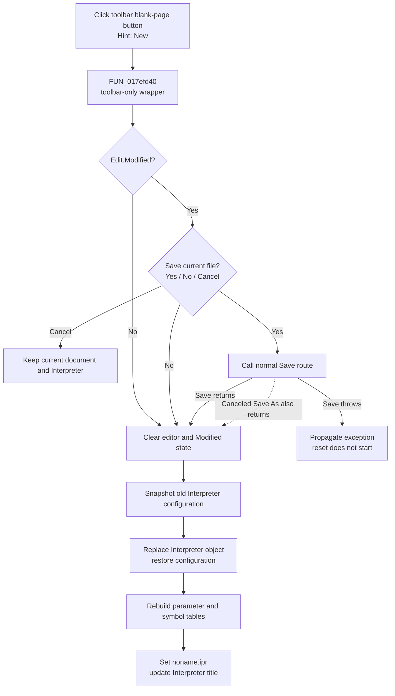

# New

> Analysis status: Source reviewed. The toolbar wrapper, shared New coordinator, unsaved-change decision, reset state, canceled Save As edge, and failure boundaries are supported by recovered code.

## Control

| Property | Recovered value |
| --- | --- |
| Form | I_Class |
| Component path | I_Class.pnToolPanel.sbFileNew |
| Control class | TSpeedButton |
| Caption | Not present in the recovered resource. |
| Hint | New |
| Text | Not present in the recovered resource. |
| Embedded image | Two-frame blank-page glyph. |
| Handler name | sbFileNewClick |
| Handler address | 017efd40 |
| Graph node | `resource:dfm:I_Class/I_Class.pnToolPanel.sbFileNew` |
| Handler node | `function:017efd40` |
| Graph layer | UI |

## What happens when clicked

`FUN_017efd40` is a one-call toolbar wrapper. It ignores `Sender` and calls the shared Interpreter New coordinator `FUN_017eef40`. The **File > New** menu item uses the separate wrapper `FUN_017ef8c0`, but it calls the same coordinator. Neither wrapper nor the coordinator branches on the event source, so the toolbar and menu commands have the same document effect.

The `TSpeedButton` has no caption or shortcut. Its hint is **New**, and its two-frame embedded glyph shows blank-page imagery. This resource evidence identifies the toolbar intent; the call to the shared New coordinator proves its behavior.

## Unsaved-change decision

The shared coordinator first calls the modified-document guard:

- If `I_Class.Edit.Modified` is false, the reset starts without a prompt.
- If it is true, the guard shows a localized Yes, No, or Cancel prompt for the current file.
- **Cancel** returns false. The toolbar action then leaves the editor, current path, title, and Interpreter object unchanged.
- **No** accepts the reset without saving.
- **Yes** calls the normal Save route. A named document is written to its current path; the sentinel path `noname.ipr` opens Save As.

The guard calls a `void` Save command and does not test whether Save As accepted a path. If the user selects **Yes** and then cancels Save As for an unnamed document, Save returns normally, the guard reports approval, and New discards the editor content. A save exception is different: it propagates before the guard returns, so the reset does not start.

## Accepted reset and retained state

After approval, `FUN_017eef40` performs these operations in order:

1. Clears `I_Class.Edit.Lines` and its Modified flag.
2. Clears the current status string and refreshes the line, column, error, and Interpreter-mode displays.
3. Copies the old Interpreter object's configuration block at offsets `+0x628` through `+0x88f` to form-owned fields.
4. Destroys the old Interpreter object, constructs a new object, and binds it to the existing editor and status control.
5. Copies the saved numerical-format, math, and drawing configuration into the new object.
6. Clears and rebuilds the Interpreter parameter and symbol tables.
7. Sets the current path to `noname.ipr` and rebuilds the window caption with the resource template `Interpreter-<%s>`.

The source lines, old path, runtime tables, and generated symbol text are removed. The copied Interpreter configuration remains active. The command does not compile or run the empty editor.

## Errors and persistence

- A prompt Cancel is a complete no-op because it occurs before the first mutation.
- A canceled Save As after **Yes** is not a no-op; the reset continues because Save has no result.
- The coordinator has no local exception handler or rollback. After the editor is cleared, a later object-construction, table-rebuild, string, or UI exception can leave earlier changes applied.
- A save exception occurs before reset mutations and propagates to the caller.
- New does not create or write `noname.ipr`, update a recent-file list, persist the retained Interpreter settings, or close the form. A file changes only when the user accepts the pre-reset Save path.
- The new editor, Interpreter object, path, title, and retained configuration are form-lifetime state. The form's destroy handler later owns cleanup of the replacement Interpreter object.

## Click flow

## Handler evidence

- Source: [DecompiledSources/Tina16/functions/00000000017EFD40__FUN_017efd40.c](../../../DecompiledSources/Tina16/functions/00000000017EFD40__FUN_017efd40.c)
- Shared New coordinator: [DecompiledSources/Tina16/functions/00000000017EEF40__FUN_017eef40.c](../../../DecompiledSources/Tina16/functions/00000000017EEF40__FUN_017eef40.c)
- Menu New wrapper: [DecompiledSources/Tina16/functions/00000000017EF8C0__FUN_017ef8c0.c](../../../DecompiledSources/Tina16/functions/00000000017EF8C0__FUN_017ef8c0.c)
- Modified-document guard: [DecompiledSources/Tina16/functions/00000000017F1540__FUN_017f1540.c](../../../DecompiledSources/Tina16/functions/00000000017F1540__FUN_017f1540.c)
- Save router and Save As return path: [DecompiledSources/Tina16/functions/00000000017EF6C0__FUN_017ef6c0.c](../../../DecompiledSources/Tina16/functions/00000000017EF6C0__FUN_017ef6c0.c), [DecompiledSources/Tina16/functions/00000000017EF730__FUN_017ef730.c](../../../DecompiledSources/Tina16/functions/00000000017EF730__FUN_017ef730.c)
- Form cleanup owner: [DecompiledSources/Tina16/functions/00000000017F0730__FUN_017f0730.c](../../../DecompiledSources/Tina16/functions/00000000017F0730__FUN_017f0730.c)
- Recovered role: Dispatch the Interpreter toolbar New command to the shared new-document coordinator.
- Current graph summary: Handles 1 Delphi UI event: I_Class.pnToolPanel.sbFileNew.OnClick.
- Current graph behavior: Ignores the event source and invokes the same guarded New coordinator as the File menu command.
- Current graph evidence: The DFM binds `sbFileNew.OnClick` to `017efd40`; the recovered wrapper contains only a call to `017eef40`, which owns the guard and reset.
- Complexity: simple
- Distinct outgoing calls: 1

## Direct calls

- `function:017eef40` — FUN_017eef40

## Resource evidence

- Kind: Not present in the recovered resource.
- Modal result: Not present in the recovered resource.
- Checked state: Not present in the recovered resource.
- List items: Not present in the recovered resource.
- Image reference: Not present in the recovered resource.
- Extracted glyph: [`0229_I_Class_I_Class_pnToolPanel_sbFileNew_Glyph_Data.png`](../../../glyph/0229_I_Class_I_Class_pnToolPanel_sbFileNew_Glyph_Data.png)

## Nearby label candidates

Nearby labels are layout candidates only. They are not proof of behavior.

- No same-parent label candidate is available.

## Analysis limits

- `FUN_017eef40` and the menu wrapper `FUN_017ef8c0` are canonically documented by `TIARA-diz.6.7.642`; this article cites but does not redefine them.
- `FUN_017f1540`, the modified-document guard, is canonically documented by `TIARA-diz.6.7.641` and is not duplicated here.
- The blank-page glyph and **New** hint support the toolbar meaning, but the shared call path is the behavior evidence.
- Recovered offsets do not supply original Delphi field names for the retained configuration block. The exact localized prompt and status strings are also not present in the DFM evidence.
