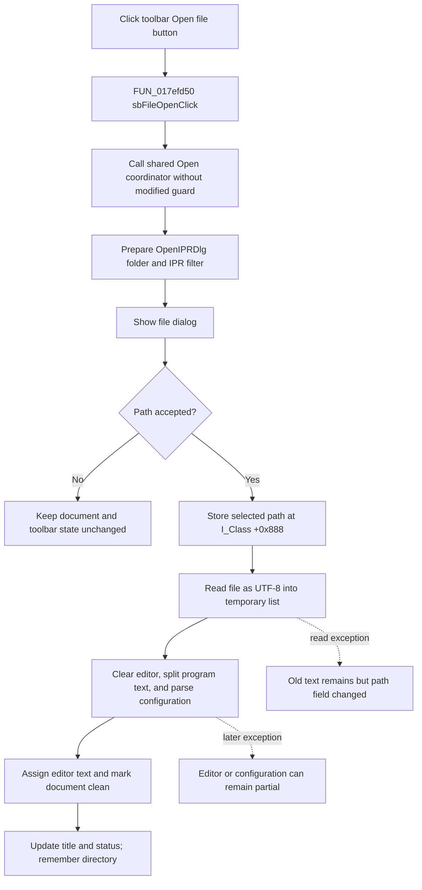

# Open an Interpreter program from the toolbar

> Analysis status: Complete source review.

## Control

| Property | Recovered value |
| --- | --- |
| Form | I_Class |
| Form caption | Interpreter-`<%s>` |
| Component path | I_Class.pnToolPanel.sbFileOpen |
| Control class | TSpeedButton |
| Caption | Not present in the recovered resource. |
| Hint | Open file |
| Handler name | sbFileOpenClick |
| Handler address | 017efd50 |
| Graph node | `resource:dfm:I_Class/I_Class.pnToolPanel.sbFileOpen` |
| Handler node | `function:017efd50` |
| Graph layer | UI |

The speed button is 25 by 25 pixels. Its embedded bitmap is 32 by 16 pixels,
and `NumGlyphs` is `2`. The extracted image contains two folder frames. This
supports the recovered **Open file** hint, but the handler and shared file-open
coordinator provide the behavior evidence.

## Toolbar route

`FUN_017efd50` contains one call to the shared Interpreter IPR open coordinator
`FUN_017ef290`. The wrapper has no recovered parameter and does not inspect a
Delphi `Sender`. Therefore, the toolbar button does not select a different
open mode, filter, target, or document based on the control instance.

The File > Open menu handler calls the same coordinator. It is the canonical
owner of that coordinator and the IPR loader. The toolbar route has no extra
precondition or state update before the shared call.

The button resource does not define `GroupIndex`, `Down`, or a checked state.
The handler does not change the button's enabled, visible, pressed, or glyph
state. VCL drawing can select one of the two bitmap frames for normal button
visuals, but no application state is stored in the button by this click.

## Open dialog and accepted file

Each click executes the form-owned `OpenIPRDlg`. Form initialization gives the
dialog this filter:

`Interpreter file (*.IPR)|*.IPR`

It also adds **User Examples** and **Tina Examples** places. The initial folder
is the TINA Examples directory until the form remembers a directory from a
successful open. The filter guides selection only. The recovered coordinator
does not validate the selected extension or a file signature.

If the user accepts the dialog, the shared path performs these operations:

1. It stores the selected path in the current-file field at `I_Class +0x888`.
2. It loads the file into a temporary Delphi string list with UTF-8 code page
   65001.
3. After the disk read succeeds, it clears `I_Class.Edit.Lines`.
4. It copies program lines before the first `@` configuration marker and
   resets and parses the Interpreter configuration records.
5. It assigns the decoded program lines to the `TSynEdit` editor.
6. After the loader returns, it marks the editor unmodified, updates the
   Interpreter title and status, and remembers the selected directory for the
   next Open command in this form instance.

The toolbar click does not run the loaded program. A later Run command rebuilds
the runtime from the editor and loaded configuration.

## Missing unsaved-document guard

The toolbar wrapper and shared Open coordinator do not call modified-document
guard `FUN_017f1540`. This is the same omission as the File > Open menu route.

If the current editor is modified, clicking the toolbar button immediately
opens the file dialog. If the user accepts another file, the Open path replaces
the current editor text without a Yes, No, or Cancel save prompt. It does not
invoke Save or Save As first. New and form close use the guard, so their
unsaved-document behavior does not apply here.

## Cancel, repeated click, and persistence

Cancel returns from the shared coordinator before it changes the current path,
editor text, configuration, modified flag, title, status, or remembered
directory. The toolbar button is not latched, so another click executes the
same dialog again.

A successful open changes the live Interpreter document and makes the selected
path the target for a later normal Save. Open does not write or rewrite the
selected file. It also does not write an INI, registry, project, or preference
setting. The remembered directory is recovered only as a field on the live
`I_Class` form.

## Invalid files and partial failure

The unique toolbar wrapper, shared coordinator, and loader have no local
exception handler or rollback.

- The selected path is stored before the file read. If the read fails, the old
  editor text remains, but the current-path field already names the selected
  path. The old title, modified flag, status, and remembered directory remain.
- If a later failure occurs after `Edit.Lines` is cleared, the editor can stay
  empty or partly replaced. Later clean-state, title, status, and directory
  updates do not run.
- An invalid numeric configuration field makes the decoder return without a
  failure result. The configuration can remain reset or partly populated. The
  coordinator then marks the loaded editor clean and updates the title as if
  the load completed.
- A file without an `@` marker is accepted as program text. Its configuration
  remains at the decoder's reset defaults.

There is no separate toolbar-specific error message. Any exception propagates
through `FUN_017efd50`.

## Click flow

## Source evidence

- Toolbar wrapper: [FUN_017efd50](../../../DecompiledSources/Tina16/functions/00000000017EFD50__FUN_017efd50.c)
- File > Open wrapper: [FUN_017ef8d0](../../../DecompiledSources/Tina16/functions/00000000017EF8D0__FUN_017ef8d0.c)
- Shared Open coordinator: [FUN_017ef290](../../../DecompiledSources/Tina16/functions/00000000017EF290__FUN_017ef290.c)
- Shared IPR loader: [FUN_017ef4d0](../../../DecompiledSources/Tina16/functions/00000000017EF4D0__FUN_017ef4d0.c)
- Shared IPR decoder: [FUN_010cd270](../../../DecompiledSources/Tina16/functions/00000000010CD270__FUN_010cd270.c)
- Modified-document guard absent from this route: [FUN_017f1540](../../../DecompiledSources/Tina16/functions/00000000017F1540__FUN_017f1540.c)
- Open dialog initialization: [FUN_017efdf0](../../../DecompiledSources/Tina16/functions/00000000017EFDF0__FUN_017efdf0.c)
- Canonical File > Open analysis: [miopen-aff8cce523.md](miopen-aff8cce523.md)
- Extracted two-frame folder glyph: [0230_I_Class_I_Class_pnToolPanel_sbFileOpen_Glyph_Data.png](../../../glyph/0230_I_Class_I_Class_pnToolPanel_sbFileOpen_Glyph_Data.png)
- Glyph metadata: [manifest.json](../../../glyph/manifest.json)
- Recovered form and control evidence: [ui-evidence.json](../../../DecompiledSources/Tina16/resources/dfm/ui-evidence.json)

The graph classifies `FUN_017efd50` as a simple function in the `UI` layer with
one distinct outgoing call. Both the graph and source show that its only callee
is the canonical Interpreter Open coordinator.

## Analysis ownership

- This analysis owns only toolbar wrapper `FUN_017efd50`.
- `.643` owns File > Open wrapper `FUN_017ef8d0`, shared Open coordinator
  `FUN_017ef290`, and IPR loader `FUN_017ef4d0`.
- `.641` owns modified-document guard `FUN_017f1540`.
- The decoder, dialog setup, Run route, VCL controls, UTF-8 provider, and Delphi
  string-list helpers remain evidence-only.

## Analysis limits

- The two bitmap frames show a folder in different colors. Their exact VCL
  visual-state mapping is not recovered, so this article does not name one
  frame as disabled, pressed, or selected.
- The configuration fields are identified by offsets and later consumers. Their
  original Delphi field names are not recovered.
