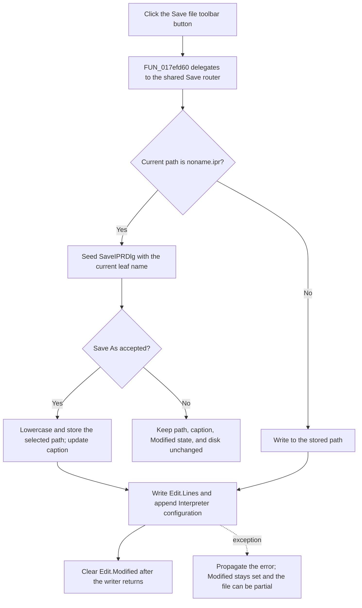

# Save the Interpreter file from the toolbar

> Analysis status: Complete. The recovered toolbar handler, shared Save router, Save As path, writer, DFM resource, and extracted glyph support this explanation.

## Control

| Property | Recovered value |
| --- | --- |
| Form | I_Class |
| Component path | I_Class.pnToolPanel.sbFileSave |
| Control class | TSpeedButton |
| Caption | Not present in the recovered resource. |
| Hint | Save file |
| Handler name | sbFileSaveClick |
| Handler address | 017efd60 |
| Graph node | `resource:dfm:I_Class/I_Class.pnToolPanel.sbFileSave` |
| Handler node | `function:017efd60` |
| Graph layer | UI |

## What happens when clicked

`FUN_017efd60` calls the shared I_Class Save router `FUN_017ef6c0` and returns. Its body is the same as the **Save** menu wrapper `FUN_017ef8e0`, except that the DFM binds it to the toolbar button. It does not read `Sender`, inspect the button, or add a toolbar-specific branch. The toolbar, menu item, and Ctrl+S path therefore use the same stored-path decision and writer.

The Save router reads the current Interpreter project path at form offset `+0x888`:

- If the path is not `noname.ipr`, it writes directly to that path and clears `I_Class.Edit.Modified` only after the writer returns.
- If the path is `noname.ipr`, it calls the shared Save As coordinator. Form creation and New assign this sentinel, so this is the unnamed-document path.

The wrapper and router return no success value. The toolbar handler cannot report whether a Save As dialog was accepted or cancelled.

## Toolbar resource and state

The DFM gives the speed button the hint `Save file`, enables hint display, and assigns an embedded bitmap strip with `NumGlyphs = 2`. The extracted 40-by-20 image contains two floppy-disk panels. The hint and glyph corroborate the Save role that the handler source proves.

The resource does not define a caption, toggle group, down state, or custom action. The handler does not read an enabled, pressed, or checked state and does not change the button after the save. The two glyph panels are visual states; they do not select different save operations. A disabled-control dispatch, if one occurs in VCL before the event, is outside this recovered handler.

## Save As cancellation and acceptance

For `noname.ipr`, `FUN_017ef730` extracts the current leaf name and puts it in the inherited Save dialog. The dialog is configured as `SaveIPRDlg` with the filter `Interpreter file (*.IPR)|*.IPR`; its setup also supplies User Examples and Tina Examples locations.

If the user cancels the dialog or rejects an overwrite prompt, the accepted branch does not run. The current path, window caption, editor Modified flag, editor text, and disk stay unchanged.

If the user accepts, the coordinator lowercases the complete selected path, stores it at `+0x888`, and updates the window caption before it writes. After the writer returns, it clears `Edit.Modified`. A later toolbar click now writes directly to that stored path and does not reopen the dialog.

## File content and persistence

`FUN_017ef620` passes the selected path, `I_Class.Edit.Lines`, and the active Interpreter numerical, math, and drawing settings to the shared IPR serializer. The serializer writes the source text with the recovered UTF-8 encoding object and then appends a configuration section to the same file.

The IPR file is the persistent output of this click. The current path, caption, and Modified flag are form-lifetime state. This path does not store the current path in an INI file, registry value, or database.

## Errors and partial results

The wrapper, router, Save As coordinator, and writer have no local exception handler, retry, temporary-file replacement, backup, or rollback:

- A direct-write exception leaves the current path and caption unchanged. It also prevents the later Modified-clear call.
- Save As stores the accepted path and caption before the write. A write exception can leave this new form state in memory while Modified remains set.
- The serializer writes the source before it appends the configuration. A failure can leave a replaced, truncated, source-only, or partly configured file.
- A cancelled Save As is a no-op, not a write error. The toolbar wrapper receives no status that distinguishes cancellation from success.

## Click flow

## Handler evidence

- [Toolbar wrapper `FUN_017efd60`](../../../DecompiledSources/Tina16/functions/00000000017EFD60__FUN_017efd60.c) calls only the shared Save router.
- [Menu Save wrapper `FUN_017ef8e0`](../../../DecompiledSources/Tina16/functions/00000000017EF8E0__FUN_017ef8e0.c) has the same one-call body.
- [Shared Save router `FUN_017ef6c0`](../../../DecompiledSources/Tina16/functions/00000000017EF6C0__FUN_017ef6c0.c) selects direct Save or Save As from the `noname.ipr` sentinel.
- [Save As coordinator `FUN_017ef730`](../../../DecompiledSources/Tina16/functions/00000000017EF730__FUN_017ef730.c) proves the cancel no-op and the accepted path, caption, write, and Modified-state order.
- [I_Class writer adapter `FUN_017ef620`](../../../DecompiledSources/Tina16/functions/00000000017EF620__FUN_017ef620.c) passes the editor text and active Interpreter settings to the serializer.
- [IPR serializer `FUN_010cd780`](../../../DecompiledSources/Tina16/functions/00000000010CD780__FUN_010cd780.c) writes the source and appends the numerical, math, and drawing configuration.
- [Form setup `FUN_017efdf0`](../../../DecompiledSources/Tina16/functions/00000000017EFDF0__FUN_017efdf0.c) establishes the sentinel and Save dialog configuration.
- [New-document handler `FUN_017eef40`](../../../DecompiledSources/Tina16/functions/00000000017EEF40__FUN_017eef40.c) restores `noname.ipr` for a new project.
- [Extracted two-panel floppy-disk glyph](../../../glyph/0231_I_Class_I_Class_pnToolPanel_sbFileSave_Glyph_Data.png) corroborates the DFM hint and proven Save call path.
- The canonical [Save menu article](misave-af88b167f5.md) owns the shared Save router and writer annotations. The canonical [Save As article](misaveas-6d878d6b23.md) owns the Save As coordinator annotation.

## Analysis limits

- Only the unique toolbar wrapper `FUN_017efd60` is annotated by this task. Shared functions owned by `TIARA-diz.6.7.644` and `TIARA-diz.6.7.645` are evidence only.
- The glyph proves a floppy-disk image with two panels. The recovered resource does not name the individual visual states.
- Native or VCL overwrite confirmation can occur in the dialog layer. The application handler contains no separate file-existence check.
- The exact low-level exception presentation and partial-write point are not recovered from this wrapper.
