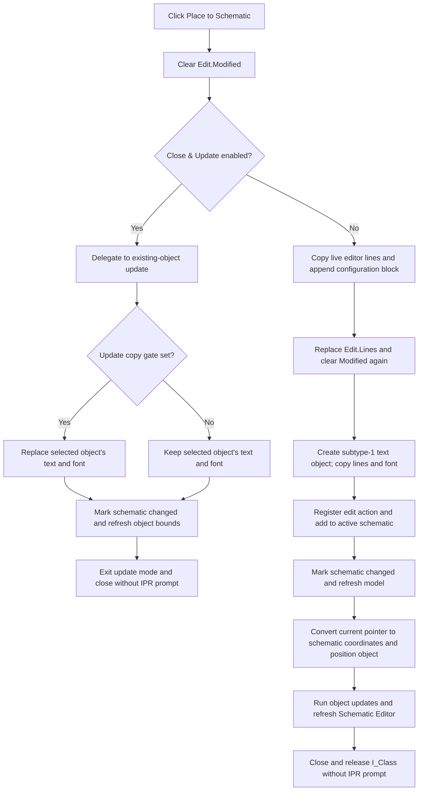

# Place to Schematic

## Control

| Property | Recovered value |
| --- | --- |
| Form | I_Class |
| Component path | I_Class.pnToolPanel.sbPlace |
| Control class | TSpeedButton |
| Caption | Not present in the recovered resource. |
| Hint | Place to Schematic |
| Number of glyph frames | 2 |
| Handler name | sbPlaceClick |
| Handler address | 017f2a00 |
| Graph node | `resource:dfm:I_Class/I_Class.pnToolPanel.sbPlace` |
| Handler node | `function:017f2a00` |
| Graph layer | UI |

The extracted 32 by 16 pixel glyph has two frames. It shows a small document and a right-pointing yellow arrow. The glyph supports the transfer meaning in the hint, but the recovered handler and insertion code establish the target and state changes.

## What happens when clicked

`sbPlaceClick` first clears the `Modified` state of the I_Class `TSynEdit`. It then uses the enabled state of **Close & Update** as a mode switch:

- When **Close & Update** is disabled, the handler creates a new Interpreter text object in the active schematic.
- When **Close & Update** is enabled, the handler delegates to that command's existing-component update and close path.

The click does not compile or run the Interpreter source. It transfers the current editor source and configuration to the schematic.

## New object placement

`FUN_017f2a50` builds a temporary string list. The `.640`-owned serializer `FUN_017f2850` copies the current `Edit.Lines` and appends a configuration block with these recovered sections:

- `; numerical format`
- `; math`
- `; drawing`

The block is delimited by `@ Configuration begin` and `.@ Configuration end`. Its values come from the I_Class working runtime at `+0xb48`, not from a file reload.

After the temporary list is complete, the worker clears `Edit.Lines`, assigns the serialized list back to the editor, and clears `Modified` again. This means the visible in-memory editor text now includes the appended configuration block.

The worker then passes these inputs to `FUN_01c9c910`:

- the active main-application object;
- the normalized editor line list;
- the current editor font;
- subtype value `1`.

The selected-object activation path recognizes subtype `1` as the Interpreter editor object. The insertion coordinator creates that schematic text object, copies the line list and font into it, and sets the subtype.

## Schematic insertion and position

The insertion coordinator targets the active schematic model stored at main-application offset `+0x27a8`. It performs these model operations in sequence:

1. It creates a shared schematic edit-action object for the new object set.
2. It adds the new text object to the active schematic collection.
3. It calls the schematic changed-state notifier with changed value `1`.
4. It refreshes object-derived model state.
5. It gets the current pointer position from the active schematic view and converts it to schematic coordinates.
6. It positions the new object at those coordinates and runs the normal object and schematic update callbacks.
7. It refreshes the related Schematic Editor control.

The coordinate helper returns `-1, -1` when the active view has no window handle. The insertion coordinator does not test that result before it positions the object. It also has no null check for the main application or active schematic.

The shared edit-action construction proves placement-history bookkeeping. The recovered path does not connect that object to the Schematic Editor **Undo** menu handler, so the exact user-visible undo result remains unproven.

## Existing-object update mode

When **Close & Update** is enabled, `sbPlaceClick` calls the `.640`-owned `FUN_017f28b0` instead of creating a second object. That handler can copy the current editor lines, configuration, and font back to the selected schematic Interpreter object. It then marks the active schematic changed, refreshes the object's rectangle, exits update mode, and requests form closure.

The toolbar wrapper clears `Edit.Modified` before this delegation. Therefore, the later I_Class close query does not show its `.IPR` save prompt on this route. A false update gate inside `FUN_017f28b0` can still skip the text and font copy while the schematic change, UI-mode reset, rectangle update, and close request continue.

The existing-object path expects the stored edit owner at `+0xb58` to be valid. It has no local no-target guard.

## Style, close, and persistence boundaries

The new-placement worker does not read I_Class local background fields `+0xb00`, `+0xb04`, or border field `+0xb08`. The new text-object constructor instead loads its background mode, background color, and border defaults from `TINA.INI`, section `Text Dialog Setup`. Therefore, local choices made through the I_Class Background and Border popup handlers are not proven to affect this new object. The existing-object update worker also does not copy those local fields back to the selected object.

After new insertion, `FUN_017f2a50` requests the common VCL form-close path. Since the editor modified state was cleared, the I_Class close query accepts without a source-file save prompt. I_Class `OnClose` selects form release.

The active schematic is marked changed, but this click does not save the circuit. The placed object remains live in memory until a separate circuit-save operation persists it. The click also does not write the current `.IPR` file or save the local popup style state.

The handler does not explicitly restore the editor caret or selection after it replaces `Edit.Lines`. The form closes immediately after successful new placement, so no later caret operation is present in this path.

## Errors and partial state

There is no confirmation dialog, source validation, compile check, target check, result check, local exception handler, transaction, or rollback.

- The outer handler clears `Edit.Modified` before it checks the placement mode. An exception in either branch can therefore leave the source marked unmodified even though placement or update did not finish.
- The temporary serialization completes before the worker clears the editor. A serialization failure does not reach that clear, but the earlier outer modified-state clear remains.
- A failure after `Edit.Lines.Clear` can leave the editor empty or partly replaced.
- The new object is initialized, registered in the edit action, added, marked changed, positioned, and refreshed in separate steps. A later failure can leave an inserted or partly initialized in-memory object without the final UI refresh or form close.
- A failure in the existing-object branch can occur after its target text list was cleared or copied. The Close & Update analysis documents that partial-state boundary.
- Successful placement has no no-op branch, even when the source editor initially has no user lines, because the serializer still appends the configuration block.

## Placement flow

## Evidence

- [Place handler](../../../DecompiledSources/Tina16/functions/00000000017F2A00__FUN_017f2a00.c): clears editor modified state and selects new placement or existing-object update from the Close & Update enabled state.
- [New-placement worker](../../../DecompiledSources/Tina16/functions/00000000017F2A50__FUN_017f2a50.c): serializes to a temporary list, replaces the editor text, clears modified state, passes lines, font, and subtype `1` to the insertion coordinator, and closes the form.
- [Shared editor and configuration serializer](../../../DecompiledSources/Tina16/functions/00000000017F2850__FUN_017f2850.c) and [configuration-block builder](../../../DecompiledSources/Tina16/functions/00000000010CDE90__FUN_010cde90.c): copy live lines and append numerical-format, math, and drawing state. Bead `.640` owns the serializer annotation.
- [Shared schematic text-object insertion coordinator](../../../DecompiledSources/Tina16/functions/0000000001C9C910__FUN_01c9c910.c): constructs the object, copies text and font, sets its subtype, registers an edit action, inserts it, marks the schematic changed, positions it, and refreshes the editor.
- [Text-object default loader](../../../DecompiledSources/Tina16/functions/000000000149D1A0__FUN_0149d1a0.c): loads Background, BgndColor, and Border from `TINA.INI` section `Text Dialog Setup`.
- [Pointer-to-schematic coordinate helper](../../../DecompiledSources/Tina16/functions/0000000001A9A4E0__FUN_01a9a4e0.c): gets the current pointer and returns `-1, -1` when the active view has no window handle.
- [Schematic changed-state notifier](../../../DecompiledSources/Tina16/functions/000000000199E310__FUN_0199e310.c): stores the changed value and notifies open schematic consumers.
- [Existing-object activation](../../../DecompiledSources/Tina16/functions/000000000149E460__FUN_0149e460.c): maps subtype `1` to I_Class, stores the selected owner, loads its text and font, and enables Close & Update mode.
- [Existing-object update worker](../../../DecompiledSources/Tina16/functions/00000000017F28B0__FUN_017f28b0.c): owns the copy-back, changed-state, bounds-refresh, mode-reset, and close behavior. Bead `.640` owns its annotation.
- [SynEdit modified-state setter](../../../DecompiledSources/Tina16/functions/0000000000C0DAD0__FUN_00c0dad0.c): updates `Modified` and related native edit state.
- [I_Class close query](../../../DecompiledSources/Tina16/functions/00000000017F0F20__FUN_017f0f20.c) and [common VCL close coordinator](../../../DecompiledSources/Tina16/functions/0000000000805200__FUN_00805200.c): prove that cleared modified state avoids the source-save choice and that accepted close reaches the form action.
- [Extracted two-frame toolbar glyph](../../../glyph/0233_I_Class_I_Class_pnToolPanel_sbPlace_Glyph_Data.png): supports document-transfer intent but does not establish the target or implementation.

## Limits

- The original Delphi class names for the schematic edit-action object and subtype enumeration are not recovered.
- The recovered source proves edit-action construction but not the exact result of a later Schematic Editor Undo command.
- The original names of the nested active-schematic and view fields are not recovered. Their repeated consumers establish the model and coordinate roles described here.
- No recovered call in this path saves the circuit or Interpreter source file.
