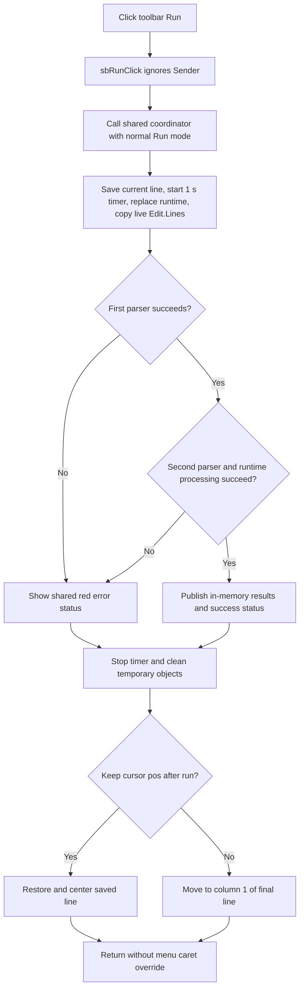

# Run

## Control

| Property | Recovered value |
| --- | --- |
| Form | I_Class |
| Component path | I_Class.pnToolPanel.sbRun |
| Control class | TSpeedButton |
| Caption | Not present in the recovered resource. |
| Hint | Run |
| Glyph | Green right-pointing triangle, 20 x 20 pixels |
| Handler name | sbRunClick |
| Handler address | 017efdd0 |
| Graph node | `resource:dfm:I_Class/I_Class.pnToolPanel.sbRun` |
| Handler node | `function:017efdd0` |
| Graph layer | UI |

The hint and extracted glyph identify this as the toolbar Run command. The handler body proves that it uses the same normal Interpreter run mode as the **Run** menu item and F9 shortcut.

## What happens when clicked

`sbRunClick` ignores its `Sender` argument and immediately calls the shared Interpreter run coordinator with the normal Run mode mask. It does not read `Down`, `Enabled`, or another speed-button property. It also does not change the button state itself.

The shared coordinator runs the current in-memory text from `I_Class.Edit`:

1. It records the current editor line, enables `MyTimer` with a 1,000 ms interval, and replaces the prior Interpreter runtime while retaining its numerical and execution configuration.
2. It binds the new runtime to the editor and status control, copies the current `Edit.Lines`, applies the normal Run mode, and registers the current Interpreter variables and design data.
3. It runs two generated parser phases. If both succeed and work is available, it enters the Interpreter processing loop.
4. On clean completion, it reports success and publishes the recovered configuration and requested outputs to in-memory application objects.
5. On handled return paths, it stops the timer and applies the shared caret policy.

The run input is the live editor buffer. Unsaved changes are included. The toolbar handler does not save the `.IPR` file, change its path, or clear the editor modified state.

## Toolbar and menu difference

The toolbar and menu wrappers pass the same mode mask to the same coordinator. The menu wrapper then makes one additional call that moves the caret to column 1 of the final editor line. The toolbar wrapper does not make that call.

The toolbar therefore keeps the coordinator's `Keep cursor pos after run` policy on a normal return:

- When the option is clear, the coordinator moves the caret to column 1 of the final line.
- When the option is set, the coordinator restores and centers the saved editor line. If the helper must move to a different line, it uses column 1; the source saves a line number, not the original column.

In contrast, the menu Run wrapper always forces the final-line position after the coordinator returns. This is a caret and viewport difference only. Neither route changes the editor text as part of its caret handling.

The shared cursor option is loaded from `TINA.INI`, section `designtool`, key `Keep cursor pos after run`. The toolbar wrapper neither changes the option nor writes the settings file.

## Errors, cancellation, and re-entry

The first or second parser can return a failure. Runtime processing can also record an error. These handled failures use the shared error presenter, which writes a red status, focuses the editor, and can show `Errors occurred during the execution of the program, the curves will not be drawn!`. The normal handled cleanup destroys temporary parser objects, stops `MyTimer`, and applies the shared caret policy.

For a long run, the timer permits a progress dialog. Its Cancel action sets a runtime cancellation byte. The processing loop tests that byte between items, so cancellation is cooperative. The coordinator does not roll back already accumulated work. If cancellation does not also set an error, partial in-memory results can reach the normal publication path.

The wrapper and coordinator do not disable the toolbar button and do not test a form-level busy flag before they replace the runtime. The processing loop can pump application messages. The recovered path therefore does not prove that a second Run click is blocked during progress processing. An escaping exception is also outside the handler's proven cleanup path because neither function has a local exception or `finally` guard.

## Click flow

## Evidence

- [Toolbar Run handler](../../../DecompiledSources/Tina16/functions/00000000017EFDD0__FUN_017efdd0.c): makes the single shared-coordinator call with the normal Run mode mask and has no sender or button-state branch.
- [Menu Run handler](../../../DecompiledSources/Tina16/functions/00000000017EFC30__FUN_017efc30.c): makes the same coordinator call and then calls the final-line caret helper, which proves the route-specific difference.
- [Shared Interpreter run coordinator](../../../DecompiledSources/Tina16/functions/00000000017F17C0__FUN_017f17c0.c): replaces and configures the runtime, copies the live editor lines, dispatches parsing and processing, handles status and result publication, and selects the caret policy.
- [Coordinator cleanup](../../../DecompiledSources/Tina16/functions/00000000017F1FA0__FUN_017f1fa0.c), [saved-line restoration](../../../DecompiledSources/Tina16/functions/00000000017F2B70__FUN_017f2b70.c), and [final-line caret helper](../../../DecompiledSources/Tina16/functions/00000000017EFD70__FUN_017efd70.c): establish the two caret results and timer cleanup.
- [Settings loader](../../../DecompiledSources/Tina16/functions/00000000017E1500__FUN_017e1500.c): reads the shared cursor option from `TINA.INI`; the toolbar wrapper does not call a settings writer.
- [Menu Run analysis](mirun-be459c43c0.md): owns the detailed shared-coordinator and final-line-helper analysis used by both routes.
- [Extracted toolbar glyph](../../../glyph/0232_I_Class_I_Class_pnToolPanel_sbRun_Glyph_Data.png): shows a green right-pointing triangle. The glyph supports the recovered Run intent but does not establish execution behavior by itself.

## Limits

- The original Delphi enumeration name for the normal Run mask is not recovered.
- The two generated parser grammars do not have recovered source-language names.
- The exact product meanings of the coordinator's three one-shot result-transfer flags are not established by this wrapper.
- The source proves in-memory result publication, but it does not prove immediate persistence of those results to disk.
