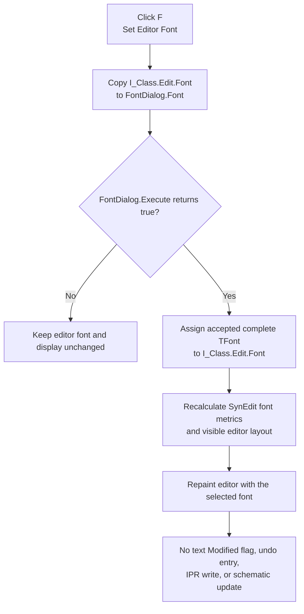

# Set editor font

> Analysis status: Evidence-backed source review complete.

## Control

| Property | Recovered value |
| --- | --- |
| Form | I_Class |
| Component path | I_Class.pnToolPanel.sbSetFont |
| Control class | TSpeedButton |
| Caption | F |
| Hint | Set Editor Font |
| Handler name | sbSetFontClick |
| Handler address | 017f1430 |
| Graph node | `resource:dfm:I_Class/I_Class.pnToolPanel.sbSetFont` |
| Handler node | `function:017f1430` |
| Graph layer | UI |

## What happens when clicked

[`FUN_017f1430`](../../../DecompiledSources/Tina16/functions/00000000017F1430__FUN_017f1430.c) edits the font of `I_Class.Edit`, the form's `TSynEdit` source editor.

The handler first gets the current editor font through [`FUN_00bf2c10`](../../../DecompiledSources/Tina16/functions/0000000000BF2C10__FUN_00bf2c10.c). It assigns that complete `TFont` to the streamed `I_Class.FontDialog` component at form field `+0x788`, whose private font is at `+0xD0`. Therefore, the font dialog starts with the editor's current font on every click.

The handler then calls `TFontDialog.Execute` and tests its Boolean result:

- A false result leaves `I_Class.Edit.Font` unchanged. The recovered handler cannot distinguish a user Cancel from another native dialog failure that returns false.
- A true result assigns the complete accepted `FontDialog.Font` back to `I_Class.Edit.Font` at form field `+0x868`. This is not a copy of only the face name or point size. It uses the `TFont.Assign` path for the complete font object.

The `TFontDialog` is a DFM-owned component. The handler does not create or destroy it on each click. A false result can leave private dialog state changed by the native dialog, but the next click always reseeds that state from the current editor font.

## Immediate editor effect

The accepted assignment changes the active editor's presentation immediately. The recovered `TSynEdit` constructor [`FUN_00bf1f20`](../../../DecompiledSources/Tina16/functions/0000000000BF1F20__FUN_00bf1f20.c) connects its font-change callback to [`FUN_00bf2bf0`](../../../DecompiledSources/Tina16/functions/0000000000BF2BF0__FUN_00bf2bf0.c). That callback recalculates font metrics through [`FUN_00c0a6b0`](../../../DecompiledSources/Tina16/functions/0000000000C0A6B0__FUN_00c0a6b0.c) and updates the editor's visible rows, columns, scrolling, caret layout, and invalidated display through [`FUN_00c09f90`](../../../DecompiledSources/Tina16/functions/0000000000C09F90__FUN_00c09f90.c).

The click does not change source text, cursor text coordinates, Interpreter numerical or drawing settings, or an active schematic object. Font-driven layout can change how much text is visible, but the handler does not replace the text or execute it.

## Click flow

## Modified state and undo

The handler and the recovered font-change callback do not call the `TSynEdit` modified-state setter, edit the line collection, or add a text-undo operation. Therefore, a font-only change does not set the recovered `Edit.Modified` flag and does not create a text undo entry.

This boundary affects later close behavior. The I_Class close guard checks `Edit.Modified`. A font-only change does not, by itself, create the unsaved-source prompt. The handler also does not mark the active schematic changed and does not create a schematic undo record.

## Later schematic use and persistence

The accepted font stays in the active `TSynEdit` object for the lifetime of that I_Class form. New and Open replace editor text and Interpreter configuration, but the recovered I_Class paths do not replace `Edit.Font`.

The IPR Save path [`FUN_017ef620`](../../../DecompiledSources/Tina16/functions/00000000017EF620__FUN_017ef620.c) writes editor lines plus numerical, math, and drawing configuration. It does not serialize the editor font. Thus, Save or Save As does not make this selection part of the IPR file.

The font can enter a schematic through later, separate commands:

- [Place to Schematic](../../../DecompiledSources/Tina16/functions/00000000017F2A50__FUN_017f2a50.c) passes the current editor lines and font to the schematic-component creation path.
- [Close & Update](../../../DecompiledSources/Tina16/functions/00000000017F28B0__FUN_017f28b0.c) copies the editor font to the existing schematic Interpreter component and marks the schematic changed.

This font-button click performs neither operation. Durable storage of a font copied into a schematic depends on a later circuit save. Opening an existing schematic Interpreter component uses the inverse path in [`FUN_0149e460`](../../../DecompiledSources/Tina16/functions/000000000149E460__FUN_0149e460.c), which copies that component's stored font into `I_Class.Edit.Font`.

## Repeated use, Cancel, and errors

- Each click starts from the font that the editor currently uses. After one accepted selection, a second click starts from that accepted font.
- Cancel or any other false `Execute` result leaves the editor, text-modified state, undo state, Interpreter model, schematic, and IPR file unchanged.
- There is no application-specific font validation, retry, confirmation, or error message. The VCL and native font dialog own font availability and validation.
- The handler has no local exception handler or rollback. An exception from font assignment or dialog execution propagates through the surrounding Delphi exception path. The recovered code does not restore an earlier font after a partial failure.

## Handler evidence

- Source: [DecompiledSources/Tina16/functions/00000000017F1430__FUN_017f1430.c](../../../DecompiledSources/Tina16/functions/00000000017F1430__FUN_017f1430.c)
- Recovered role: Edit the I_Class source editor font through its streamed font dialog.
- Current graph summary: Handles `I_Class.pnToolPanel.sbSetFont.OnClick`.
- Complexity: simple
- Distinct outgoing calls: 1

## Direct call

- `function:00bf2c10` returns the `TSynEdit` font object. It is a generic accessor and remains supporting evidence rather than an I_Class-specific annotation.

The dialog `Execute` and `TFont.Assign` operations are recovered virtual calls, so they do not appear as direct function-call edges from the handler.

## Resource evidence

- The speed button caption is `F`.
- Its hint is `Set Editor Font`.
- `I_Class.Edit` is a `TSynEdit` text box.
- `I_Class.FontDialog` is a nonvisual `TFontDialog` component.
- The button has no image reference or extracted glyph.

## Analysis ownership and limits

- This task owns only `FUN_017f1430`. Generic font, dialog, SynEdit layout, modified-state, and persistence helpers remain evidence-only.
- Bead `.640` owns the Close & Update handler. Bead `.661` owns the Place to Schematic path.
- The source proves a complete `TFont` assignment. It does not expose which installed fonts the native dialog lists or the platform-specific message for a common-dialog failure.
- The recovered source does not prove that every external schematic save format preserves every `TFont` field. It proves only that the in-memory schematic component receives the font before a later circuit save boundary.
