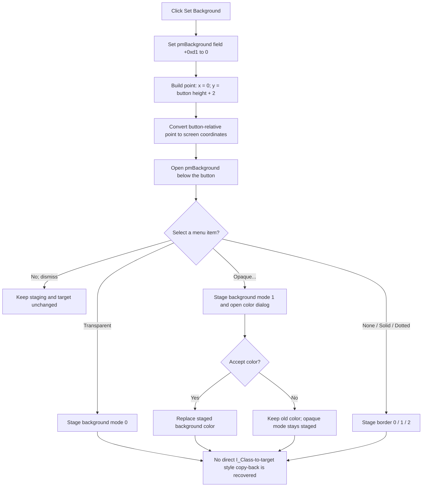

# Set Background

> Analysis status: Complete source review. The click opens the background and border popup. The popup items change I_Class staging fields, but the recovered I_Class close path does not prove a copy-back of those fields to the selected object.

## Control

| Property | Recovered value |
| --- | --- |
| Form | I_Class |
| Component path | I_Class.pnToolPanel.SetBackground |
| Control class | TSpeedButton |
| Caption | Not present in the recovered resource. |
| Hint | Set Background |
| Handler name | SetBackgroundClick |
| Handler address | 017f2be0 |
| Graph node | `resource:dfm:I_Class/I_Class.pnToolPanel.SetBackground` |
| Handler node | `function:017f2be0` |
| Graph layer | UI |

## What happens when clicked

The click does not change a background or border value directly. [FUN_017f2be0](../../../DecompiledSources/Tina16/functions/00000000017F2BE0__FUN_017f2be0.c) first sets an internal field of `pmBackground` at offset `+0xd1` to zero. It then forms the button-relative point `(0, Height + 2)` with [FUN_00498310](../../../DecompiledSources/Tina16/functions/0000000000498310__FUN_00498310.c), converts that point to screen coordinates with [FUN_0064d1f0](../../../DecompiledSources/Tina16/functions/000000000064D1F0__FUN_0064d1f0.c), and explicitly opens `pmBackground` at that position. The menu therefore starts at the left edge of the button, two pixels below its bottom edge.

The recovered glyph is a 7-by-5 downward arrow. It supports the popup affordance, while the handler's coordinate conversion and popup virtual call prove the behavior.

## Popup staging and choices

When the I_Class editor is opened for a compatible selected text object, [FUN_0149e460](../../../DecompiledSources/Tina16/functions/000000000149E460__FUN_0149e460.c) stores that object as the current target and calls [FUN_017f2de0](../../../DecompiledSources/Tina16/functions/00000000017F2DE0__FUN_017f2de0.c). That shared initializer copies the target's background mode, background color, and border value into I_Class staging fields and synchronizes the menu checks. If this target setup does not run, form creation supplies transparent, white, and no-border defaults.

The five menu handlers have these proven staging effects:

| Menu choice | Handler | Staging effect |
| --- | --- | --- |
| Background > Transparent | [FUN_017f2c50](../../../DecompiledSources/Tina16/functions/00000000017F2C50__FUN_017f2c50.c) | Sets background mode to `0` and checks only Transparent. |
| Background > Opaque... | [FUN_017f2c90](../../../DecompiledSources/Tina16/functions/00000000017F2C90__FUN_017f2c90.c) | Sets background mode to `1`, checks only Opaque, and opens a color dialog seeded with the staged color. Accept replaces the staged color. Cancel keeps the previous color, but it does not undo the change to opaque mode. |
| Border > None | [FUN_017f2d20](../../../DecompiledSources/Tina16/functions/00000000017F2D20__FUN_017f2d20.c) | Sets border value to `0` and checks only None. |
| Border > Solid | [FUN_017f2d60](../../../DecompiledSources/Tina16/functions/00000000017F2D60__FUN_017f2d60.c) | Sets border value to `1` and checks only Solid. |
| Border > Dotted | [FUN_017f2da0](../../../DecompiledSources/Tina16/functions/00000000017F2DA0__FUN_017f2da0.c) | Sets border value to `2` and checks only Dotted. |

Closing the popup without selecting an item does not change these staging fields. Repeated clicks reopen the popup from the current staged values.

## Visual, commit, and persistence boundaries

[FUN_01a5daf0](../../../DecompiledSources/Tina16/functions/0000000001A5DAF0__FUN_01a5daf0.c) proves how the corresponding fields affect a target text object when they are present in that object: background mode `1` fills its rectangle with the stored background color; mode `0` does not do that fill. Border value `1` draws the solid option and value `2` draws the dotted option. Value `0` does not take either border branch.

The recovered I_Class `Close && Update` path does not establish that the popup's staging fields reach those target fields. [FUN_017f28b0](../../../DecompiledSources/Tina16/functions/00000000017F28B0__FUN_017f28b0.c) copies editor text and font data and asks the target and schematic to update. Its copier, [FUN_017f2850](../../../DecompiledSources/Tina16/functions/00000000017F2850__FUN_017f2850.c), transfers interpreter and drawing configuration, but neither function directly reads the three background and border staging fields. A separate text-object copier, [FUN_01a5eb60](../../../DecompiledSources/Tina16/functions/0000000001A5EB60__FUN_01a5eb60.c), can copy the target style fields, but no recovered call from this I_Class popup or close path proves that it is used here. The article therefore does not claim an immediate repaint, a successful copy-back, or an undo record for these menu choices.

Once the values are in a target object, persistence is proven. [FUN_01a5f630](../../../DecompiledSources/Tina16/functions/0000000001A5F630__FUN_01a5f630.c) writes `BgrndMode`, `BgrndColor`, and `Border`; [FUN_01a601e0](../../../DecompiledSources/Tina16/functions/0000000001A601E0__FUN_01a601e0.c) reads those keys; and [FUN_01a61fe0](../../../DecompiledSources/Tina16/functions/0000000001A61FE0__FUN_01a61fe0.c) includes the same values in binary persistence. This proves the target object's persistence boundary, not the missing I_Class copy-back.

## Click flow

## Handler evidence

- Source: [DecompiledSources/Tina16/functions/00000000017F2BE0__FUN_017f2be0.c](../../../DecompiledSources/Tina16/functions/00000000017F2BE0__FUN_017f2be0.c)
- Recovered role: Open the I_Class background and border popup below the toolbar button.
- Inputs: The form-owned `SetBackground` speed button and `pmBackground` popup instances.
- State changes: The direct handler changes only the popup field at `+0xd1`. It does not read the selected target or write background, border, modified, undo, or persistent state.
- Output: `pmBackground` is shown at the button's screen X coordinate and at screen Y equal to the button bottom plus two pixels.
- Complexity: moderate
- Distinct outgoing calls: 2

## Resource evidence

- Hint: `Set Background`.
- Popup children: `Background > Transparent`, `Background > Opaque...`, `Border > None`, `Border > Solid`, and `Border > Dotted`.
- Button behavior: `AllowAllUp = true` is present in the resource, but the click handler does not use the button's down state as the style value.
- Extracted glyph: [`0234_I_Class_I_Class_pnToolPanel_SetBackground_Glyph_Data.png`](../../../glyph/0234_I_Class_I_Class_pnToolPanel_SetBackground_Glyph_Data.png), a 7-by-5 downward arrow extracted from a 142-byte Delphi BMP resource.

## Error and no-target behavior

- The direct handler does not test the current target pointer. It can still open the popup with the existing staging values when no target has been installed. It does not safely apply values to a target by itself.
- The handler assumes its DFM-owned button and popup objects exist. It has no null guard, error dialog, exception handler, or rollback path around coordinate conversion and popup display.
- Dismissing the popup is a no-op. The Opaque color dialog has the one proven partial-cancel case: cancellation preserves the old color but leaves opaque mode staged.
- No source-proven modified flag, undo record, immediate repaint, model copy-back, or project write occurs in this click handler or the five popup item handlers.

## Analysis limits

- The meaning of the popup field at `+0xd1` is not recovered. Only its zero assignment before explicit popup display is proven.
- The visual renderer and persistence functions prove what the target style fields mean. They do not close the missing copy-back gap from the I_Class staging fields.
- The glyph supports a drop-down action only. The handler and popup resource tree provide the functional evidence.
