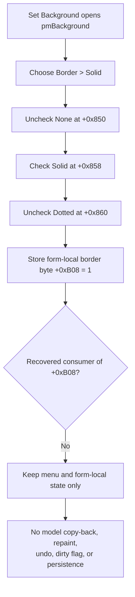

# Select the solid I_Class border option

> Analysis status: Complete. The recovered handler, sibling border commands, shared style initializer, existing-object entry path, renderer, update path, placement path, and serializer establish the local value and the absence of a recovered application or persistence path.

## Control

| Property | Recovered value |
| --- | --- |
| Form | I_Class |
| Form caption | `Interpreter-<%s>` |
| Component path | I_Class.pmBackground.Border1.SolidMnu |
| Parent menu | Border (`B&order`) |
| Control class | TMenuItem |
| Caption | Solid |
| Handler name | SolidMnuClick |
| Handler address | 017f2d60 |
| Graph node | `resource:dfm:I_Class/I_Class.pmBackground.Border1.SolidMnu` |
| Handler node | `function:017f2d60` |
| Graph layer | UI |

The Solid item has no recovered hint, text, glyph, image, action, initial checked value, `RadioItem`, or `GroupIndex` property. The handler and its siblings, not a declared VCL radio group, enforce the exclusive check marks.

## What happens when selected

`FUN_017f2d60` makes four direct state changes in this order:

1. It unchecks **None** at I_Class field `+0x850`.
2. It checks **Solid** at `+0x858`.
3. It unchecks **Dotted** at `+0x860`.
4. It writes byte value `1` to the form-local border-style field at `+0xB08`.

The value mapping is source-proven. **None** handler `FUN_017f2d20` writes `0`, **Solid** writes `1`, and **Dotted** handler `FUN_017f2da0` writes `2`. Shared initializer `FUN_017f2de0` maps the same three values back to the corresponding exclusive menu checks.

The selected system-text model also has a `Border` byte at `+0xA0`. Its renderer treats value `1` as a solid pen style and draws the surrounding rectangle; value `2` selects the dotted pen style. The renderer has an additional point-linked-object condition that can promote model value `0` into its solid branch, so this article does not describe value `0` as an unconditional rendering no-op. The source still establishes what model value `1` means; it does not establish that this menu click changes the model value.

## Set Background and local staging

The **Set Background** speed-button handler `FUN_017f2be0` only opens the form-owned `pmBackground` popup beside the toolbar button. It does not apply a style before or after the popup. Solid is one command inside the popup's **Border** submenu.

When an existing schematic Interpreter text item enters I_Class edit mode, `FUN_0149e460` stores the selected-object owner at form field `+0xB58`. It then passes that item's background mode at `+0x99`, background color at `+0x9C`, and border byte at `+0xA0` to the shared initializer. The initializer copies the border byte into form field `+0xB08` and restores the matching menu check.

`SolidMnuClick` performs only the reverse menu-state change locally. It does not read `+0xB58`, write model field `+0xA0`, or call a model updater. Thus the form can display a selected object's current solid border and can stage a different local choice, but no recovered function applies that changed choice to the object.

## Copy-back, rendering, and persistence boundaries

The recovered downstream paths omit I_Class field `+0xB08`:

- **Close & Update** coordinator `FUN_017f28b0` can copy editor text, Interpreter configuration, and the editor font into the selected schematic item. Its helper `FUN_017f2850` does not read or copy `+0xB08` to the item's `Border` field.
- The new-placement path `FUN_017f2a50` passes editor lines and font into the schematic insertion coordinator. It does not read or pass `+0xB08`.
- A newly constructed schematic Interpreter text item gets its own `Border` default from `TINA.INI`, section `Text Dialog Setup`, key `Border`. The I_Class handler does not write that key.
- The system-text renderer and binary serializer consume the model item's `+0xA0` value, not the I_Class-local `+0xB08` value.

Therefore, no recovered copy-back, redraw, update, save, or settings path consumes the solid choice made by this click. A later Close & Update can update other object data and mark the schematic changed, but this trace does not show it committing the local border byte. This is an evidence boundary; it does not assert that an indirect path missing from the recovered sources cannot exist.

## Repeated click, errors, and modified state

- A repeated Solid click is idempotent for the recovered state. None and Dotted remain unchecked, Solid remains checked, and `+0xB08` remains `1`.
- Shared checked-state setter `FUN_007e2d20` skips its native-menu notification when a requested check already has that value. The Solid handler still performs all three setter calls and rewrites `1` to `+0xB08`.
- The handler has no selected-object guard because it dereferences only form-owned menu items and the form-local byte. It has no normal no-selection no-op branch.
- It does not touch `I_Class.Edit`, the TSynEdit undo list, caret, selection, or Modified byte. It does not create a schematic undo record or set a document-dirty flag.
- It has no validation, confirmation, status message, result branch, error dialog, transaction, or rollback. A checked-state exception would propagate through the Delphi event path; earlier menu changes can remain because the local byte is written last.
- It does not save an IPR file, circuit file, INI setting, registry value, or preference.

## Selection flow

## Source and graph evidence

- [Solid handler `FUN_017f2d60`](../../../DecompiledSources/Tina16/functions/00000000017F2D60__FUN_017f2d60.c) proves the explicit false, true, false menu checks and local value `1`.
- [None sibling `FUN_017f2d20`](../../../DecompiledSources/Tina16/functions/00000000017F2D20__FUN_017f2d20.c) and [Dotted sibling `FUN_017f2da0`](../../../DecompiledSources/Tina16/functions/00000000017F2DA0__FUN_017f2da0.c) prove the `0`, `1`, `2` border mapping and exclusive checks.
- [Shared style initializer `FUN_017f2de0`](../../../DecompiledSources/Tina16/functions/00000000017F2DE0__FUN_017f2de0.c) loads background mode, color, and border style into I_Class fields and restores all five popup-menu checks.
- [Set Background handler `FUN_017f2be0`](../../../DecompiledSources/Tina16/functions/00000000017F2BE0__FUN_017f2be0.c) proves that the toolbar command only positions and opens `pmBackground`.
- [Selected-object entry `FUN_0149e460`](../../../DecompiledSources/Tina16/functions/000000000149E460__FUN_0149e460.c) passes the selected system-text item's fields `+0x99`, `+0x9C`, and `+0xA0` to the initializer and stores its owner at `+0xB58`.
- [Close & Update coordinator `FUN_017f28b0`](../../../DecompiledSources/Tina16/functions/00000000017F28B0__FUN_017f28b0.c) and [copy helper `FUN_017f2850`](../../../DecompiledSources/Tina16/functions/00000000017F2850__FUN_017f2850.c) prove the existing-object data copied on update and the omission of local border field `+0xB08`.
- [New-placement path `FUN_017f2a50`](../../../DecompiledSources/Tina16/functions/00000000017F2A50__FUN_017f2a50.c) proves that placement also omits `+0xB08`.
- [System-text constructor `FUN_0149d1a0`](../../../DecompiledSources/Tina16/functions/000000000149D1A0__FUN_0149d1a0.c) loads the new model object's independent `Border` default from `TINA.INI`.
- [Named-field reader `FUN_01a601e0`](../../../DecompiledSources/Tina16/functions/0000000001A601E0__FUN_01a601e0.c) identifies model offset `+0xA0` as `Border`.
- [System-text renderer `FUN_01a5daf0`](../../../DecompiledSources/Tina16/functions/0000000001A5DAF0__FUN_01a5daf0.c) maps model border value `1` to solid pen style and value `2` to dotted style. [Binary writer `FUN_01a61fe0`](../../../DecompiledSources/Tina16/functions/0000000001A61FE0__FUN_01a61fe0.c) serializes the model byte.
- [Menu checked-state setter `FUN_007e2d20`](../../../DecompiledSources/Tina16/functions/00000000007E2D20__FUN_007e2d20.c) proves the unchanged-state no-op and native menu update boundary.
- [Recovered Delphi resource evidence](../../../DecompiledSources/Tina16/resources/dfm/ui-evidence.json) binds Solid to `017f2d60`, identifies its None and Dotted siblings and the Set Background popup owner, and proves that no radio-group or initial checked properties were recovered.

## Analysis ownership

- `.656` owns only Solid handler `FUN_017f2d60`.
- `.652` owns shared I_Class style initializer `FUN_017f2de0`; the existing core annotation owns VCL menu setter `FUN_007e2d20`. This article cites and omits both.
- `.654` and `.655` own the Dotted and None handlers. The selected-object entry, update and placement paths, renderer, serializer, constructor, and VCL infrastructure remain evidence-only here.
