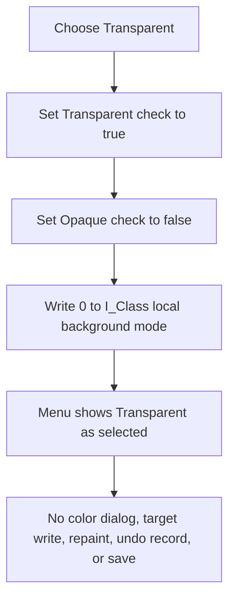

# Select a transparent background in the Interpreter editor

> Analysis status: Complete. This command selects the local transparent-background state. It does not directly change a schematic object.

## Control

| Property | Recovered value |
| --- | --- |
| Form | I_Class |
| Component path | I_Class.pmBackground.Background1.TransparentMnu |
| Control class | TMenuItem |
| Parent menu | Background |
| Caption | Transparent |
| Paired command | Opaque... |
| Handler name | TransparentMnuClick |
| Handler address | 017f2c50 |
| Graph node | `resource:dfm:I_Class/I_Class.pmBackground.Background1.TransparentMnu` |
| Handler node | `function:017f2c50` |
| Graph layer | UI |

## What happens when clicked

`FUN_017f2c50` performs three operations in order:

1. It checks the **Transparent** menu item at I_Class offset `+0x840`.
2. It clears the **Opaque...** menu item at `+0x848`.
3. It writes background mode `0` to the I_Class field at `+0xB00`.

The handler does not use the event sender. It has no selection test and no
branch for an existing schematic object. A valid I_Class form can therefore
enter this local state even when there is no selected object.

The shared `TMenuItem.SetChecked` recovery writes a menu state only when the
requested state differs from the current state. A repeated click can therefore
avoid both native menu updates, but the handler still writes `0` to `+0xB00`.
The repeated operation is idempotent.

## State and visible output

The immediate visible output is the pair of menu check marks. The DFM does not
configure the items as a radio group, so this handler sets both checks
explicitly. It does not open a dialog, invalidate a control, or request a
schematic repaint.

The paired `FUN_017f2c90` handler selects mode `1`, checks **Opaque...**, and
opens a color dialog. Transparent mode does not change the retained local
background color at `+0xB04`. If the user selects **Opaque...** later, its
dialog starts with that retained color. The border style at `+0xB08` also stays
unchanged.

The shared style initializer `FUN_017f2de0` confirms the value mapping. It maps
mode `0` to Transparent and mode `1` to Opaque. I_Class creation calls the
initializer with mode `0`, white, and no border. When the editor opens for an
existing system-text item, `FUN_0149e460` instead copies the item's background
mode, color, and border fields into the same local I_Class fields and menu
checks.

## Model, undo, and persistence boundaries

The selected system-text model has equivalent fields at `+0x99`, `+0x9C`, and
`+0xA0`. Its renderer treats model mode `0` as transparent, and its binary
writer serializes those model fields. These consumers prove the meaning of the
mode value. They do not consume the I_Class field at `+0xB00`.

The click handler does not read the selected-item reference at `+0xB58` and
does not write a model field. The recovered new-item path `FUN_017f2a50` and
the existing-item update path `FUN_017f28b0` also do not copy I_Class offsets
`+0xB00`, `+0xB04`, or `+0xB08` to a system-text object. A later target-style
change is therefore not established by the recovered source.

This command also does not:

- change the SynEdit text, selection, caret, or undo history;
- set the source editor's modified-state fields;
- create a diagram undo record or mark the schematic as modified;
- call the renderer, serializer, file-save path, or preference writer.

No confirmation or Cancel path exists. The handler has no local validation,
error message, exception handler, or rollback. It assumes that the two menu
item fields are valid. The recovered code does not define a recovery action if
a checked-state update fails.

## Click flow

## Evidence

- [Transparent handler `FUN_017f2c50`](../../../DecompiledSources/Tina16/functions/00000000017F2C50__FUN_017f2c50.c) applies the two menu checks and writes local mode `0`.
- [Opaque handler `FUN_017f2c90`](../../../DecompiledSources/Tina16/functions/00000000017F2C90__FUN_017f2c90.c) applies the inverse mode and menu checks, then executes a color dialog without restoring Transparent mode on Cancel.
- [Shared style initializer `FUN_017f2de0`](../../../DecompiledSources/Tina16/functions/00000000017F2DE0__FUN_017f2de0.c) stores the mode, color, and border values and maps mode `0` and `1` to the paired checks. Its canonical annotation belongs to `TIARA-diz.6.7.652`.
- [Selected system-text activation `FUN_0149e460`](../../../DecompiledSources/Tina16/functions/000000000149E460__FUN_0149e460.c) loads model fields `+0x99`, `+0x9C`, and `+0xA0` into the I_Class style initializer and records the selected object at `+0xB58`.
- [I_Class creation `FUN_017efdf0`](../../../DecompiledSources/Tina16/functions/00000000017EFDF0__FUN_017efdf0.c) initializes the local style as transparent, white, and borderless.
- [New-item command `FUN_017f2a50`](../../../DecompiledSources/Tina16/functions/00000000017F2A50__FUN_017f2a50.c) sends editor text, configuration data, and font data to the schematic creation path; it does not read the three local style fields.
- [Existing-item update `FUN_017f28b0`](../../../DecompiledSources/Tina16/functions/00000000017F28B0__FUN_017f28b0.c) updates editor content and font data; it does not copy the local style fields to the item.
- [Menu checked setter `FUN_007e2d20`](../../../DecompiledSources/Tina16/functions/00000000007E2D20__FUN_007e2d20.c) skips the native menu update when the requested checked state already matches.
- [System-text renderer preparation `FUN_01294700`](../../../DecompiledSources/Tina16/functions/0000000001294700__FUN_01294700.c) maps model background mode `0` to its transparent sentinel.
- [System-text binary writer `FUN_01a61fe0`](../../../DecompiledSources/Tina16/functions/0000000001A61FE0__FUN_01a61fe0.c) serializes the model mode, color, and border fields. The click handler does not call it.

## Direct calls

- `function:007e2d20` sets each menu item's checked state. The handler calls it
  once for Transparent and once for Opaque.

## Resource evidence and limits

- The recovered `TMenuItem` caption is **Transparent** under **Background**.
- The paired item caption is **Opaque...**.
- Neither item has a recovered hint, glyph, image, action, shortcut, initial
  checked value, radio-item flag, or group index.
- The original Delphi enum type name is not recovered. The paired handlers,
  shared initializer, and model renderer establish the mode values.
- No recovered reader copies I_Class offset `+0xB00` to a model object. This
  article does not infer a target change or persistence path.
