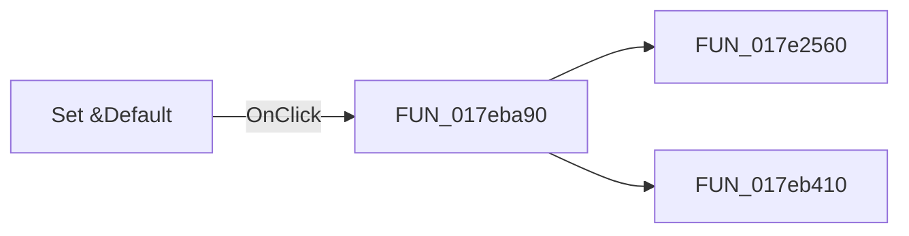

# Set &Default

> Analysis status: Pending individual source review.

## Control

| Property | Recovered value |
| --- | --- |
| Form | I_Drawing |
| Component path | I_Drawing.Default |
| Control class | TButton |
| Caption | Set &Default |
| Hint | Not present in the recovered resource. |
| Text | Not present in the recovered resource. |
| Handler name | DefaultClick |
| Handler address | 017eba90 |
| Graph node | `resource:dfm:I_Drawing/I_Drawing.Default` |
| Handler node | `function:017eba90` |
| Graph layer | UI |

## What happens when clicked

Pending individual analysis. An agent must read the recovered handler source and its relevant callees before it replaces this text.

## Click flow

## Handler evidence

- Source: [DecompiledSources/Tina16/functions/00000000017EBA90__FUN_017eba90.c](../../../DecompiledSources/Tina16/functions/00000000017EBA90__FUN_017eba90.c)
- Recovered role: Not present in the recovered resource.
- Current graph summary: Handles 1 Delphi UI event: I_Drawing.Default.OnClick.
- Current graph behavior: Not present in the recovered resource.
- Current graph evidence: Not present in the recovered resource.
- Complexity: moderate
- Distinct outgoing calls: 2

## Direct calls

- `function:017e2560` — FUN_017e2560
- `function:017eb410` — FUN_017eb410

## Resource evidence

- Kind: Not present in the recovered resource.
- Modal result: Not present in the recovered resource.
- Checked state: Not present in the recovered resource.
- List items: Not present in the recovered resource.
- Image reference: Not present in the recovered resource.
- Extracted glyph: None.

## Nearby label candidates

Nearby labels are layout candidates only. They are not proof of behavior.

- Rank 1: Interval &Subdivision at distance 483.

## Analysis limits

- Do not infer behavior from the control class, caption, hint, glyph, or nearby label alone.
- Do not replace the pending status until the handler source and relevant call path provide enough evidence.
