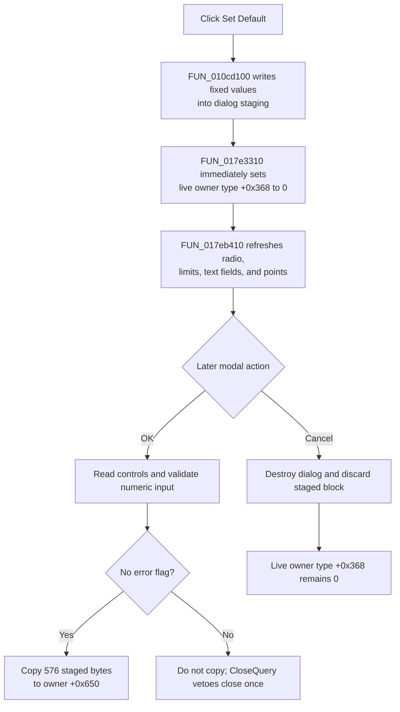

# Set &Default

> Analysis status: Source reviewed. The staged defaults, control refresh, immediate live-model type write, OK and Cancel boundaries, validation, and persistence limits are supported by recovered code.

## Control

| Property | Recovered value |
| --- | --- |
| Form | I_Drawing |
| Component path | I_Drawing.Default |
| Control class | TButton |
| Caption | Set &Default |
| Hint | Not present in the recovered resource. |
| Text | Not present in the recovered resource. |
| Handler name | DefaultClick |
| Handler address | 017eba90 |
| Graph node | `resource:dfm:I_Drawing/I_Drawing.Default` |
| Handler node | `function:017eba90` |
| Graph layer | UI |

## What happens when clicked

`FUN_017eba90` resets the Drawing Preferences dialog's staged data and then refreshes the controls from that staging block. It does not close the modal dialog.

The dialog launcher stores the active Interpreter/model pointer at form offset `+0x768` and copies 576 bytes from model offset `+0x650` into the dialog block at `+0x770`. **Set Default** passes that owner pointer and staged block to `FUN_017e2560`. This shared coordinator calls the fixed drawing-default initializer `FUN_010cd100` and then writes the new type value to the live owner field at `+0x368`.

## Default values and control refresh

The default initializer writes these visible staged values:

- Type `0`, which the dialog maps to **Lin-Lin**.
- Left limit `0` and right limit `0.00002`.
- Parameter unit `s` and result unit `V`.
- Parameter name `t` and result name `Out`.
- Interval subdivision count `100`.

It also resets several internal fields that the recovered dialog does not expose by an identified control name. The initializer writes the known preference prefix through staged offset `+0xf4`; it does not clear all 576 copied bytes. Unwritten tail data therefore remains from the dialog's initial model snapshot.

After initialization, `FUN_017eb410` applies the staged values to `rgType`, `eLLimit`, `eRLimit`, `eUPar`, `eURes`, `eNPar`, `eNRes`, and `ePoints`. The refresh formats numeric values for the edit controls and maps the internal type value to the five-item radio group. It does not read user input, validate a value, close the dialog, copy the full staging block to the owner, render a diagram, or persist settings.

## Immediate effect and OK/Cancel interaction

Most changes remain staged until **OK**. The exception is the owner field at `+0x368`: `FUN_017e2560` immediately sets it to the staged default type `0`. The recovered setter performs one field write and does not call a renderer or notification method. No global variable is changed in this path.

The later modal actions have different boundaries:

- **OK** reads the radio selection, both limits, four text values, and subdivision count back into the staged block. If input conversion reports no error, it copies all 576 staged bytes to owner offset `+0x650`. The type `0` written earlier at owner `+0x368` already remains in place.
- **Cancel** has no click handler and does not copy the staged block to owner `+0x650`. The launcher destroys the modal dialog after it returns. Cancel does not restore the separate owner `+0x368` field, so a Set Default followed by Cancel can still leave the live type value at `0`. If a numeric edit has already set the dialog error flag, `FormCloseQuery` can veto that first Cancel attempt and clears the flag for a later close attempt.

This non-rollback is visible only in the live owner instance. The handler does not save a file, write the registry, set the Interpreter editor's Modified flag, or update a recent-item list.

## Validation and errors

Set Default writes fixed values directly, so it does not call the numeric edit readers or their OnError handlers. Validation happens when **OK** reads the controls, or when a numeric edit itself reports an error. The shared error helper shows the supplied error text once and sets form flag `+0x9b0`. OK does not copy staging to the owner while that flag is set. `FormCloseQuery` then vetoes the close once and clears the flag for a later attempt.

The Default handler has no null guard, exception handler, status result, or rollback. It assumes that the launcher initialized the owner pointer and controls. An exception in the default coordinator after the live type write, or in the later control refresh, can leave type `0` applied with only some controls refreshed. No handler-local error dialog covers that failure path.

## Click flow

## Handler evidence

- Source: [DecompiledSources/Tina16/functions/00000000017EBA90__FUN_017eba90.c](../../../DecompiledSources/Tina16/functions/00000000017EBA90__FUN_017eba90.c)
- Drawing-default coordinator: [DecompiledSources/Tina16/functions/00000000017E2560__FUN_017e2560.c](../../../DecompiledSources/Tina16/functions/00000000017E2560__FUN_017e2560.c)
- Fixed drawing defaults: [DecompiledSources/Tina16/functions/00000000010CD100__FUN_010cd100.c](../../../DecompiledSources/Tina16/functions/00000000010CD100__FUN_010cd100.c)
- Live owner type setter: [DecompiledSources/Tina16/functions/00000000017E3310__FUN_017e3310.c](../../../DecompiledSources/Tina16/functions/00000000017E3310__FUN_017e3310.c)
- Dialog control refresh: [DecompiledSources/Tina16/functions/00000000017EB410__FUN_017eb410.c](../../../DecompiledSources/Tina16/functions/00000000017EB410__FUN_017eb410.c)
- Dialog staging setup: [DecompiledSources/Tina16/functions/00000000017EBB80__FUN_017ebb80.c](../../../DecompiledSources/Tina16/functions/00000000017EBB80__FUN_017ebb80.c)
- OK collection and commit: [DecompiledSources/Tina16/functions/00000000017EB7F0__FUN_017eb7f0.c](../../../DecompiledSources/Tina16/functions/00000000017EB7F0__FUN_017eb7f0.c)
- Error and close veto: [DecompiledSources/Tina16/functions/00000000017EBAE0__FUN_017ebae0.c](../../../DecompiledSources/Tina16/functions/00000000017EBAE0__FUN_017ebae0.c), [DecompiledSources/Tina16/functions/00000000017EBAC0__FUN_017ebac0.c](../../../DecompiledSources/Tina16/functions/00000000017EBAC0__FUN_017ebac0.c)
- Recovered role: Reset Drawing Preferences staging to fixed defaults and refresh its controls.
- Current graph summary: Handles 1 Delphi UI event: I_Drawing.Default.OnClick.
- Current graph behavior: Initializes the staged drawing fields, immediately sets the live owner type to `0`, and reloads the dialog controls without closing or persisting.
- Current graph evidence: The DFM binds `DefaultClick` to `017eba90`; the handler passes owner `+0x768` and staging `+0x770` to `017e2560`, then passes the form to `017eb410`.
- Complexity: moderate
- Distinct outgoing calls: 2

## Direct calls

- `function:017e2560` — FUN_017e2560
- `function:017eb410` — FUN_017eb410

## Resource evidence

- Kind: Not present in the recovered resource.
- Modal result: Not present in the recovered resource.
- Checked state: Not present in the recovered resource.
- List items: Not present in the recovered resource.
- Image reference: Not present in the recovered resource.
- Extracted glyph: None.

## Nearby label candidates

Nearby labels are layout candidates only. They are not proof of behavior.

- Rank 1: Interval &Subdivision at distance 483.

## Analysis limits

- `TIARA-diz.6.7.665` owns the OK validation and staged copy-back path. This article cites it to define the Default-to-OK boundary without redefining its graph annotations.
- `TIARA-diz.6.7.666` owns the radio-group type-change path. The Default refresh selects Lin-Lin through the shared control setter but does not directly call that event handler.
- The launcher from `TIARA-diz.6.7.648` supplies the live owner and initial staging snapshot. It is citation-only here.
- The original names of owner field `+0x368`, the staged block type, and the hidden defaulted fields are not recovered. Their roles are limited to the observed writes and consumers.
- The nearby **Interval Subdivision** label is not evidence for the button by proximity; the default initializer and explicit `ePoints` refresh prove the value `100`.
