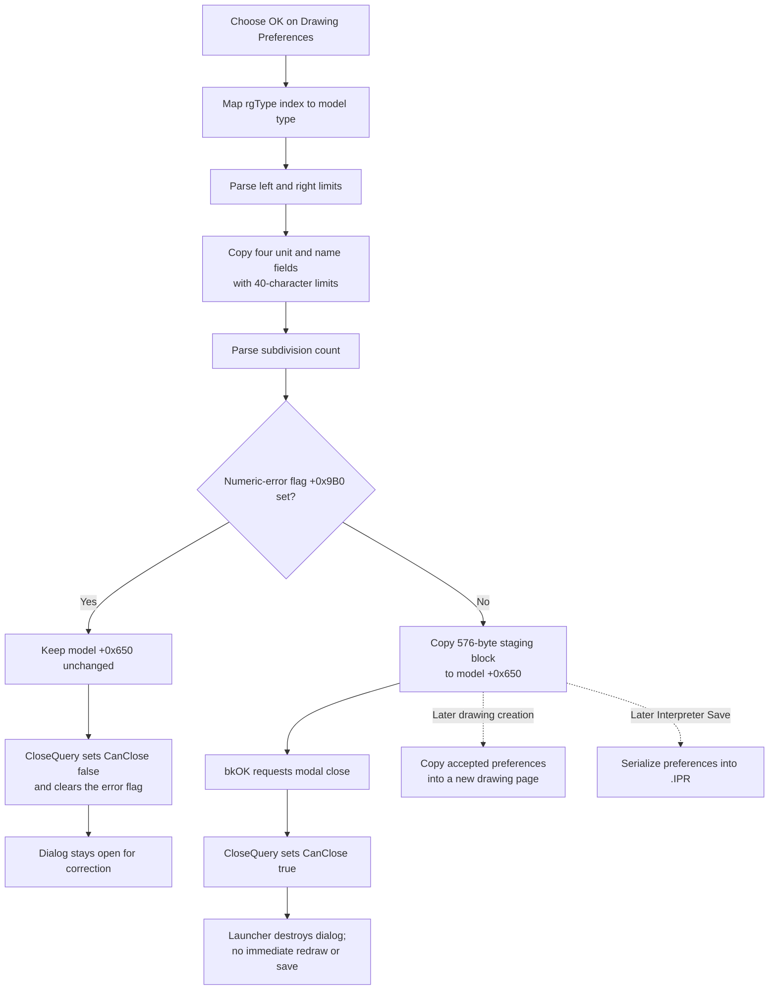

# Validate and commit Interpreter drawing preferences

> Analysis status: Complete. The recovered OK handler, numeric-error callbacks, close-query gate, staged-record initializer, type and default handlers, later drawing-page consumer, and Interpreter save path support this explanation.

## Control

| Property | Recovered value |
| --- | --- |
| Form | I_Drawing |
| Form caption | Drawing Preferences |
| Component path | I_Drawing.OKBtn |
| Control class | TBitBtn |
| Stored caption | Not present; `Kind = bkOK` supplies the standard OK action. |
| Kind | bkOK |
| Tab order | 0 |
| Handler name | OKBtnClick |
| Handler address | 017eb7f0 |
| Graph node | `resource:dfm:I_Drawing/I_Drawing.OKBtn` |
| Handler node | `function:017eb7f0` |
| Graph layer | UI |

## What happens when selected

`FUN_017eb7f0` rebuilds the dialog's 576-byte drawing-preference record from the current controls and conditionally commits it to the active Interpreter model.

1. It reads `rgType.ItemIndex`. `FUN_017eb400` maps radio indexes `0, 1, 2, 3, 4` to model drawing types `0, 1, 2, 3, 5`. Type `4` has no radio item in this dialog.
2. It parses the left and right limit editors as floating-point values and stores them at dialog offsets `+0x840` and `+0x848`.
3. It reads the four unit and name editors. Each value is converted through a temporary 255-character buffer and copied into its fixed field with a 40-character limit.
4. It parses the interval subdivision editor as an integer and stores it at `+0x850`.
5. If the numeric-error flag at `+0x9B0` is clear, it copies all 576 bytes from dialog staging at `+0x770` to the model at `+0x650`. If the flag is set, it skips the complete model copy.

The handler does not compare the left limit with the right limit. It relies on the numeric edit controls and their error events for format and configured-range checks. It also does not validate an unexpected radio index. The recovered five-item radio group normally keeps the index in its valid range.

## Staged record and committed model fields

| Control | Dialog staging | Committed model field | Meaning |
| --- | --- | --- | --- |
| `rgType` | `+0x770` | `+0x650` | Drawing type |
| `eUPar` | `+0x771` | `+0x651` | Parameter unit, up to 40 characters |
| `eURes` | `+0x79A` | `+0x67A` | Result unit, up to 40 characters |
| `eNPar` | `+0x7C3` | `+0x6A3` | Parameter name, up to 40 characters |
| `eNRes` | `+0x7EC` | `+0x6CC` | Result name, up to 40 characters |
| `eLLimit` | `+0x840` | `+0x720` | Left limit |
| `eRLimit` | `+0x848` | `+0x728` | Right limit |
| `ePoints` | `+0x850` | `+0x730` | Interval subdivision count |

The initializer `FUN_017ebb80` copied the model's complete block into staging before the dialog opened. OK replaces the listed staged fields from the current controls, preserves the other staged fields, and commits the full block as one memory copy.

## Numeric errors and modal close query

The two floating-point controls route `OnError` through `FUN_017ebb40`; the integer control uses `FUN_017ebb60`. Both wrappers pass the control's error text to `FUN_017ebae0`.

The error aggregator displays only the first error while flag `+0x9B0` is clear, then sets the flag. Further numeric errors in the same close attempt do not open additional messages. The OK handler still refreshes its dialog staging fields, but the set flag prevents the model copy.

Because the button is `bkOK`, the VCL modal-button behavior requests an accepted modal close after the click handler. `FUN_017ebac0`, the form's `OnCloseQuery` handler, performs the final gate:

- A clear error flag sets `CanClose` to true. The committed model block remains in place and the dialog closes.
- A set error flag sets `CanClose` to false, so the dialog stays open. The close query then clears the flag for the next correction and retry.

The commit occurs before the close request and close query. The recovered dialog has no additional acceptance copy after it closes, and its launcher ignores the returned modal result.

## Drawing type and Set Default interaction

The radio group contains `Lin-Lin`, `Log-Lin`, `Bode`, `Amplitude & Phase`, and `Fourier`. Its click handler loads type-specific values into the controls. Fourier disables both limit editors; the other types enable them. These control changes do not reach model block `+0x650` until a validated OK click rebuilds and commits staging.

**Set Default** has a separate immediate side effect. Its helper overwrites the known staging prefix through relative offset `+0xF4` and refreshes the controls with factory values: Lin-Lin, parameter unit `s`, result unit `V`, parameter name `t`, result name `Out`, limits `0` to `2e-5`, and `100` subdivisions. It does not clear the remaining bytes of the 576-byte staging block. The default coordinator also writes type `0` to the model's separate active-drawing-type field at `+0x368` immediately.

OK itself does not call that active-type writer. It commits the preference type inside model block `+0x650`, but does not directly change model field `+0x368`. Therefore:

- Normal type changes followed by OK update the preference block, not the separate active-type field.
- Set Default followed by OK commits the factory-populated fields together with the preserved remainder of staging, and leaves active type `0`.
- Set Default followed by another type selection and OK can commit that selected type to `+0x650` while the earlier active-type side effect remains `0` until another recovered consumer changes it.

## Cancel and other close paths

`CancelBtn` is a standard `bkCancel` button with no custom click handler. A normal Cancel closes the modal dialog without running `FUN_017eb7f0`, so the staged block is discarded and model block `+0x650` stays unchanged.

The close query does not distinguish OK, Cancel, or the window close command. If a numeric error has already set `+0x9B0`, the next close request is vetoed once and clears the flag. A later Cancel can then close the dialog. Cancel does not undo the separate active-type write caused by Set Default.

## OK and validation flow

## Downstream rendering and persistence

OK does not redraw an existing diagram or create a drawing page. `FUN_017e4620` consumes the accepted model block later. When it creates a drawing page, it copies all 576 preference bytes from model `+0x650` to the page record at `+0x68`. If it reuses a page whose stored curve type differs from the current preference type, it raises `Curve type mismatch` instead of silently replacing the page type. Later drawing instructions can also replace these defaults before page creation.

The commit is an in-memory model change. It does not write an INI file, registry value, circuit, or `.ipr` file. It also does not call the recovered SynEdit modified-state setter. A later Interpreter Save serializes the model's drawing block into the `.IPR` file. A preference-only change does not itself create the editor's unsaved-text prompt, so persistence requires a later explicit or otherwise reached Save path.

## Error and partial-state behavior

- A reported numeric error prevents the complete 576-byte model copy. The close-query veto keeps the dialog available for correction.
- The handler has no application-side check for `left < right`, zero subdivisions, or an unexpected radio index beyond the numeric controls' own configured validation.
- The four text fields are limited during fixed-buffer copying. Excess input is truncated to the recovered 40-character field capacity; there is no warning in this handler.
- The handler assumes that `FUN_017ebb80` supplied a valid model pointer at `+0x768`. It has no null-target guard.
- There is no transaction or rollback around the model copy. An exception after some copy iterations or during the later modal-close pipeline can leave the model already changed. The handler has no local exception dialog or retry.
- A successful commit does not produce confirmation or inspect a persistence result. Later drawing-page and file-save failures belong to those later operations.

## Source and graph evidence

- OK handler and conditional 576-byte commit: [FUN_017eb7f0](../../../DecompiledSources/Tina16/functions/00000000017EB7F0__FUN_017eb7f0.c)
- Model-to-dialog snapshot: [FUN_017ebb80](../../../DecompiledSources/Tina16/functions/00000000017EBB80__FUN_017ebb80.c)
- Drawing type index mapper: [FUN_017eb400](../../../DecompiledSources/Tina16/functions/00000000017EB400__FUN_017eb400.c)
- Floating-point and integer value readers: [FUN_00b90090](../../../DecompiledSources/Tina16/functions/0000000000B90090__FUN_00b90090.c) and [FUN_00f04d50](../../../DecompiledSources/Tina16/functions/0000000000F04D50__FUN_00f04d50.c)
- Numeric error wrappers and shared aggregator: [FUN_017ebb40](../../../DecompiledSources/Tina16/functions/00000000017EBB40__FUN_017ebb40.c), [FUN_017ebb60](../../../DecompiledSources/Tina16/functions/00000000017EBB60__FUN_017ebb60.c), and [FUN_017ebae0](../../../DecompiledSources/Tina16/functions/00000000017EBAE0__FUN_017ebae0.c)
- First-error message and flag helper: [FUN_01b1cf30](../../../DecompiledSources/Tina16/functions/0000000001B1CF30__FUN_01b1cf30.c)
- Modal close-query gate: [FUN_017ebac0](../../../DecompiledSources/Tina16/functions/00000000017EBAC0__FUN_017ebac0.c)
- Radio-type handler and type-specific control loader: [FUN_017eba20](../../../DecompiledSources/Tina16/functions/00000000017EBA20__FUN_017eba20.c) and [FUN_017eb590](../../../DecompiledSources/Tina16/functions/00000000017EB590__FUN_017eb590.c)
- Set Default handler, coordinator, and active-type writer: [FUN_017eba90](../../../DecompiledSources/Tina16/functions/00000000017EBA90__FUN_017eba90.c), [FUN_017e2560](../../../DecompiledSources/Tina16/functions/00000000017E2560__FUN_017e2560.c), and [FUN_017e3310](../../../DecompiledSources/Tina16/functions/00000000017E3310__FUN_017e3310.c)
- Dialog control loader: [FUN_017eb410](../../../DecompiledSources/Tina16/functions/00000000017EB410__FUN_017eb410.c)
- I_Class launcher: [FUN_017efb70](../../../DecompiledSources/Tina16/functions/00000000017EFB70__FUN_017efb70.c)
- Later drawing-page consumer: [FUN_017e4620](../../../DecompiledSources/Tina16/functions/00000000017E4620__FUN_017e4620.c)
- Later Interpreter save serializer: [FUN_017ef620](../../../DecompiledSources/Tina16/functions/00000000017EF620__FUN_017ef620.c)

The graph classifies `FUN_017eb7f0` as complex with eight distinct outgoing calls. Its application entry is the recovered `I_Drawing.OKBtn.OnClick` trigger.

## Resource evidence

- The DFM binds `I_Drawing.OKBtn.OnClick` to `OKBtnClick` at `017eb7f0`.
- `OKBtn` is a `TBitBtn` with `Kind = bkOK`, tab order `0`, and `NumGlyphs = 2`. The stored resource has no separate caption, hint, action, image reference, or extracted `Glyph.Data`.
- `CancelBtn` has `Kind = bkCancel` and no custom click event.
- `rgType` supplies five text items: `Lin-Lin`, `Log-Lin`, `Bode`, `Amplitude & Phase`, and `Fourier`.
- The nearby `Interval &Subdivision` label describes `ePoints`; proximity to OK does not establish OK behavior.

## Analysis and annotation ownership

- This article owns `FUN_017eb7f0`, `FUN_017ebac0`, and `FUN_017ebae0`.
- The `rgType` analysis `TIARA-diz.6.7.666` owns type mapping and type-specific control helpers `FUN_017eb400`, `FUN_017eba20`, and `FUN_017eb590`.
- The Set Default analysis `TIARA-diz.6.7.664` owns its handler, default initializer and coordinator, and control refresh. This article cites the active-type writer `FUN_017e3310` without annotating it.
- Launcher analysis `TIARA-diz.6.7.648` owns only `FUN_017efb70`. This article cites the launcher without redefining it.
- Generic edit readers, fixed-buffer string helpers, the shared first-error message helper, drawing-page creation, and persistence functions remain evidence-only here.
