# Type

> Analysis status: Source reviewed. The radio-to-model type mapping, preset values, initialization guard, enabled state, staging boundary, and later OK, Cancel, and persistence effects are supported by recovered code.

## Control

| Property | Recovered value |
| --- | --- |
| Form | I_Drawing |
| Component path | I_Drawing.rgType |
| Control class | TRadioGroup |
| Caption | Type  |
| Hint | Not present in the recovered resource. |
| Text | Not present in the recovered resource. |
| Handler name | rgTypeClick |
| Handler address | 017eba20 |
| Graph node | `resource:dfm:I_Drawing/I_Drawing.rgType` |
| Handler node | `function:017eba20` |
| Graph layer | UI |

## What happens when clicked

`FUN_017eba20` converts the selected radio item to the drawing type used by the model. It then replaces the dialog controls with the preset for that type family. The handler does not update the staged 576-byte preference record or the live model. It also does not close the dialog.

The five visible items map as follows:

| Radio index | Item | Internal type |
| ---: | --- | ---: |
| 0 | Lin-Lin | 0 |
| 1 | Log-Lin | 1 |
| 2 | Bode | 2 |
| 3 | Amplitude & Phase | 3 |
| 4 | Fourier | 5 |

`FUN_017eb400` adds one only when the radio index is greater than 3. Internal type `4` is therefore not selectable in this dialog.

## Presets and enabled state

Every user selection replaces both limit edits, all four text edits, and the interval-subdivision edit. Unsaved text or numbers in those controls are lost when another type is selected.

| Selected type | Left limit | Right limit | Parameter unit | Result unit | Parameter name | Result name | Subdivisions |
| --- | ---: | ---: | --- | --- | --- | --- | ---: |
| Lin-Lin or Log-Lin | 0 | 0.00002 | `s` | `V` | `t` | `Out` | 100 |
| Bode, Amplitude & Phase, or Fourier | 10000 | 1000000 | `Hz` | `dB\|deg` | `s` | `Out` | 100 |

For internal types 0 through 3, the handler enables both limit edits. For Fourier, internal type 5, it disables both limit edits after it loads the frequency preset. It does not change the visibility of a control. The other text and subdivision controls remain in their existing enabled state.

## Initialization guard

`FormCreate` clears byte `+0x9b1`. The launcher then copies the current 576-byte preference record to dialog staging and loads its fields into the controls. If setting `rgType.ItemIndex` generates an OnClick event during this load, the cleared byte makes `FUN_017eba20` a no-op. This prevents the current stored values from being replaced by a preset while the dialog initializes.

`FormShow` sets `+0x9b1` and applies only the limit-edit enabled state for the current type. It does not call the preset loader. The dialog therefore opens with the saved limits and text, including non-preset values, while later user clicks load the fixed presets.

## OK, Cancel, errors, and persistence

The type click changes controls only. **OK** later reads the selected type, limits, four text fields, and subdivision count into dialog staging. If no edit has reported a conversion error, OK copies all 576 staged bytes to model offset `+0x650`. Fourier's disabled limit edits are still read by OK, so their 10000 and 1000000 preset values are committed.

If numeric conversion reports an error, OK does not copy the staging block. `FormCloseQuery` vetoes that close attempt and clears the error flag so that the user can correct the input. The radio handler does not parse input, set the error flag, show an error message, or provide a rollback path for the control values it replaces.

**Cancel** is the standard `bkCancel` button and has no custom click handler. It bypasses OK, the modal dialog is destroyed, and the type and preset changes remain uncommitted. By contrast, [Set Default](default-65f116ea69.md) also writes a separate live-model type field immediately; this radio handler does not.

After a successful OK, later drawing creation can copy the accepted preferences into a drawing page. A later Interpreter Save can write them to an `.IPR` file. This click does not redraw a page, mark the editor modified, or write a file, registry value, or preference store.

## Click flow

```mermaid
flowchart TD
    select["Select a Type radio item"] --> guard{"Initialization guard +0x9b1 set?"}
    guard -->|No| noop["Return without changing controls"]
    guard -->|Yes| map["Map indices 0..3 unchanged;<br/>map Fourier index 4 to type 5"]
    map --> family{"Type family"}
    family -->|Lin-Lin or Log-Lin| time["Load 0..0.00002, s, V,<br/>t, Out, and 100"]
    family -->|Bode, Amplitude and Phase, or Fourier| freq["Load 10000..1000000, Hz,<br/>literal dB&#124;deg, s, Out, and 100"]
    time --> enable["Enable both limit edits"]
    freq --> fourier{"Internal type is 5?"}
    fourier -->|No| enable
    fourier -->|Yes| disable["Disable both limit edits"]
    enable --> wait["Wait for OK or Cancel"]
    disable --> wait
    wait -->|OK and valid| commit["Read controls and copy 576 staged bytes<br/>to model +0x650"]
    wait -->|OK with numeric error| veto["Do not copy; veto close once"]
    wait -->|Cancel| discard["Destroy dialog; discard control changes"]
```

## Handler evidence

- [Type click handler `FUN_017eba20`](../../../DecompiledSources/Tina16/functions/00000000017EBA20__FUN_017eba20.c) checks the initialization byte, maps `ItemIndex`, loads a preset, and sets both limit edits enabled unless the internal type is 5.
- [Type mapper `FUN_017eb400`](../../../DecompiledSources/Tina16/functions/00000000017EB400__FUN_017eb400.c) maps visible index 4 to internal type 5 and leaves indices 0 through 3 unchanged.
- [Preset loader `FUN_017eb590`](../../../DecompiledSources/Tina16/functions/00000000017EB590__FUN_017eb590.c) writes the two proven preset families to the identified controls.
- [FormCreate guard initializer `FUN_017eb770`](../../../DecompiledSources/Tina16/functions/00000000017EB770__FUN_017eb770.c) clears `+0x9b1`.
- [FormShow state initializer `FUN_017eb780`](../../../DecompiledSources/Tina16/functions/00000000017EB780__FUN_017eb780.c) sets the guard and applies the Fourier limit-edit rule without loading a preset.
- [Dialog staging setup `FUN_017ebb80`](../../../DecompiledSources/Tina16/functions/00000000017EBB80__FUN_017ebb80.c) copies the model record to dialog staging before the modal session.
- [Control loader `FUN_017eb410`](../../../DecompiledSources/Tina16/functions/00000000017EB410__FUN_017eb410.c) loads staged values into the radio group, limits, text controls, and subdivision control.
- [OK handler `FUN_017eb7f0`](../../../DecompiledSources/Tina16/functions/00000000017EB7F0__FUN_017eb7f0.c) proves that the selected type and current control values are collected and conditionally copied to the model.
- [Close-query handler `FUN_017ebac0`](../../../DecompiledSources/Tina16/functions/00000000017EBAC0__FUN_017ebac0.c) proves the error-flag close veto.
- [Drawing Preferences launcher article](../i-class/midrawing-43ec886b05.md) documents the caller, later consumer, and `.IPR` persistence boundary.
- Recovered role: Select a drawing type and load its control preset in Drawing Preferences.
- Current graph summary: Handles 1 Delphi UI event: I_Drawing.rgType.OnClick.
- Current graph behavior: Maps the five radio items to internal types 0, 1, 2, 3, and 5; loads a type-family preset; and disables both limit edits only for Fourier.
- Current graph evidence: The DFM binds `rgTypeClick` to `017eba20`; its source reads the radio group's `ItemIndex`, calls the mapper and preset loader, and invokes each limit edit's enabled setter.
- Complexity: moderate
- Distinct outgoing calls: 2

## Direct calls

- `function:017eb400` — Map the radio index to the internal drawing type.
- `function:017eb590` — Load the selected type family's controls with fixed values.

## Resource evidence

- Kind: Not present in the recovered resource.
- Modal result: Not present in the recovered resource.
- Checked state: Not present in the recovered resource.
- List items: (`&Lin-Lin`, `Lo&g-Lin`, `&Bode`, `A&mplitude && Phase`, `&Fourier`)
- Image reference: Not present in the recovered resource.
- Extracted glyph: None.

## Nearby label candidates

Nearby labels are layout candidates only. They are not proof of behavior.

- Rank 1: Interval &Subdivision at distance 136.

## Analysis limits

- `TIARA-diz.6.7.664` owns the Set Default initializer and control-loader annotations. This article cites those paths only to contrast their state boundaries.
- `TIARA-diz.6.7.665` owns OK validation, copy-back, error, and close-veto annotations. This article cites those paths only to establish when radio-control changes become model changes.
- `TIARA-diz.6.7.648` owns the launcher and later consumer context. It is citation-only here.
- The original Delphi record type and field names are not recovered. The article uses control identity, offsets, values, and proven consumers instead.
- The frequency preset result unit is the literal `dB|deg`. The delimiter's display meaning is not recovered, so the article does not assign it to one selected type or call it a user choice.
- Internal type 4 is skipped by this dialog's mapper. Its meaning is not recovered from this control path.
