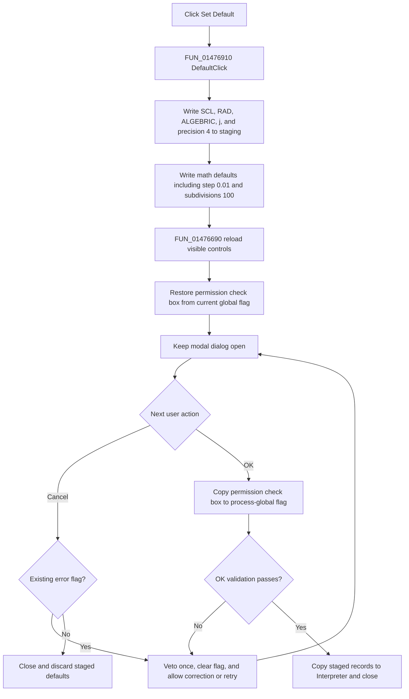

# Set the numerical-format defaults

> Analysis status: Complete source review.

## Control

| Property | Recovered value |
| --- | --- |
| Form | I_NumFDlg |
| Form caption | Numerical format & Precisions |
| Component path | I_NumFDlg.Default |
| Control class | TButton |
| Caption | Set &Default |
| Handler name | DefaultClick |
| Handler address | 01476910 |
| Graph node | `resource:dfm:I_NumFDlg/I_NumFDlg.Default` |
| Handler node | `function:01476910` |
| Graph layer | UI |

The button has no recovered hint, image, glyph, checked state, modal result, or
list data. It is a normal `TButton`, not an OK or Cancel button. Clicking it
does not close the modal dialog.

## Staged defaults

`FUN_01476910` replaces two dialog-local staging records and then calls the
shared control refresh function. It does not write the bound Interpreter model
at dialog field `+0x760`.

The visible staged defaults are:

| Setting | Default |
| --- | --- |
| Numerical format | SCL |
| Angle | RAD |
| Complex format | ALGEBRIC |
| Imaginary-unit name | j |
| Displayed precision | 4 |
| Step (diff.) | 0.01 |
| Interv. subdivision (integr.) | 100 |

The numerical record at dialog offset `+0x738` receives the four radio indexes
and precision. The math record at `+0x740` receives the visible differentiation
step and integration subdivision count. It also receives three recovered
internal values: double `0.00002`, integer `100`, and byte `0`. These values
are staged at `+0x750` through `+0x75c`. The dialog has no separate controls or
recovered Delphi field names for them.

`FUN_01476690` then reloads the four radio groups, displayed precision,
differentiation step, and integration subdivision controls from staging. A
repeat click writes the same defaults and reloads the same controls. There is
no unchanged-value no-op branch.

## Component-value permission

**Enable modifying component values** is not part of either staged default
record. The refresh function reads the current process-global flag and assigns
that value to the check box.

Therefore, Set Default does not change the global permission. If the user
changed only the check box before clicking Set Default, the refresh discards
that pending check-box edit and restores the current global value in the
control. No new default permission is selected.

## OK, Cancel, and validation

Set Default itself does not validate or commit the values. The dialog stays
open so the user can edit them further.

- **OK** reads the controls back into staging. It writes the component-value
  check box to the process-global flag before its validation guard. If the
  dialog error flag is clear, it copies the staged numerical and math records
  to the bound Interpreter.
- **Cancel** closes without copying the staged default records to the
  Interpreter. The dialog object and its staging fields are then discarded.
- Displayed precision above 12 and custom edit-control errors use the dialog
  error flag at `+0x768`. The default values are within the recovered checks,
  so this click does not create a new validation error.
- Set Default does not clear a validation error that was already active. The
  next close attempt can still be vetoed once by `FormCloseQuery`; that query
  clears the flag so the user can retry.

The outer `I_Class` numerical-format command does not inspect the modal result.
After either OK or Cancel, it rebuilds the Interpreter symbol-list text. Only a
valid OK changes the Interpreter numerical and math records. This Default
handler does not rename the imaginary symbol or rebuild the symbol list while
the dialog remains open.

## Runtime effects and persistence

There is no immediate formatting, calculation, source-editor, or runtime
execution effect. After a valid OK, later Interpreter operations use the
committed values for numerical formatting, complex display, angle units,
differentiation, and integration.

This click does not set `I_Class.Edit.Modified`. It writes no IPR file, INI
file, registry value, or project setting. A later explicit Interpreter Save
serializes numerical and math records that were committed by OK. Cancel after
Set Default leaves those saved-model inputs unchanged.

The process-global component-value permission also remains unchanged by Set
Default. A later OK can change it, but the Default handler does not call the
application settings writer.

## Error and partial-state behavior

`FUN_01476910` and the control refresh have no local exception handler or
rollback.

- The numerical staging record is replaced before the math staging record.
- Both staging records are replaced before the controls are refreshed.
- If a control assignment raises, staging already contains defaults and some
  controls can already show their new values. The handler does not restore the
  earlier staged or visible values before the exception propagates.
- The handler assumes the dialog controls and staging fields are valid. It has
  no null guard or error-message path.

No model or persistent state is partly committed by this click because it does
not write the bound Interpreter or the global permission flag.

## Click flow

## Source evidence

- Default handler: [FUN_01476910](../../../DecompiledSources/Tina16/functions/0000000001476910__FUN_01476910.c)
- Numerical-record default initializer: [FUN_010cd0b0](../../../DecompiledSources/Tina16/functions/00000000010CD0B0__FUN_010cd0b0.c)
- Math-record default initializer: [FUN_010cd0d0](../../../DecompiledSources/Tina16/functions/00000000010CD0D0__FUN_010cd0d0.c)
- Dialog control refresh: [FUN_01476690](../../../DecompiledSources/Tina16/functions/0000000001476690__FUN_01476690.c)
- Dialog staging initializer: [FUN_01476a00](../../../DecompiledSources/Tina16/functions/0000000001476A00__FUN_01476a00.c)
- OK validation and commit: [FUN_01476770](../../../DecompiledSources/Tina16/functions/0000000001476770__FUN_01476770.c)
- Close-query veto and retry: [FUN_01476940](../../../DecompiledSources/Tina16/functions/0000000001476940__FUN_01476940.c)
- Owning Interpreter menu command: [FUN_017efab0](../../../DecompiledSources/Tina16/functions/00000000017EFAB0__FUN_017efab0.c)
- Canonical numerical-format analysis: [minumericalformat-bb51f66c1a.md](../i-class/minumericalformat-bb51f66c1a.md)
- Recovered form and control evidence: [ui-evidence.json](../../../DecompiledSources/Tina16/resources/dfm/ui-evidence.json)

The graph classifies `FUN_01476910` as a complex function in the `UI` layer
with three distinct direct calls. The resource binds this handler to **Set
Default** and identifies all visible target controls.

## Analysis ownership

- `.649` owns `FUN_01476910`; this fragment repeats its complete canonical
  annotation exactly because the current control binds directly to it.
- `.649` also owns dialog initializer `FUN_01476a00`, control refresh
  `FUN_01476690`, OK commit `FUN_01476770`, error adapter `FUN_01476960`,
  CloseQuery `FUN_01476940`, the outer menu handler, and the imaginary-symbol
  rename helper. They are cited and omitted here.
- Shared default initializers, runtime consumers, serializers, global settings
  services, VCL controls, and generic validation helpers remain evidence-only.

## Analysis limits

- The recovered source gives exact values for the three internal math defaults,
  but it does not expose their original Delphi field names or individual
  controls. This article records their values without inventing meanings.
- The source proves that refresh assigns the permission check box from the
  process-global flag. It does not identify a separate default for that option.
