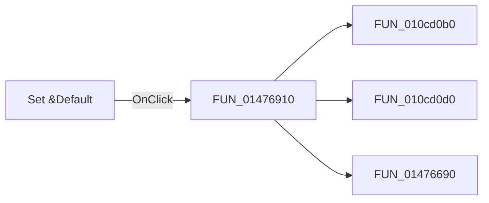

# Set &Default

> Analysis status: Pending individual source review.

## Control

| Property | Recovered value |
| --- | --- |
| Form | I_NumFDlg |
| Component path | I_NumFDlg.Default |
| Control class | TButton |
| Caption | Set &Default |
| Hint | Not present in the recovered resource. |
| Text | Not present in the recovered resource. |
| Handler name | DefaultClick |
| Handler address | 01476910 |
| Graph node | `resource:dfm:I_NumFDlg/I_NumFDlg.Default` |
| Handler node | `function:01476910` |
| Graph layer | UI |

## What happens when clicked

Pending individual analysis. An agent must read the recovered handler source and its relevant callees before it replaces this text.

## Click flow

## Handler evidence

- Source: [DecompiledSources/Tina16/functions/0000000001476910__FUN_01476910.c](../../../DecompiledSources/Tina16/functions/0000000001476910__FUN_01476910.c)
- Recovered role: Not present in the recovered resource.
- Current graph summary: Handles 1 Delphi UI event: I_NumFDlg.Default.OnClick.
- Current graph behavior: Not present in the recovered resource.
- Current graph evidence: Not present in the recovered resource.
- Complexity: complex
- Distinct outgoing calls: 3

## Direct calls

- `function:010cd0b0` — FUN_010cd0b0
- `function:010cd0d0` — FUN_010cd0d0
- `function:01476690` — FUN_01476690

## Resource evidence

- Kind: Not present in the recovered resource.
- Modal result: Not present in the recovered resource.
- Checked state: Not present in the recovered resource.
- List items: Not present in the recovered resource.
- Image reference: Not present in the recovered resource.
- Extracted glyph: None.

## Nearby label candidates

Nearby labels are layout candidates only. They are not proof of behavior.

- Rank 1: &Step (diff.) at distance 381.
- Rank 2: Displa&yed precision at distance 411.
- Rank 3: &Interv. subdivison (integr.) at distance 482.

## Analysis limits

- Do not infer behavior from the control class, caption, hint, glyph, or nearby label alone.
- Do not replace the pending status until the handler source and relevant call path provide enough evidence.
