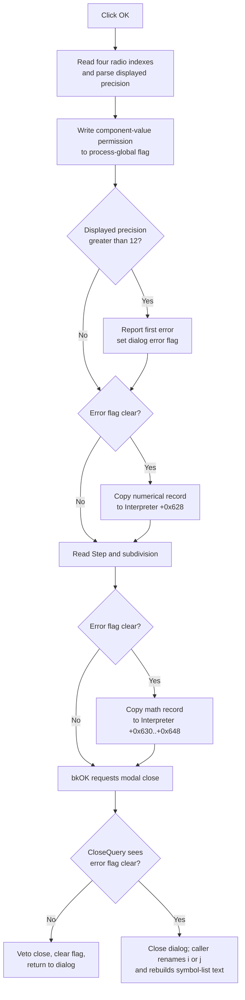

# Validate and commit Interpreter numerical settings

> Analysis status: Complete for the recovered control boundary. The control-to-staging mapping, commit order, explicit precision limit, close veto, Cancel contrast, partial-change boundaries, downstream consumers, and later persistence paths are recovered.

## Control

| Property | Recovered value |
| --- | --- |
| Form | I_NumFDlg |
| Form caption | Numerical format & Precisions |
| Component path | I_NumFDlg.OKBtn |
| Control class | TBitBtn |
| Kind | bkOK |
| Handler name | OKBtnClick |
| Handler address | 01476770 |
| Graph node | `resource:dfm:I_NumFDlg/I_NumFDlg.OKBtn` |
| Handler node | `function:01476770` |
| Graph layer | UI |

The resource has no explicit caption, hint, image reference, or extracted glyph for this button. Its `bkOK` kind supplies the standard dialog acceptance behavior. The application-specific work is established by `OKBtnClick`, the form controls, and the caller that supplies the target Interpreter.

## Values read by OK

The dialog initializer has already copied the target Interpreter record to dialog staging. OK replaces the visible parts of that staging record from these controls:

| Dialog control | Recovered value | Staging field | Accepted Interpreter field |
| --- | --- | --- | --- |
| NumericF | SCL, FIX, or EXP item index | byte `+0x738` | byte `+0x628` |
| Angle | DEG or RAD item index | byte `+0x739` | byte `+0x629` |
| ComplexF | ALGEBRIC or POLAR item index | byte `+0x73A` | byte `+0x62A` |
| Imaginary | i or j item index | byte `+0x73B` | byte `+0x62B` |
| Displayed | displayed-precision integer | integer `+0x73C` | integer `+0x62C` |
| E_Diff | differentiation step | double `+0x740` | double `+0x630` |
| E_Integr | integration subdivision count | integer `+0x748` | integer `+0x638` |
| cbEnableModCompVal | component-value modification permission | process-global flag | not part of the Interpreter record |

Two additional staged math values at `+0x750` and `+0x758` initially come from Interpreter offsets `+0x640` and `+0x648`. OK does not update them from controls. It carries the current staging values back; **Set Default** can replace them together with the other staged math values.

## Exact commit order

`FUN_01476770` is not one atomic validation-and-copy operation. It performs these steps in order:

1. Read the four radio-group item indexes into staging.
2. Parse **Displayed precision** into staging.
3. Copy **Enable modifying component values** to `PTR_DAT_02004aa8`, a process-global flag.
4. Parse displayed precision again. If it is greater than 12, load localized resource `0x200` and report the validation error.
5. If dialog error flag `+0x768` is clear, copy the packed numerical record from staging `+0x738` to Interpreter `+0x628`.
6. Parse **Step (diff.)** and **Interv. subdivison (integr.)** into staging.
7. If the error flag is still clear, copy staging `+0x740` through `+0x758` to Interpreter `+0x630` through `+0x648`.

On the normal valid path, this commits all numerical-format and math values to the supplied Interpreter. The handler does not compare old and new values, set a separate modified flag, recalculate results, or write a file.

## Validation, errors, and partial changes

Displayed precision has one application-specific rule in this handler: values above 12 are rejected. Resource `0x200` supplies the localized message, but its exact text is not recovered here. The handler has no explicit lower-bound test.

The custom integer and floating-point getters also parse the edit text and enforce their control-level ranges. `Displayed.OnError` and `E_Integr.OnError` call the dialog integer-error adapter; `E_Diff.OnError` calls the floating-point adapter. Both adapters forward the control's error text to the same first-error reporter. The first report shows a modal error and sets byte `+0x768`; more reports are suppressed while that byte remains set.

The order creates two important boundaries:

- A displayed-precision parse failure during the first getter occurs before the global check-box write. In contrast, a successfully parsed value above 12 is reported after the global flag has already changed. Thus, an explicitly rejected `> 12` OK can change the component-value permission even though it does not commit either Interpreter record.
- The packed numerical record is copied before the Step and subdivision getters run. If either later getter raises a parse or range exception, there is no local rollback: the global flag and numerical record can already be changed while the math-record copy has not run. If an edit error flag was active before OK reached the first copy guard, both record copies are skipped.

The handler has no local exception handler, transaction, or restore path. An unexpected getter, message, or model-write exception propagates through the application exception path. Completed writes remain completed.

## CloseQuery and Cancel behavior

After the click event returns normally, the standard `bkOK` button requests modal acceptance. `I_NumFDlg.FormCloseQuery` sets `CanClose` to true only when error flag `+0x768` is clear. It then always clears that flag.

Therefore, a reported validation error vetoes that close attempt and leaves the dialog open for correction. The flag reset lets a later valid OK close the dialog. It also means that Cancel immediately after a control error can be vetoed once; a later Cancel can close.

`CancelBtn` is a `bkCancel` button with no application OnClick handler. A normal Cancel does not run `FUN_01476770`, so it does not copy controls to staging, write the global permission, or copy either Interpreter record. However, Cancel does not undo writes from an earlier failed OK. In particular, it does not restore the early global permission change or any numerical block already copied before a later getter exception.

## Effects after the dialog closes

Both recovered callers pass an Interpreter to the dialog: the Interpreter editor and the Design Tool. They do not test the modal result after the modal call. This is safe for the numerical settings because only this OK handler performs the model copies; a normal Cancel leaves them unchanged.

After either accepted OK or Cancel, each caller compares the old and current imaginary selector, renames the built-in `i` or `j` symbol when its old entry exists, and rebuilds the Interpreter symbol-list text. On Cancel, the selector is unchanged, but the rebuild still runs. This post-dialog path does not execute Interpreter source or recompute existing results.

Accepted settings affect later work:

- the packed record selects SCL, FIX, or EXP output, displayed precision, DEG or RAD polar angles, algebraic or polar complex output, and the `i` or `j` suffix;
- the differentiation evaluator reads the step at Interpreter `+0x630`;
- integration evaluators read the subdivision count at Interpreter `+0x638`;
- new Interpreter execution contexts consult the process-global permission before they allow assignment to component-backed values.

## Click flow

Parse or range exceptions from a custom edit getter leave this normal flow before `bkOK` requests the close. The diagram shows the returned error-flag path, not an invented recovery from an exception.

## Persistence and no-op boundaries

- OK itself writes no file. A later Interpreter Save serializes the accepted numerical record under `; numerical format` and the math record under `; math`. Open can load those records again.
- The component-value permission is separate from the Interpreter file. Startup reads **Enable modifying component values** from `TINA.INI`, and the shared application-settings writer later writes the same key. This click changes only its in-memory global value.
- The handler does not set the Interpreter editor's modified flag. The recovered close guard uses that editor flag, so this settings-only click does not establish a save prompt through this path.
- Repeated valid clicks copy the record again even when every value is unchanged. There is no unchanged-value no-op branch.
- The handler assumes that dialog field `+0x760` contains a valid target Interpreter. It has no null-target guard.

## Source evidence

- [OK handler `FUN_01476770`](../../../DecompiledSources/Tina16/functions/0000000001476770__FUN_01476770.c) proves the control reads, explicit precision limit, early global write, two copy guards, and non-atomic order.
- [Dialog initializer `FUN_01476a00`](../../../DecompiledSources/Tina16/functions/0000000001476A00__FUN_01476a00.c) and [control refresh `FUN_01476690`](../../../DecompiledSources/Tina16/functions/0000000001476690__FUN_01476690.c) prove the Interpreter-to-staging and staging-to-control mappings.
- [Floating-point error adapter `FUN_014769c0`](../../../DecompiledSources/Tina16/functions/00000000014769C0__FUN_014769c0.c), [integer error adapter `FUN_014769e0`](../../../DecompiledSources/Tina16/functions/00000000014769E0__FUN_014769e0.c), [dialog error adapter `FUN_01476960`](../../../DecompiledSources/Tina16/functions/0000000001476960__FUN_01476960.c), and [first-error reporter `FUN_01b1cf30`](../../../DecompiledSources/Tina16/functions/0000000001B1CF30__FUN_01b1cf30.c) prove field-error forwarding, one-message suppression, and the shared error flag.
- [Integer getter `FUN_00f04d50`](../../../DecompiledSources/Tina16/functions/0000000000F04D50__FUN_00f04d50.c) and [floating-point getter `FUN_00b90090`](../../../DecompiledSources/Tina16/functions/0000000000B90090__FUN_00b90090.c) prove the parse and range checks used by OK.
- [Form CloseQuery `FUN_01476940`](../../../DecompiledSources/Tina16/functions/0000000001476940__FUN_01476940.c) proves the one-attempt close veto and flag reset.
- [Interpreter caller `FUN_017efab0`](../../../DecompiledSources/Tina16/functions/00000000017EFAB0__FUN_017efab0.c) and [Design Tool caller `FUN_014994a0`](../../../DecompiledSources/Tina16/functions/00000000014994A0__FUN_014994a0.c) prove modal use, imaginary-symbol handling, and unconditional post-dialog symbol refresh.
- [Interpreter serializer `FUN_010cd780`](../../../DecompiledSources/Tina16/functions/00000000010CD780__FUN_010cd780.c) proves later numerical and math persistence. [Global preference loader `FUN_017e1500`](../../../DecompiledSources/Tina16/functions/00000000017E1500__FUN_017e1500.c) and [application-settings writer `FUN_01c85f70`](../../../DecompiledSources/Tina16/functions/0000000001C85F70__FUN_01c85f70.c) prove the separate `TINA.INI` preference path.
- [Recovered Delphi resource evidence](../../../DecompiledSources/Tina16/resources/dfm/ui-evidence.json) binds OKBtn.OnClick, the edit-error handlers, and FormCloseQuery, and supplies the radio choices, labels, `bkOK`, and `bkCancel` kinds.

## Analysis ownership and limits

- `.668` duplicates the canonical `FUN_01476770` annotation from `.649` exactly because both documents cover the same handler.
- `.649` remains the canonical owner of the dialog initializer, control refresh, error adapter, CloseQuery, default handler, menu caller, and imaginary-symbol renamer. They are evidence-only here.
- The exact localized text for resource `0x200`, original Delphi field names for the two hidden staged math values, and the custom edits' configured lower bounds are not recovered. This article does not invent them.
