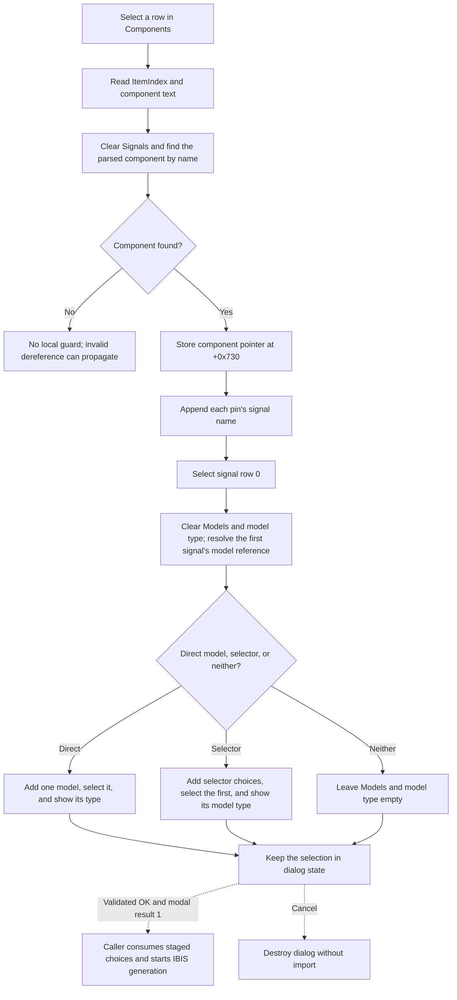

# Select an IBIS component

> Analysis status: Complete. The recovered component handler, list initializer, parsed IBIS lookups, dependent-list refresh, OK validation, and modal caller support this explanation.

## Control

| Property | Recovered value |
| --- | --- |
| Form | IbisImport |
| Component path | IbisImport.lbComponents |
| Control class | TListBox |
| Nearby label | Components: |
| Handler name | lbComponentsClick |
| Handler address | 01bc0d00 |
| Graph node | `resource:dfm:IbisImport/IbisImport.lbComponents` |
| Handler node | `function:01bc0d00` |
| Graph layer | UI |

## What happens when selected

`FUN_01bc0d00` reads `lbComponents.ItemIndex`, gets the text of that row, and passes the text to `FUN_01bc0a90`. It does not use `Sender` and does not import or write a file.

`FUN_01bc0a90` performs the component-dependent refresh:

1. It clears `lbSignals.Items`.
2. It finds the named component in the parsed IBIS object stored at form offset `+0x720`.
3. It stores the resolved component pointer at form offset `+0x730`.
4. It reads the signal name from each component pin entry and appends it to `lbSignals`.
5. It selects signal row 0.
6. It calls the shared signal-to-model refresh `FUN_01bc0d90`.

The signal-to-model refresh clears `lbModels` and the read-only model-type edit. For a direct model reference, it adds that model, selects row 0, and shows its type. For a model-selector reference, it adds the selector choices, selects the first choice, resolves its model, and shows that model's type. If it finds neither form, the Models list and model-type edit remain empty.

Thus, each component click rebuilds both dependent lists. It does not preserve a previously selected signal or model, even when the user selects the same component again.

## Initial selection

The DFM does not contain fixed component items. On form show, `FUN_01bc0bd0` clears `lbComponents`, enumerates the parsed IBIS component collection, and appends each component name. It then selects component row 0 and runs the same component-to-signal rebuild. A normal dialog therefore opens with the first component, its first signal, and the first compatible model choice selected.

The DFM labels confirm the visible cascade: `Components:`, `Signals:`, and `Models (selected signal):`. The source and parsed-object data flow, rather than label proximity alone, establish the dependency.

## Staged result and OK interaction

Component selection changes dialog state only. It stores the component pointer at `+0x730`; the downstream signal/model refresh updates the selected model name at `+0x748`. The selected signal name at `+0x740` and the Typ/Min/Max index at `+0x738` are copied by the OK handler, not by this component handler.

`FUN_01bc1460` rejects an empty signal selection and special `POWER`, `GND`, or `NC` models. Its error flag makes `FUN_01bc0a30` veto that close attempt and keep the dialog open. A valid `bkOK` close produces modal result 1.

The caller `FUN_01ca4350` consumes the staged component pointer, signal name, model name, Typ/Min/Max index, and model-type text only after modal result 1. It then starts the IBIS conversion/generation path. Cancel or any other modal result destroys the dialog without starting that import. The component click itself has no persistent side effect.

## Empty and error behavior

- The click handler has no `ItemIndex >= 0` guard. An event with no current component passes an invalid index to the list-string getter; any resulting VCL error propagates.
- The normal list is built from the same parsed collection that the name lookup searches. If the lookup nevertheless returns null, `FUN_01bc0a90` dereferences it without a local guard or error message.
- If the selected component has no signals, the helper still selects signal row 0 and invokes the downstream refresh. It has no empty-signal no-op branch; an invalid list access can propagate.
- A signal with no direct model and no model selector leaves Models and model type empty. This click path does not present an error for that state.
- Repeated selection clears and reconstructs the dependent controls. No old dependent selection is restored.

## Click flow

## Handler evidence

- [Component click `FUN_01bc0d00`](../../../DecompiledSources/Tina16/functions/0000000001BC0D00__FUN_01bc0d00.c) gets the selected row text and invokes the component refresh.
- [Component-to-signal refresh `FUN_01bc0a90`](../../../DecompiledSources/Tina16/functions/0000000001BC0A90__FUN_01bc0a90.c) clears and rebuilds Signals, stores the component pointer, selects row 0, and starts the model refresh.
- [Component-list initializer `FUN_01bc0bd0`](../../../DecompiledSources/Tina16/functions/0000000001BC0BD0__FUN_01bc0bd0.c) enumerates parsed components and chooses the first one on show.
- [Form-show wrapper `FUN_01bc0a80`](../../../DecompiledSources/Tina16/functions/0000000001BC0A80__FUN_01bc0a80.c) calls the component-list initializer.
- [Parsed-component lookup `FUN_01bbbe90`](../../../DecompiledSources/Tina16/functions/0000000001BBBE90__FUN_01bbbe90.c) scans component names and returns the matching component or null.
- [Signal-to-model refresh `FUN_01bc0d90`](../../../DecompiledSources/Tina16/functions/0000000001BC0D90__FUN_01bc0d90.c) supplies the downstream direct-model, selector, and empty states. Its annotation belongs to `TIARA-diz.6.7.672`.
- [Model-selection updater `FUN_01bc11a0`](../../../DecompiledSources/Tina16/functions/0000000001BC11A0__FUN_01bc11a0.c) updates the staged model choice after a later Models selection. Its annotation belongs to `TIARA-diz.6.7.671`.
- [OK validator `FUN_01bc1460`](../../../DecompiledSources/Tina16/functions/0000000001BC1460__FUN_01bc1460.c) validates the signal and special-model restrictions.
- [Close-query handler `FUN_01bc0a30`](../../../DecompiledSources/Tina16/functions/0000000001BC0A30__FUN_01bc0a30.c) vetoes a validation-error close and resets the error flag.
- [Dialog caller `FUN_01ca4350`](../../../DecompiledSources/Tina16/functions/0000000001CA4350__FUN_01ca4350.c) proves the modal-result boundary and later use of the staged fields.

## Analysis limits

- `FUN_01bc0d90` and `FUN_01bc11a0` are evidence for the dependent-state cascade but have separate control owners. They are not repeated in this task's annotation fragment.
- The exact Delphi field names at offsets `+0x720`, `+0x730`, `+0x738`, `+0x740`, and `+0x748` are not recovered. Their roles follow from the writes and the modal caller's reads.
- The exact VCL exception class for an invalid list index is not established.
- This article does not assign parser or circuit-generation responsibilities that belong to the OK and caller workflow.
