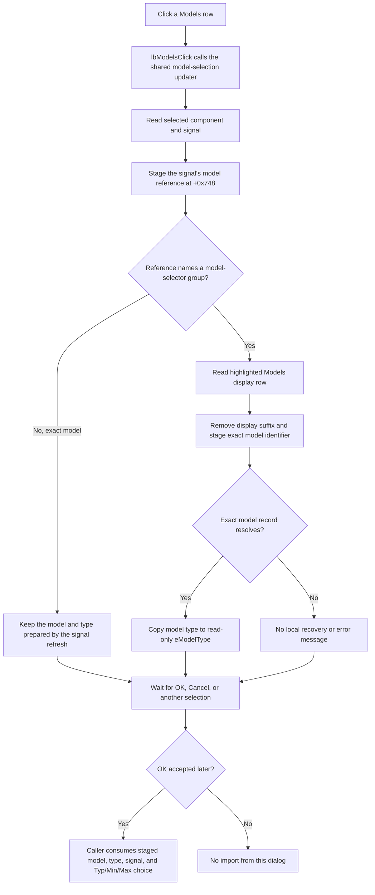

# Models for selected signal

## Control

| Property | Recovered value |
| --- | --- |
| Form | IbisImport |
| Component path | IbisImport.lbModels |
| Control class | TListBox |
| Caption | Not present in the recovered resource. |
| Related label | Models (selected signal): |
| Handler name | lbModelsClick |
| Handler address | 01bc1420 |
| Graph node | `resource:dfm:IbisImport/IbisImport.lbModels` |
| Handler node | `function:01bc1420` |
| Graph layer | UI |

The list has no static items, hint, image, or glyph. The form label names its contents. The signal-selection source and this handler prove that the rows are the IBIS models available for the current component signal.

## How the list is prepared

The Models list depends on the selected **Components** and **Signals** rows. A signal-selection refresh first clears the read-only **Model type** edit and the Models list. It then reads the selected component and signal from the parsed IBIS data.

- If the signal names one exact model, the refresh adds that model name as the only row, displays the model record's type, and selects row 0.
- If the signal names a model-selector group, the refresh adds each group member as a display row. Each row contains the exact model identifier plus selector text from the parsed IBIS data. The refresh selects row 0, stages its exact model identifier, and displays its model type.

Changing the component rebuilds the Signals list and then runs this same signal-selection refresh. The Models click does not rebuild the component or signal lists.

## What happens when clicked

`lbModelsClick` is a one-call wrapper. It does not inspect `Sender`. Its model-selection updater does the following work:

1. It reads the current component and signal names from the selected rows.
2. It resolves the signal record and copies that signal's model reference into the form's staged model string at `+0x748`.
3. It looks for a model-selector group with that reference.
4. For a group, it reads the highlighted Models row, removes the row's display suffix at the internal separator, and stores the exact model identifier at `+0x748`.
5. It resolves that exact model record and copies the record's type string into the read-only `eModelType` control.

For a signal that already names one exact model, there is no selector group. The signal-selection refresh has already selected and displayed that model. A click on its single row only restages the signal's same model reference and returns; it does not replace the type text.

Selecting the same group row again repeats the same string and type assignments. There is no additional selection history or toggle state.

## Staging and OK

The click changes form-local selection state only. It does not import the model, write a file, modify the schematic, or close the dialog.

The separate OK handler requires a selected signal, rejects the special signal model values `POWER`, `GND`, and `NC`, and stores the **Typ/Min/Max** combo-box index. An error sets the form's close-veto flag and displays a message. On an accepted modal return, the caller consumes the staged model identifier at `+0x748`, the displayed model type, the selected signal, and the Typ/Min/Max index to generate an intermediate circuit file and continue the schematic import.

Cancel does not enter that caller import path. The Models click therefore has no disk persistence by itself. Its staged values survive only while this dialog instance remains open or until another component, signal, or model selection replaces them.

## Empty and error paths

The model-selection updater has no explicit check for an empty component, signal, or Models selection. Normal form setup selects the first component, signal, and available model row after it populates each list. If the VCL delivers a click with `ItemIndex = -1`, the exact-model case returns after restaging its model reference, but a selector-group case can try to read row `-1`.

The helper also assumes that every displayed group row can be converted to an exact model record. If the selected index, display separator, or model lookup is inconsistent with the parsed IBIS data, this path has no local message, fallback, or exception handler. It can pass an invalid record to the model-type updater. The recovered source does not prove recovery from that malformed-data case.

## Click flow

## Evidence

- [Models click handler](../../../DecompiledSources/Tina16/functions/0000000001BC1420__FUN_01bc1420.c): delegates directly to the model-selection updater and has no sender, state, or error branch.
- [Model-selection updater](../../../DecompiledSources/Tina16/functions/0000000001BC11A0__FUN_01bc11a0.c): reads the selected component, signal, and model row; normalizes the display row; stages the model identifier; and resolves the exact model record.
- [Model-type display updater](../../../DecompiledSources/Tina16/functions/0000000001BC13E0__FUN_01bc13e0.c): copies the resolved model record's type field into `eModelType`.
- [Signal-selection refresh](../../../DecompiledSources/Tina16/functions/0000000001BC0D90__FUN_01bc0d90.c): clears and populates the Models list, distinguishes an exact model from a model-selector group, selects the first row, and prepares the initial model type.
- [Component-selection updater](../../../DecompiledSources/Tina16/functions/0000000001BC0A90__FUN_01bc0a90.c): rebuilds the Signals list for a component, selects its first signal, and starts the downstream model refresh.
- [OK handler](../../../DecompiledSources/Tina16/functions/0000000001BC1460__FUN_01bc1460.c) and [close-query handler](../../../DecompiledSources/Tina16/functions/0000000001BC0A30__FUN_01bc0a30.c): establish signal validation, the three special model values, Typ/Min/Max staging, and close veto.
- [IBIS import dialog caller](../../../DecompiledSources/Tina16/functions/0000000001CA4350__FUN_01ca4350.c): sets the parsed IBIS object, waits for an accepted modal result, then reads the form's staged selection and model-type text for import generation.
- [IBIS file command](../../../DecompiledSources/Tina16/functions/0000000001CA4A80__FUN_01ca4a80.c): proves that canceled or rejected dialog results do not continue to schematic import.

## Limits

- The recovered source does not expose the original Delphi field name for the staged model string at `+0x748`.
- The internal separator and selector-text format in a model-group display row are present as data addresses, not recovered string literals. The source proves the prefix extraction but not a safe user-facing name for the suffix syntax.
- This control selects an IBIS model. The later circuit generation and schematic placement are outside the click handler and occur only after the dialog is accepted.
