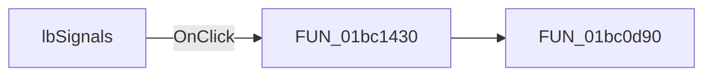

# lbSignals

> Analysis status: Pending individual source review.

## Control

| Property | Recovered value |
| --- | --- |
| Form | IbisImport |
| Component path | IbisImport.lbSignals |
| Control class | TListBox |
| Caption | Not present in the recovered resource. |
| Hint | Not present in the recovered resource. |
| Text | Not present in the recovered resource. |
| Handler name | lbSignalsClick |
| Handler address | 01bc1430 |
| Graph node | `resource:dfm:IbisImport/IbisImport.lbSignals` |
| Handler node | `function:01bc1430` |
| Graph layer | UI |

## What happens when clicked

Pending individual analysis. An agent must read the recovered handler source and its relevant callees before it replaces this text.

## Click flow

## Handler evidence

- Source: [DecompiledSources/Tina16/functions/0000000001BC1430__FUN_01bc1430.c](../../../DecompiledSources/Tina16/functions/0000000001BC1430__FUN_01bc1430.c)
- Recovered role: Not present in the recovered resource.
- Current graph summary: Handles 1 Delphi UI event: IbisImport.lbSignals.OnClick.
- Current graph behavior: Not present in the recovered resource.
- Current graph evidence: Not present in the recovered resource.
- Complexity: simple
- Distinct outgoing calls: 1

## Direct calls

- `function:01bc0d90` — FUN_01bc0d90

## Resource evidence

- Kind: Not present in the recovered resource.
- Modal result: Not present in the recovered resource.
- Checked state: Not present in the recovered resource.
- List items: Not present in the recovered resource.
- Image reference: Not present in the recovered resource.
- Extracted glyph: None.

## Nearby label candidates

Nearby labels are layout candidates only. They are not proof of behavior.

- Rank 1: Signals: at distance 27.
- Rank 2: Components: at distance 131.
- Rank 3: Models (selected signal): at distance 150.

## Analysis limits

- Do not infer behavior from the control class, caption, hint, glyph, or nearby label alone.
- Do not replace the pending status until the handler source and relevant call path provide enough evidence.
