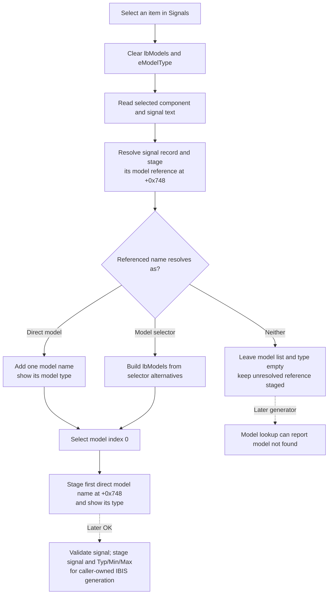

# Select an IBIS signal and its model choices

> Analysis status: Evidence-backed source review complete.

## Control

| Property | Recovered value |
| --- | --- |
| Form | IbisImport |
| Component path | IbisImport.lbSignals |
| Control class | TListBox |
| Nearby label | Signals: |
| Handler name | lbSignalsClick |
| Handler address | 01bc1430 |
| Graph node | `resource:dfm:IbisImport/IbisImport.lbSignals` |
| Handler node | `function:01bc1430` |
| Graph layer | UI |

The list box has no caption, hint, image, or design-time items. Its role is established by the nearby `Signals:` label, the `Models (selected signal):` dependent list, and the recovered data flow.

## What happens when clicked

[`FUN_01bc1430`](../../../DecompiledSources/Tina16/functions/0000000001BC1430__FUN_01bc1430.c) is the published `lbSignalsClick` wrapper. It delegates to [`FUN_01bc0d90`](../../../DecompiledSources/Tina16/functions/0000000001BC0D90__FUN_01bc0d90.c), which rebuilds the model choices for the current component and signal.

The refresh starts by clearing the read-only `eModelType` edit and the `lbModels` list. It then reads the current text from `lbComponents` at form field `+0x6B0` and `lbSignals` at `+0x6E0`. The parsed IBIS document is reached through form field `+0x720`.

The coordinator performs these lookups:

1. It finds the parsed IBIS component whose name equals the selected component text.
2. Within that component, it finds the pin or signal record whose name equals the selected signal text.
3. It reads that signal record's referenced model name and stores it in dialog field `+0x748`.
4. It tests whether the referenced name identifies one direct model or an IBIS model selector.

This is a dependent-list refresh. It does not parse the file again and does not change the parsed IBIS document.

## Direct model and model-selector branches

If the signal references a direct model, the handler adds that model's name as the only `lbModels` item, copies its type text to read-only `eModelType`, and selects model index 0. Field `+0x748` keeps that direct model name.

If the reference identifies a model selector, the handler iterates the selector's alternatives. It splits each recovered selector entry at its internal delimiter and builds one display entry for `lbModels`. It then selects index 0, extracts the first alternative's direct model name into field `+0x748`, resolves that model, and updates `eModelType` through the `.671`-owned helper [`FUN_01bc13e0`](../../../DecompiledSources/Tina16/functions/0000000001BC13E0__FUN_01bc13e0.c).

The user can select another alternative afterward. The separate `lbModels` handler updates field `+0x748` and `eModelType` for that alternative. This signal click only establishes the initial model selection.

## Selection flow

## Dialog staging and OK interaction

The click updates only the dialog's current controls and staged model-name field. It does not set the final selected-signal field `+0x740` or the Typ/Min/Max index at `+0x738`.

The `.669` OK handler [`FUN_01bc1460`](../../../DecompiledSources/Tina16/functions/0000000001BC1460__FUN_01bc1460.c) owns that later boundary. It verifies that a signal is selected, copies the selected signal text to `+0x740`, rejects the special `POWER`, `GND`, and `NC` records, and stores the `Typ`, `Min`, or `Max` combo index in `+0x738`. Its error flag lets the form's CloseQuery veto an invalid OK attempt.

After a successful modal result, caller [`FUN_01ca4350`](../../../DecompiledSources/Tina16/functions/0000000001CA4350__FUN_01ca4350.c) forwards the staged component record at `+0x730`, signal at `+0x740`, model name at `+0x748`, and Typ/Min/Max index at `+0x738` to the IBIS generator. [`FUN_01bbf630`](../../../DecompiledSources/Tina16/functions/0000000001BBF630__FUN_01bbf630.c) uses the selected model override when it resolves the signal's model and generates the output.

The standard `bkCancel` button has no custom handler. Cancel causes the caller to skip generation, so the signal and model choices are discarded with the dialog.

## Initial and related selection paths

On form show, [`FUN_01bc0bd0`](../../../DecompiledSources/Tina16/functions/0000000001BC0BD0__FUN_01bc0bd0.c) populates `lbComponents`, selects component index 0, and invokes the component refresh. The `.670`-owned component helper populates `lbSignals`, selects signal index 0, and then calls the same `FUN_01bc0d90` model refresh. Thus, the first available component, signal, and model are selected automatically when the parsed lists are non-empty.

`lbSignals.OnKeyDown` is bound to [`FUN_01bc1440`](../../../DecompiledSources/Tina16/functions/0000000001BC1440__FUN_01bc1440.c), which also calls `FUN_01bc0d90`. Keyboard selection therefore uses the same dependent-list refresh as this click.

## Empty, missing, and error behavior

- The click has no message, validation dialog, or local exception handler.
- If the referenced name is neither a direct model nor a model selector, the already-cleared model list and type remain empty. Field `+0x748` still holds the unresolved name. OK does not test this model-resolution failure; the later generator can report `<name>: model not found`.
- The coordinator assumes that the component list, signal list, component record, signal record, selector alternatives, and referenced direct models are consistent. It does not guard a selected index of `-1`, a missing component or signal record, an empty model-selector list, or an invalid selector alternative before it dereferences the result.
- An inconsistent or empty parsed structure can therefore raise through the Delphi or VCL path after the model controls have been cleared. There is no rollback to their earlier contents.
- A normal repeated click rebuilds the dependent list from the current component and signal. It discards any earlier alternative model selection and selects the first valid model again.

## Persistence boundaries

This click performs no file write, import generation, application-model mutation, or persistence operation. Its controls and fields belong to the modal IbisImport form. A successful OK lets the caller use the staged selection for one generated IBIS import result. Cancel, invalid OK, or dialog destruction without a successful modal result does not apply the selection outside the form.

## Handler evidence

- Source: [DecompiledSources/Tina16/functions/0000000001BC1430__FUN_01bc1430.c](../../../DecompiledSources/Tina16/functions/0000000001BC1430__FUN_01bc1430.c)
- Shared refresh: [DecompiledSources/Tina16/functions/0000000001BC0D90__FUN_01bc0d90.c](../../../DecompiledSources/Tina16/functions/0000000001BC0D90__FUN_01bc0d90.c)
- Recovered role: Refresh the dependent IBIS model choices for the selected signal.
- Current graph summary: Handles `IbisImport.lbSignals.OnClick`.
- Complexity: simple
- Distinct outgoing calls: 1

## Resource evidence

- `lbSignals` is under the `Signals:` label.
- `lbModels` is under `Models (selected signal):`.
- `eModelType` is read-only and is under `Model type:`.
- `cbMinMax` is a drop-down list with `Typ`, `Min`, and `Max`.
- The form has standard `bkOK`, `bkCancel`, and `bkHelp` buttons.
- The signal and model lists have no design-time items, hint, image, or extracted glyph.

## Analysis ownership and limits

- This task owns `FUN_01bc1430` and shared signal-to-model refresh `FUN_01bc0d90`.
- Bead `.670` owns the component-to-signal refresh. Bead `.671` owns model-choice handling and `FUN_01bc13e0`. Bead `.669` owns OK validation and final staging.
- Parsed-IBIS component, pin, direct-model, selector, and string access helpers remain evidence-only because their responsibilities extend beyond this control.
- The selector entry delimiter strings are not recovered as text. This article describes the proven split-and-display behavior without inventing their characters or original Delphi field names.
