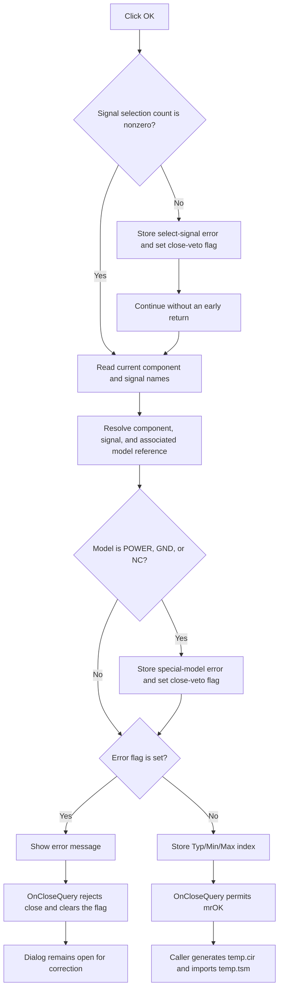

# Validate and import the selected IBIS signal

> Analysis status: Complete. OK validates the staged signal selection and permits the modal dialog to close. The caller performs the file generation and schematic import after `mrOK`.

## Control

| Property | Recovered value |
| --- | --- |
| Form | IbisImport |
| Component path | IbisImport.OK |
| Control class | TBitBtn |
| Button kind | bkOK |
| Handler name | OKClick |
| Handler address | 01bc1460 |
| Graph node | `resource:dfm:IbisImport/IbisImport.OK` |
| Handler node | `function:01bc1460` |
| Graph layer | UI |

The form also contains the lists **Components**, **Signals**, and **Models
(selected signal)**. A read-only edit shows **Model type**. The `cbMinMax`
drop-down contains `Typ`, `Min`, and `Max` in indexes `0`, `1`, and `2`.

## What happens when clicked

`FUN_01bc1460` performs these operations:

1. It asks the signal list at form offset `+0x6E0` for its selected count. If
   the count is zero, it stores `You have to select a signal!` at `+0x728` and
   sets the error flag at `+0x718`.
2. It reads the current component name from the list at `+0x6B0` and the
   current signal name from the list at `+0x6E0`. It stores the signal name at
   `+0x740`.
3. It uses the parsed IBIS data at `+0x720` to find that component and its
   type-1 signal entry. It reads the signal's associated model reference.
4. It rejects model references `POWER`, `GND`, and `NC`. For one of these
   values, it builds `<signal>: cannot import ...`, stores it at `+0x728`, and
   sets the error flag.
5. If the error flag is clear, it stores the current `Typ`/`Min`/`Max` index
   from `cbMinMax` at `+0x738`.
6. If the flag is set, it shows the stored error text in a modal message.

The empty-selection branch does not return after it sets the error. It still
tries to read the current component and signal items. The normal form setup
selects the first component and signal. If an invalid list index reaches this
path, the recovered handler has no guard or local exception handler before the
item access.

## Component, signal, and model state

The form prepares most selection state before OK runs:

- `FUN_01bc0bd0` fills the component list from the parsed IBIS component
  collection and selects the first component.
- `FUN_01bc0a90` stores the selected component object at `+0x730`, rebuilds the
  signal list, selects its first row, and starts the signal refresh.
- `FUN_01bc0d90` resolves the selected signal, rebuilds the model list, stores
  the selected model reference at `+0x748`, and updates the read-only model-type
  edit.
- `FUN_01bc11a0` changes `+0x748` and the model-type edit when the user selects
  another model from a model-selector list.

OK explicitly tests only the signal selection and the three special model
references. It does not have a separate component-index or model-list-index
validation branch. It trusts the component, signal, and model state that these
list handlers prepared.

## Modal close and retry behavior

The button has the built-in VCL kind `bkOK`. The caller treats modal result `1`
as acceptance. `FUN_01bc0a30`, the form's `OnCloseQuery` handler, decides
whether that result can close the form:

- If `+0x718` is clear, `CanClose` is true and the dialog can return `mrOK`.
- If `+0x718` is set, `CanClose` is false. The handler then clears the flag so
  that the user can correct the selection and try again.

The error text at `+0x728` is not cleared on the retry, but a successful retry
does not display it because the error flag stays clear. Cancel uses the
built-in `bkCancel` button and has no custom click handler. A non-`mrOK` result
skips generation and import.

## Caller, parser, and import effects

The outer command `FUN_01ca4a80` first opens an `IBIS File|*.IBS` file dialog.
After file selection, `FUN_01ca4350` creates an IBIS parser and calls
`FUN_01bbc650` before it shows IbisImport. The parser reads the selected file
and builds in-memory component, package, signal, model, model-selector, and
electrical-value data. The input `.IBS` file is not changed.

On Cancel, `FUN_01ca4350` skips all accepted-result work, returns false, and
destroys the form and parser on the normal path. Although it calculates the
fixed temporary path `temp.cir` before the dialog opens, it does not write that
file on Cancel.

After `mrOK`, the controller passes these staged values to `FUN_01bbf630`:

| Form field | Accepted value |
| --- | --- |
| `+0x730` | Selected parsed component object |
| `+0x738` | `Typ`, `Min`, or `Max` index |
| `+0x740` | Selected signal name |
| `+0x748` | Selected model name or resolved model reference |
| `+0x700` | Displayed model type, copied back to the caller |

`FUN_01bbf630` loads `IBIS Models.dat` from the TINA `SpiceLib` directory,
resolves the selected signal and model, applies the selected Typ/Min/Max value
set, emits TINA-compatible SPICE text, and saves it as `temp.cir`. The
controller copies the displayed model type to its output and returns true.
`FUN_01ca4a80` then calls `FUN_01ca4640`, which reads the generated circuit,
creates `temp.tsm`, and imports the generated model into the current design.

The OK handler itself does not parse a file, write a file, add a component, or
save the current design. No INI or registry write occurs. The accepted caller
path writes the two fixed temporary files. The recovered path has no matching
delete call for them. A later normal import can overwrite them.

## Errors and partial state

- A missing signal or a `POWER`, `GND`, or `NC` model keeps the dialog open and
  shows a message.
- The parser raises a Delphi exception for a missing input file and for
  inconsistent input such as data before a component declaration. This occurs
  before the modal form opens.
- The generator raises for a missing `IBIS Models.dat`, missing signal, missing
  model, or invalid Typ/Min/Max parameter data. This occurs after the user has
  accepted the dialog.
- The controller and generator have no recovered local catch, retry, or
  rollback branch. Normal cleanup is visible, but exception cleanup and a
  partially written output file are not established by the decompilation.
- The click handler does not change the source `.IBS` file and does not commit
  a design change before the caller completes generation and import.

## Click flow

## Evidence

- [OK handler `FUN_01bc1460`](../../../DecompiledSources/Tina16/functions/0000000001BC1460__FUN_01bc1460.c) tests the signal selection, resolves the component and signal, rejects the three special model references, stores the combo index, or shows the error.
- [Close-query gate `FUN_01bc0a30`](../../../DecompiledSources/Tina16/functions/0000000001BC0A30__FUN_01bc0a30.c) sets `CanClose` from the inverse error flag and clears the flag after each query.
- [Form-show population `FUN_01bc0bd0`](../../../DecompiledSources/Tina16/functions/0000000001BC0BD0__FUN_01bc0bd0.c) fills the component list and selects the first component.
- [Component refresh `FUN_01bc0a90`](../../../DecompiledSources/Tina16/functions/0000000001BC0A90__FUN_01bc0a90.c) stores the parsed component, fills the signal list, and selects the first signal.
- [Signal refresh `FUN_01bc0d90`](../../../DecompiledSources/Tina16/functions/0000000001BC0D90__FUN_01bc0d90.c) rebuilds model choices and updates the resolved model and model-type state.
- [Model refresh `FUN_01bc11a0`](../../../DecompiledSources/Tina16/functions/0000000001BC11A0__FUN_01bc11a0.c) applies a model-list selection to the resolved model and model-type state.
- [Modal import controller `FUN_01ca4350`](../../../DecompiledSources/Tina16/functions/0000000001CA4350__FUN_01ca4350.c) parses before ShowModal and gates generation, copy-back, and its true result on modal result `1`.
- [IBIS parser `FUN_01bbc650`](../../../DecompiledSources/Tina16/functions/0000000001BBC650__FUN_01bbc650.c) loads and parses the source file into the collections used by the form.
- [SPICE generator `FUN_01bbf630`](../../../DecompiledSources/Tina16/functions/0000000001BBF630__FUN_01bbf630.c) loads the support model file, resolves the accepted signal and model, builds the SPICE text, and saves the temporary circuit file.
- [Parser/generator error raiser `FUN_01bbc400`](../../../DecompiledSources/Tina16/functions/0000000001BBC400__FUN_01bbc400.c) creates and raises the Delphi exception used by these paths.
- [File-dialog launcher `FUN_01ca4a80`](../../../DecompiledSources/Tina16/functions/0000000001CA4A80__FUN_01ca4a80.c) uses the `.IBS` filter and calls the post-modal import only when the controller returns true.
- [Post-modal importer `FUN_01ca4640`](../../../DecompiledSources/Tina16/functions/0000000001CA4640__FUN_01ca4640.c) loads the generated circuit, creates `temp.tsm`, and adds the resulting model to the design.

## Direct calls

- `FUN_01bbbe90`, `FUN_01bbbbd0`, and `FUN_01bbb5e0` find the parsed component,
  find its type-1 signal entry, and retrieve the signal's model reference. Their
  roles are shared with the related list refresh paths and are not annotated in
  this fragment.
- `FUN_016fd940` shows the stored error message.
- `FUN_00416db0` compares each recovered model-reference string.
- The remaining direct calls manage and build Delphi UnicodeStrings.

## Resource evidence and limits

- The button has no stored caption, hint, action, or embedded glyph. Its
  recovered `Kind` is `bkOK`, and `NumGlyphs` is `2`; the image bytes are not in
  the resource stream.
- The form has a `bkCancel` sibling with no custom click handler.
- The DFM does not store an explicit `ModalResult` or `Default` property for OK.
  The built-in button kind and the caller's result-`1` branch establish the
  accepted modal route.
- The original Delphi field names are not recovered. Their responsibilities
  come from the data flow between list population, validation, the modal
  controller, and the generator.
