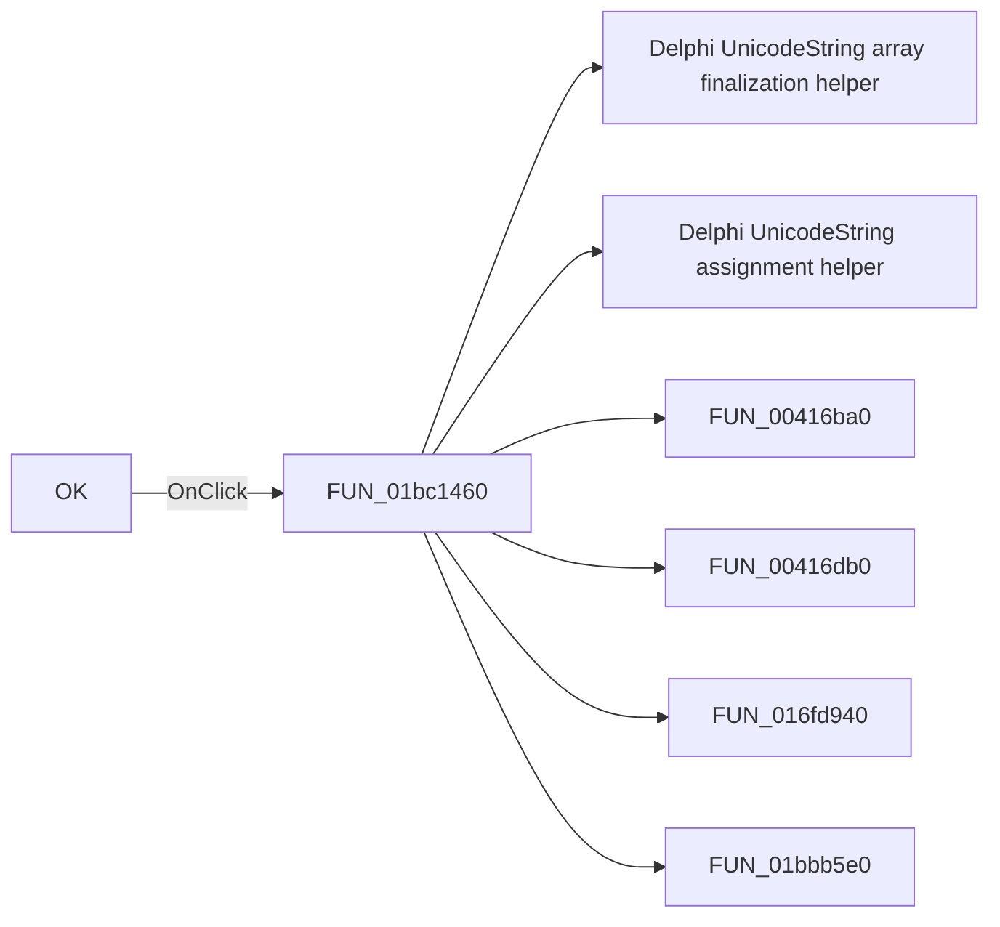

# OK

> Analysis status: Pending individual source review.

## Control

| Property | Recovered value |
| --- | --- |
| Form | IbisImport |
| Component path | IbisImport.OK |
| Control class | TBitBtn |
| Caption | Not present in the recovered resource. |
| Hint | Not present in the recovered resource. |
| Text | Not present in the recovered resource. |
| Handler name | OKClick |
| Handler address | 01bc1460 |
| Graph node | `resource:dfm:IbisImport/IbisImport.OK` |
| Handler node | `function:01bc1460` |
| Graph layer | UI |

## What happens when clicked

Pending individual analysis. An agent must read the recovered handler source and its relevant callees before it replaces this text.

## Click flow

## Handler evidence

- Source: [DecompiledSources/Tina16/functions/0000000001BC1460__FUN_01bc1460.c](../../../DecompiledSources/Tina16/functions/0000000001BC1460__FUN_01bc1460.c)
- Recovered role: Not present in the recovered resource.
- Current graph summary: Handles 1 Delphi UI event: IbisImport.OK.OnClick.
- Current graph behavior: Not present in the recovered resource.
- Current graph evidence: Not present in the recovered resource.
- Complexity: complex
- Distinct outgoing calls: 8

## Direct calls

- `function:00414560` — Delphi UnicodeString array finalization helper
- `function:00414ad0` — Delphi UnicodeString assignment helper
- `function:00416ba0` — FUN_00416ba0
- `function:00416db0` — FUN_00416db0
- `function:016fd940` — FUN_016fd940
- `function:01bbb5e0` — FUN_01bbb5e0
- `function:01bbbbd0` — FUN_01bbbbd0
- `function:01bbbe90` — FUN_01bbbe90

## Resource evidence

- Kind: bkOK
- Modal result: Not present in the recovered resource.
- Checked state: Not present in the recovered resource.
- List items: Not present in the recovered resource.
- Image reference: Not present in the recovered resource.
- Extracted glyph: None.

## Nearby label candidates

Nearby labels are layout candidates only. They are not proof of behavior.

- Rank 1: Select Typ/Min/Max: at distance 81.
- Rank 2: Model type: at distance 146.
- Rank 3: Models (selected signal): at distance 297.

## Analysis limits

- Do not infer behavior from the control class, caption, hint, glyph, or nearby label alone.
- Do not replace the pending status until the handler source and relevant call path provide enough evidence.
