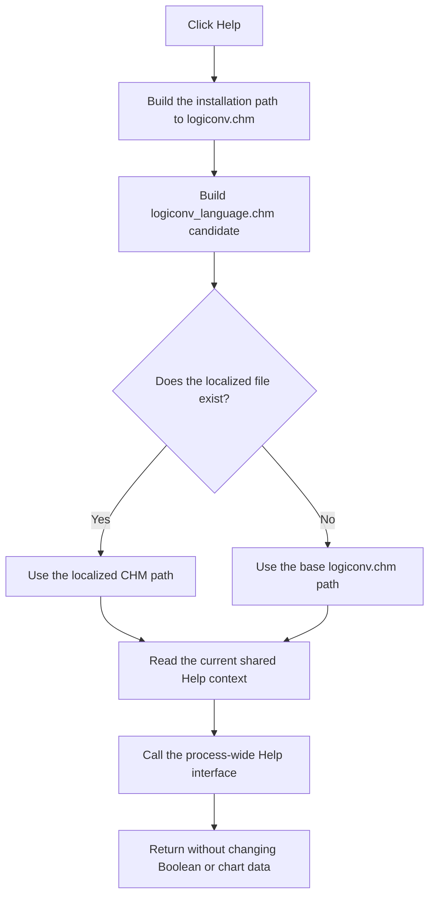

# &Help

> Analysis status: Reviewed from the recovered button handler, localized-help resolver, shared Help contexts, form Help path, resource caption, and extracted glyph.

## Control

| Property | Recovered value |
| --- | --- |
| Form | implikanst_form |
| Component path | implikanst_form.Panel1.GroupBox1.BitBtn2 |
| Control class | TBitBtn |
| Caption | &Help |
| Hint | Not present in the recovered resource. |
| Text | Not present in the recovered resource. |
| Handler name | BitBtn2Click |
| Handler address | 011a97f0 |
| Graph node | `resource:dfm:implikanst_form/implikanst_form.Panel1.GroupBox1.BitBtn2` |
| Handler node | `function:011a97f0` |
| Graph layer | UI |

## What happens when clicked

The handler builds the installation-folder path to `logiconv.chm`. It passes the path to the shared localized-help resolver. The resolver selects `logiconv_<language>.chm` when that file exists. If it does not exist, the resolver returns the original `logiconv.chm` path without a message.

The handler reads the current shared logic-converter Help context and sends that context and the resolved path to the process-wide Help interface. It does not select a fixed topic. Form creation initializes the context to decimal `4000`. The prime-implicant redraw can set it to `4200` for the recovered Minterm path or `4500` for the recovered Maxterm path. The form's OnHelp handler uses the same CHM file and shared context.

The extracted 36-by-18 glyph shows two question marks, and the caption is **Help**. This resource evidence supports the Help entry, while the handler and callees establish the file, localization, context, and dispatch behavior. The nearby labels describe form outputs and are not inputs to this button.

A missing localized file is a normal fallback. The resolver does not prove that the base CHM file exists. The button does not test the Help-service result and has no local retry, alternate topic, catch, rollback, or error message. It changes no Boolean data, chart data, form text, file, or persistent setting.

## Click flow

## Handler evidence

- Source: [DecompiledSources/Tina16/functions/00000000011A97F0__FUN_011a97f0.c](../../../DecompiledSources/Tina16/functions/00000000011A97F0__FUN_011a97f0.c)
- Recovered role: Open the current Prime Implicant Table topic from the logic-converter help file.
- Current graph summary: Handles 1 Delphi UI event: implikanst_form.Panel1.GroupBox1.BitBtn2.OnClick.
- Current graph behavior: Resolves an installed language-specific `logiconv.chm` variant when available and opens the current shared Help context.
- Current graph evidence: The handler constructs the CHM path, calls `FUN_01b1def0`, reads the context through `PTR_DAT_02004708`, and invokes the global application Help interface. Form creation initializes the context to 4000, and the chart renderer can replace it with 4200 or 4500.
- Complexity: complex
- Distinct outgoing calls: 3

## Direct calls

- `function:00414560` — Delphi UnicodeString array finalization helper
- `function:00416cd0` — FUN_00416cd0
- `function:01b1def0` — FUN_01b1def0

## Related source evidence

- [Help button handler](../../../DecompiledSources/Tina16/functions/00000000011A97F0__FUN_011a97f0.c) builds the `logiconv.chm` path, resolves it, reads the shared context, and calls the global Help interface.
- [Localized-help resolver](../../../DecompiledSources/Tina16/functions/0000000001B1DEF0__FUN_01b1def0.c) inserts the current language marker and uses the candidate only when it exists.
- [Form creation](../../../DecompiledSources/Tina16/functions/00000000011A5EE0__FUN_011a5ee0.c) initializes the shared Help context to 4000.
- [Prime-implicant renderer](../../../DecompiledSources/Tina16/functions/00000000011A6000__FUN_011a6000.c) can set the current context to 4200 or 4500 for the recovered mode paths.
- [Form Help handler](../../../DecompiledSources/Tina16/functions/00000000011A98E0__FUN_011a98e0.c) repeats the same `logiconv.chm` and shared-context request for a VCL form Help event.
- Extracted glyph: [`0227_implikanst_form_implikanst_form_Panel1_GroupBox1_BitBtn2_Glyph_Data.png`](../../../glyph/0227_implikanst_form_implikanst_form_Panel1_GroupBox1_BitBtn2_Glyph_Data.png)

## Resource evidence

- Kind: Not present in the recovered resource.
- Modal result: Not present in the recovered resource.
- Checked state: Not present in the recovered resource.
- List items: Not present in the recovered resource.
- Image reference: Not present in the recovered resource.
- Extracted glyph: [`0227_implikanst_form_implikanst_form_Panel1_GroupBox1_BitBtn2_Glyph_Data.png`](../../../glyph/0227_implikanst_form_implikanst_form_Panel1_GroupBox1_BitBtn2_Glyph_Data.png)

## Nearby label candidates

Nearby labels are layout candidates only. They are not proof of behavior.

- Rank 1: Minterm at distance 256.
- Rank 2: Canonic function at distance 484.
- Rank 3: Simplified function at distance 548.

## Analysis limits

- The handler uses the context that is current when the user clicks. It does not record which earlier action last wrote that shared value.
- Viewer-specific failure and navigation behavior are outside this handler.
