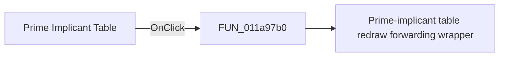

# Prime Implicant Table

> Analysis status: Pending individual source review.

## Control

| Property | Recovered value |
| --- | --- |
| Form | implikanst_form |
| Component path | implikanst_form |
| Control class | Timplikanst_form |
| Caption | Prime Implicant Table |
| Hint | Not present in the recovered resource. |
| Text | Not present in the recovered resource. |
| Handler name | FormClick |
| Handler address | 011a97b0 |
| Graph node | `resource:dfm:implikanst_form` |
| Handler node | `function:011a97b0` |
| Graph layer | UI |

## What happens when clicked

Pending individual analysis. An agent must read the recovered handler source and its relevant callees before it replaces this text.

## Click flow

## Handler evidence

- Source: [DecompiledSources/Tina16/functions/00000000011A97B0__FUN_011a97b0.c](../../../DecompiledSources/Tina16/functions/00000000011A97B0__FUN_011a97b0.c)
- Recovered role: Prime-implicant table click redraw handler
- Current graph summary: Resets the Prime Implicant Table drawing origin to (10, 10), then rebuilds the chart, selects a Boolean cover, and updates the displayed simplified expression. Handles 1 Delphi UI event: implikanst_form.OnClick.
- Current graph behavior: Resets the Prime Implicant Table drawing origin to (10, 10), then rebuilds the chart, selects a Boolean cover, and updates the displayed simplified expression.
- Current graph evidence: implikanst_form.OnClick binds FormClick to this function. It writes 10 to both drawing-origin globals and calls FUN_011a5ff0. The form's OnShow handler performs the same reset and redraw.
- Complexity: simple
- Distinct outgoing calls: 1

## Direct calls

- `function:011a5ff0` — Prime-implicant table redraw forwarding wrapper

## Resource evidence

- Kind: Not present in the recovered resource.
- Modal result: Not present in the recovered resource.
- Checked state: Not present in the recovered resource.
- List items: Not present in the recovered resource.
- Image reference: Not present in the recovered resource.
- Extracted glyph: None.

## Nearby label candidates

Nearby labels are layout candidates only. They are not proof of behavior.

- No same-parent label candidate is available.

## Analysis limits

- Do not infer behavior from the control class, caption, hint, glyph, or nearby label alone.
- Do not replace the pending status until the handler source and relevant call path provide enough evidence.
