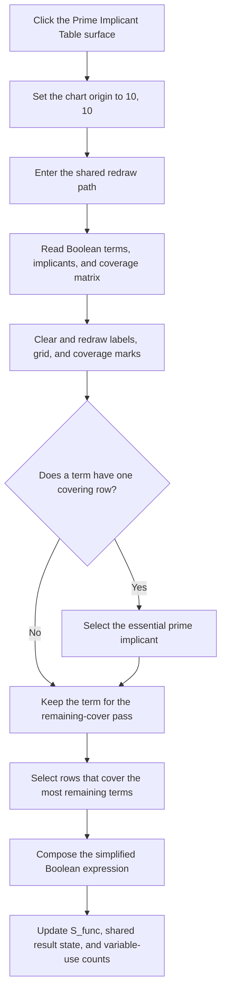

# Prime Implicant Table

> Analysis status: Reviewed from the recovered click handler, redraw wrapper, chart renderer, form lifecycle, and resource controls.

## Control

| Property | Recovered value |
| --- | --- |
| Form | implikanst_form |
| Component path | implikanst_form |
| Control class | Timplikanst_form |
| Caption | Prime Implicant Table |
| Hint | Not present in the recovered resource. |
| Text | Not present in the recovered resource. |
| Handler name | FormClick |
| Handler address | 011a97b0 |
| Graph node | `resource:dfm:implikanst_form` |
| Handler node | `function:011a97b0` |
| Graph layer | UI |

## What happens when clicked

The VCL dispatches this event when the user clicks the Prime Implicant Table form surface. The handler does not read the sender, mouse coordinates, button state, or a selected chart cell. It always sets the two chart-origin globals to `(10, 10)` and calls the shared redraw path.

The redraw reads the active Boolean-mode data, term counts, prime-implicant strings, and the implicant-versus-term matrix from process-wide logic-converter state. It clears the prior simplified-expression control and rebuilds the chart on the `Image1` canvas. It draws row and column labels and coverage marks. It first selects essential prime implicants for terms that have one covering row. It then repeatedly selects the row that covers the most remaining terms until no uncovered term has a candidate. It composes the selected rows into the simplified Boolean expression, writes the result to the read-only `S_func` control, copies the result to shared logic-converter controls and state, and recalculates variable-use counts.

The renderer can also replace the shared Help context with decimal `4200` or `4500` for the recovered Minterm or Maxterm mode. A later Help button or form Help event uses that value.

The form's OnShow handler captures the `Image1` canvas, applies the same `(10, 10)` origin, and performs the initial redraw. A repeated surface click performs the complete computation and drawing sequence again. Counts that are zero cause their related loops to skip, but there is no handler-level no-data return. The click path has no cancel branch, local exception handler, rollback, or control-specific error message. Earlier global and display changes can remain if a later drawing or string operation fails.

## Click flow

## Handler evidence

- Source: [DecompiledSources/Tina16/functions/00000000011A97B0__FUN_011a97b0.c](../../../DecompiledSources/Tina16/functions/00000000011A97B0__FUN_011a97b0.c)
- Recovered role: Prime-implicant table click redraw handler
- Current graph summary: Resets the Prime Implicant Table drawing origin to (10, 10), then rebuilds the chart, selects a Boolean cover, and updates the displayed simplified expression. Handles 1 Delphi UI event: implikanst_form.OnClick.
- Current graph behavior: Resets the Prime Implicant Table drawing origin to (10, 10), then rebuilds the chart, selects a Boolean cover, and updates the displayed simplified expression.
- Current graph evidence: implikanst_form.OnClick binds FormClick to this function. It writes 10 to both drawing-origin globals and calls FUN_011a5ff0. The form's OnShow handler performs the same reset and redraw.
- Complexity: simple
- Distinct outgoing calls: 1

## Direct calls

- `function:011a5ff0` — Prime-implicant table redraw forwarding wrapper

## Related source evidence

- [Form click handler](../../../DecompiledSources/Tina16/functions/00000000011A97B0__FUN_011a97b0.c) writes 10 to both origin globals and calls the redraw wrapper without an input or selection test.
- [Redraw wrapper](../../../DecompiledSources/Tina16/functions/00000000011A5FF0__FUN_011a5ff0.c) forwards directly to the chart renderer.
- [Chart renderer and cover selector](../../../DecompiledSources/Tina16/functions/00000000011A6000__FUN_011a6000.c) copies the coverage matrix, draws the chart, selects essential rows, runs the maximum-remaining-coverage loop, composes the expression, publishes it, and updates variable-use counts.
- [Form show handler](../../../DecompiledSources/Tina16/functions/00000000011A9740__FUN_011a9740.c) captures the `Image1` canvas and performs the same origin reset and redraw when the form first appears.
- [Form paint handler](../../../DecompiledSources/Tina16/functions/00000000011A9790__FUN_011a9790.c) resets only the two origin globals. It does not call the redraw wrapper.

## Resource evidence

- Kind: Not present in the recovered resource.
- Modal result: Not present in the recovered resource.
- Checked state: Not present in the recovered resource.
- List items: Not present in the recovered resource.
- Image reference: Not present in the recovered resource.
- Extracted glyph: None.

## Nearby label candidates

Nearby labels are layout candidates only. They are not proof of behavior.

- No same-parent label candidate is available.

## Analysis limits

- The chart renderer uses many process-wide fields whose original Delphi names are not recovered. The matrix flow and outputs are recovered, but the documentation does not invent names for those fields.
- The exact surface area that dispatches the form event is controlled by VCL hit testing and the child controls that cover the form. The handler performs no hit test of its own.
