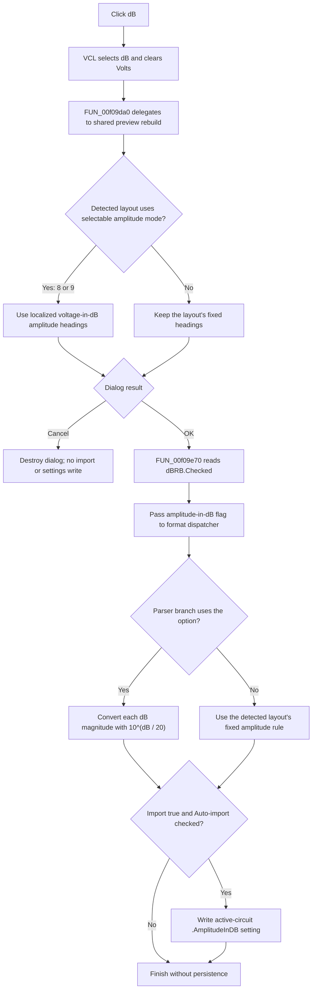

# dB

> Analysis status: Source reviewed through radio selection, preview rebuild,
> accepted import, amplitude conversion, and AutoImport persistence.

## Control

| Property | Recovered value |
| --- | --- |
| Form | ImportCurveDialog |
| Component path | ImportCurveDialog.GroupBox1.dBRB |
| Control class | TRadioButton |
| Caption | dB |
| Hint | Not present in the recovered resource. |
| Text | Not present in the recovered resource. |
| Handler name | dBRBClick |
| Handler address | 00f09da0 |
| Graph node | `resource:dfm:ImportCurveDialog/ImportCurveDialog.GroupBox1.dBRB` |
| Handler node | `function:00f09da0` |
| Graph layer | UI |

The resource creates this radio button checked but disabled. It creates the
paired **Volts** button disabled and not checked. A curve-type change enables
both amplitude buttons, and the Display-format combo box, when the selected
type is **AC** or **Discret**. The controls stay disabled for **Auto-detect**
and **Transient**. The checked dB default can therefore still supply the
amplitude interpretation while the control is disabled.

## What happens when clicked

The VCL radio-button code selects **dB** and clears its **Volts** sibling before
it sends `OnClick`. `dBRBClick` does not read the sender or set either checked
state itself. It delegates directly to the shared preview parser and grid
rebuilder at `FUN_00f09f30`.

For the internal AC and Discret layouts `8` and `9`, the preview rebuild tests
`VoltsRB.Checked`. A clear Volts state selects the localized
`ImportCurveDlg.VoltagedBTxt` heading for every amplitude column; a checked
Volts state selects `ImportCurveDlg.VoltageTxt`. The phase columns keep their
phase headings.

This click does not convert the preview values. The shared function tokenizes
the source rows again and copies up to ten rows into the preview grid. It only
changes the column heading and the interpretation that a later accepted import
uses. Some auto-detected formats have fixed voltage or dB columns. For those
formats, selecting dB can rebuild the same visible preview without changing a
heading.

Clicking an already selected dB radio button runs the same rebuild again. The
handler has no comparison that suppresses a repeated call.

## Accepted import and scaling

The dialog uses standard `bkOK` and `bkCancel` buttons and has no custom OK or
Cancel click handler. On modal result `1`, the outer Import command calls
`FUN_00f09e70`. That getter reads `dBRB.Checked` from the form field at offset
`+0x728`. The command passes this Boolean as the amplitude-in-dB argument to
the `.283`-owned import dispatcher.

The option has a numeric effect only in parser branches that use this argument:

- the AC or frequency-domain parser converts selected dB amplitude fields to
  linear amplitude; and
- the Discret Fourier parser applies the same conversion to each magnitude.

The conversion helper calculates `10^(dB / 20)`. These parsers separately
convert phase values from degrees to radians. The click does not rewrite the
source text, preview cells, or file. It also does not apply a reverse conversion
when **Volts** is selected; the parser then treats the source magnitude as an
already linear value.

Other recognized file layouts contain fixed voltage or fixed dB columns. Their
parser branches follow that layout and can perform a fixed conversion without
consulting this radio option. The radio caption alone does not override such a
detected layout.

## Persistence, Cancel, and errors

The dB selection is dialog-local until OK. If the import dispatcher returns
true and **Auto-import for active circuit** is checked, the outer command writes
the Boolean as `<prefix>.AmplitudeInDB` in the active circuit's `AutoImport`
settings. A later automatic import reads that setting and passes it to the same
dispatcher. The current click does not write this setting. It also does not
store the selected state when Auto-import is clear or when import returns
false.

Cancel returns a non-OK modal result. The outer command then destroys the form
without parsing data, changing the imported result, or writing AutoImport
settings. The local radio state is discarded.

The click handler has no validation, error message, exception handler, or
rollback. A preview parsing or grid error propagates from the shared rebuild.
After OK, numeric conversion and result creation belong to the import parsers,
not this click. Those parsers replace the prior imported-result object before
all rows have been processed. Their progress-cancel path clears the new result,
but it does not restore the old one. Failed or canceled parsing prevents the
AutoImport write.

## Click and commit flow

## Evidence

- [dB click handler](../../../DecompiledSources/Tina16/functions/0000000000F09DA0__FUN_00f09da0.c): contains only the call to the shared preview rebuild.
- [dB-state getter](../../../DecompiledSources/Tina16/functions/0000000000F09E70__FUN_00f09e70.c): reads the checked state of the control at form offset `+0x728`.
- [Curve-type change handler](../../../DecompiledSources/Tina16/functions/0000000000F09C90__FUN_00f09c90.c): enables the Display, Volts, and dB controls for curve-type indexes `2` and `3`, then rebuilds the preview.
- [Shared preview parser](../../../DecompiledSources/Tina16/functions/0000000000F09F30__FUN_00f09f30.c): detects the internal layout, chooses the voltage or voltage-in-dB localized heading for layouts `8` and `9`, and copies raw tokens into the preview grid. Bead `.674` owns its annotation.
- [Outer Import coordinator](../../../DecompiledSources/Tina16/functions/0000000001A894F0__FUN_01a894f0.c): gates accepted-dialog processing, reads the dB state, passes it to the parser, and conditionally writes `.AmplitudeInDB` after successful import. Bead `.283` owns its annotation.
- [Import dispatcher](../../../DecompiledSources/Tina16/functions/00000000013E26F0__FUN_013e26f0.c), [AC parser](../../../DecompiledSources/Tina16/functions/00000000013E34C0__FUN_013e34c0.c), and [Discret Fourier parser](../../../DecompiledSources/Tina16/functions/00000000013E4610__FUN_013e4610.c): route the selected format and apply the optional dB-to-linear conversion. Bead `.283` owns these annotations.
- [dB-to-linear conversion](../../../DecompiledSources/Tina16/functions/0000000000C43D30__FUN_00c43d30.c): divides the input by `20` before the recovered base-10 power path.
- [Later AutoImport consumer](../../../DecompiledSources/Tina16/functions/00000000013E4FD0__FUN_013e4fd0.c): reads `.AmplitudeInDB` and passes it to the common import dispatcher.
- [Recovered UI evidence](../../../DecompiledSources/Tina16/resources/dfm/ui-evidence.json): identifies the checked and disabled dB default, the paired Volts control, type and display items, and built-in OK and Cancel buttons.

## Limits

- The localized rendered text for `ImportCurveDlg.VoltagedBTxt` is not required
  to establish its voltage-in-dB meaning. This article does not invent its
  punctuation or unit spelling.
- The recovered internal format codes have no Delphi enumeration names. Their
  meanings come from the selected curve type, preview headings, field layouts,
  and parser data flow.
- The decompiler types `FUN_00f09e70` as `void`, but both call sites consume its
  return value. Its single virtual call and the mapped `+0x728` field establish
  that the returned value is `dBRB.Checked`.
