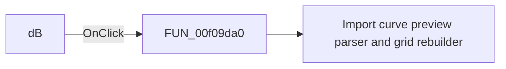

# dB

> Analysis status: Pending individual source review.

## Control

| Property | Recovered value |
| --- | --- |
| Form | ImportCurveDialog |
| Component path | ImportCurveDialog.GroupBox1.dBRB |
| Control class | TRadioButton |
| Caption | dB |
| Hint | Not present in the recovered resource. |
| Text | Not present in the recovered resource. |
| Handler name | dBRBClick |
| Handler address | 00f09da0 |
| Graph node | `resource:dfm:ImportCurveDialog/ImportCurveDialog.GroupBox1.dBRB` |
| Handler node | `function:00f09da0` |
| Graph layer | UI |

## What happens when clicked

Pending individual analysis. An agent must read the recovered handler source and its relevant callees before it replaces this text.

## Click flow

## Handler evidence

- Source: [DecompiledSources/Tina16/functions/0000000000F09DA0__FUN_00f09da0.c](../../../DecompiledSources/Tina16/functions/0000000000F09DA0__FUN_00f09da0.c)
- Recovered role: Import curve dB display-mode selector
- Current graph summary: Handles the dB radio-button click and rebuilds the import preview. Handles 1 Delphi UI event: ImportCurveDialog.GroupBox1.dBRB.OnClick.
- Current graph behavior: Handles the dB radio-button click and rebuilds the import preview.
- Current graph evidence: The dB radio button resolves here. The function only calls the shared preview rebuild, which selects the voltage-in-dB heading.
- Complexity: simple
- Distinct outgoing calls: 1

## Direct calls

- `function:00f09f30` — Import curve preview parser and grid rebuilder

## Resource evidence

- Kind: Not present in the recovered resource.
- Modal result: Not present in the recovered resource.
- Checked state: true
- List items: Not present in the recovered resource.
- Image reference: Not present in the recovered resource.
- Extracted glyph: None.

## Nearby label candidates

Nearby labels are layout candidates only. They are not proof of behavior.

- Rank 1: AC amplitude: at distance 342.
- Rank 2: Preview: at distance 365.
- Rank 3: Display format: at distance 374.

## Analysis limits

- Do not infer behavior from the control class, caption, hint, glyph, or nearby label alone.
- Do not replace the pending status until the handler source and relevant call path provide enough evidence.
