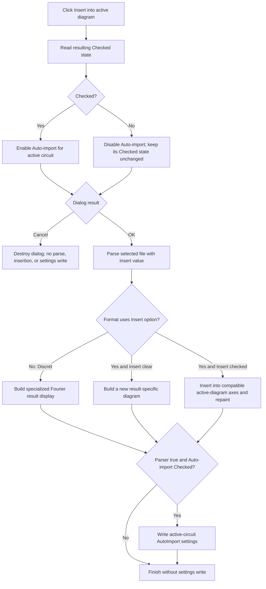

# Insert into active diagram

## Control

| Property | Recovered value |
| --- | --- |
| Form | ImportCurveDialog |
| Component path | ImportCurveDialog.GroupBox1.InsertIntoDiagramCB |
| Control class | TCheckBox |
| Caption | Insert into active diagram |
| Handler name | InsertIntoDiagramCBClick |
| Handler address | 00f09eb0 |
| Graph node | `resource:dfm:ImportCurveDialog/ImportCurveDialog.GroupBox1.InsertIntoDiagramCB` |
| Handler node | `function:00f09eb0` |
| Graph layer | UI |

The resource has no hint, action, image, or glyph for this check box. It explicitly creates the related **Auto-import for active circuit** check box disabled. Neither check box has an explicit recovered `Checked=true` property.

## What happens when clicked

`InsertIntoDiagramCBClick` reads the current checked state of **Insert into active diagram** and assigns the same Boolean value to `AutoLoadCB.Enabled`.

- Checked: **Auto-import for active circuit** becomes enabled.
- Clear: **Auto-import for active circuit** becomes disabled.

The handler does not change either check box's visibility. It does not change `AutoLoadCB.Checked`, rebuild the preview, parse the file, insert a curve, close the dialog, or write settings.

The VCL check box updates its state before it dispatches `OnClick`. The handler therefore reads the new state produced by the click.

## Deferred import behavior

The checkbox state is consumed only after the outer Import command receives modal result `1` from this dialog. The outer command reads these values separately:

- `FUN_00f09e90` returns `InsertIntoDiagramCB.Checked`;
- `FUN_00f09ef0` returns `AutoLoadCB.Checked`.

The Insert value is forwarded to the `.283`-owned import dispatcher. It has these proven effects for supported formats:

- For transient and AC or frequency-domain imports, a clear Insert value selects a result-specific new-diagram builder.
- For those same imports, a checked Insert value collects the imported curves and routes them to compatible axes in the active diagram. The lower insertion path recalculates and repaints the diagram.
- The Discret Fourier parser does not receive the Insert value. It always uses its specialized Fourier result-display path.

The checkbox does not select an axis or coordinate system. The later insertion helper selects compatible targets. If no compatible coordinate system accepts the curves, that path can show `curves cannot be inserted into this coordinate system! Please select another diagram!` and return false. The imported result can remain populated even when diagram insertion fails.

## Auto-import enablement and persistence

The click changes only `AutoLoadCB.Enabled`. It does not clear `AutoLoadCB.Checked` when Insert is cleared.

This distinction matters because the accepted-dialog caller reads `AutoLoadCB.Checked` without testing `AutoLoadCB.Enabled` or testing Insert again. Therefore, this source path permits this sequence:

1. Check Insert.
2. Check Auto-import.
3. Clear Insert. Auto-import becomes disabled but remains checked because this handler does not clear it.
4. Select OK. A successful parser result can still enter the AutoImport settings writer.

The persistence writer stores the selected file name, detected file type, skipped-row count, delimiter, and amplitude-in-dB state in the active circuit's `AutoImport` section. It does not store the Insert checkbox value or the Auto-import enabled state. A later auto-import consumer runs the shared dispatcher with active-diagram insertion enabled.

No settings are written when the parser or active-diagram insertion path returns false. An exception during the sequential settings writes can leave a partial key set because the outer command has no transaction or rollback.

## OK, Cancel, and errors

The dialog's `OKBtn` and `CancelBtn` use the built-in `bkOK` and `bkCancel` kinds. They have no custom click handlers.

- Cancel returns a non-OK modal result. The outer command destroys the dialog without parsing, diagram insertion, or AutoImport persistence. The local checkbox states then disappear with the form.
- OK returns modal result `1`. The outer command reads the format, display, skip-row, delimiter, amplitude, Insert, and Auto-import values and starts the parser.

The checkbox handler itself has no validation, error message, no-target guard, exception handler, or rollback. If the checked-state getter or enabled-state setter raises an exception, the VCL click already changed Insert, while Auto-import can retain its prior enabled state.

Parser cancellation and parser failures occur after OK, not in this click. The parsers replace the prior global imported-result object before they read all rows. Their progress-cancel path destroys the new result and clears the global slot, but it does not restore the previous result. Diagram insertion begins only after row parsing completes.

## Click and commit flow

## Evidence

- [Checkbox handler](../../../DecompiledSources/Tina16/functions/0000000000F09EB0__FUN_00f09eb0.c): reads the control at form offset `+0x6f8` through its checked-state getter and sends the result to the enabled-state setter of the control at `+0x700`.
- [Insert-state getter](../../../DecompiledSources/Tina16/functions/0000000000F09E90__FUN_00f09e90.c) and [Auto-import-state getter](../../../DecompiledSources/Tina16/functions/0000000000F09EF0__FUN_00f09ef0.c): prove that the accepted caller later reads both `Checked` values independently.
- [Outer Import coordinator](../../../DecompiledSources/Tina16/functions/0000000001A894F0__FUN_01a894f0.c): owns the file dialog, modal result gate, option reads, parser dispatch, and guarded AutoImport settings writes. Bead `.283` owns its annotation.
- [Import dispatcher](../../../DecompiledSources/Tina16/functions/00000000013E26F0__FUN_013e26f0.c): forwards Insert to the transient and AC parsers but not to the Discret Fourier parser. Bead `.283` owns its annotation.
- [Time-series parser](../../../DecompiledSources/Tina16/functions/00000000013E2850__FUN_013e2850.c) and [frequency-domain parser](../../../DecompiledSources/Tina16/functions/00000000013E34C0__FUN_013e34c0.c): select a new-diagram builder or active-diagram insertion from the Insert value.
- [Discret Fourier parser](../../../DecompiledSources/Tina16/functions/00000000013E4610__FUN_013e4610.c): uses its specialized result-display path without an Insert argument.
- [Active-diagram insertion router](../../../DecompiledSources/Tina16/functions/00000000013E2500__FUN_013e2500.c) and [compatible-axis insertion](../../../DecompiledSources/Tina16/functions/0000000001ADB8E0__FUN_01adb8e0.c): choose a target route, insert or update compatible curves, and report incompatible coordinate systems.
- [Later AutoImport consumer](../../../DecompiledSources/Tina16/functions/00000000013E4FD0__FUN_013e4fd0.c): reads the active-circuit settings and invokes the dispatcher with active-diagram insertion enabled.
- [Recovered UI evidence](../../../DecompiledSources/Tina16/resources/dfm/ui-evidence.json): maps offsets `+0x6f8` and `+0x700` to InsertIntoDiagramCB and AutoLoadCB and records `AutoLoadCB.Enabled=false`, `bkOK`, and `bkCancel`.

## Limits

- The checkbox handler does not name or select the later diagram, coordinate system, or axes. Those choices belong to the import helpers.
- The source proves that disabling Auto-import does not call its Checked setter. It does not expose a separate user action that automatically clears the checked state.
- The Insert choice is live modal-dialog state. No direct persistence of that Boolean is present.
