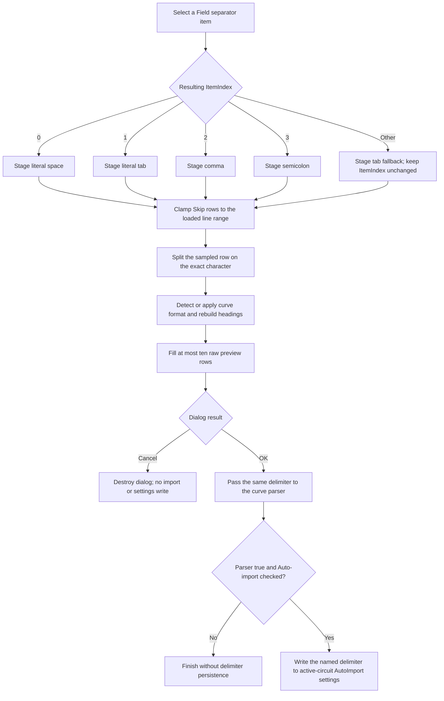

# Field separator

## Control

| Property | Recovered value |
| --- | --- |
| Form | ImportCurveDialog |
| Component path | ImportCurveDialog.GroupBox1.SeparatorGroup |
| Control class | TRadioGroup |
| Caption | Field separator |
| Items | Space; Tab; Comma (,); Semicolon (;) |
| Handler name | SeparatorGroupClick |
| Handler address | 00f09f30 |
| Graph node | `resource:dfm:ImportCurveDialog/ImportCurveDialog.GroupBox1.SeparatorGroup` |
| Handler node | `function:00f09f30` |
| Graph layer | UI |

The resource has no hint, action, image, or glyph for this radio group. Its item text identifies the available modes, and the handler's ItemIndex branches and splitter data flow prove how the modes are used.

## What happens when the selection changes

The VCL radio group changes `ItemIndex` before it calls [FUN_00f09f30](../../../DecompiledSources/Tina16/functions/0000000000F09F30__FUN_00f09f30.c). The handler maps the resulting index to the form's staged delimiter string at offset `+0x758`:

| ItemIndex | Resource item | Staged delimiter |
| ---: | --- | --- |
| 0 | Space | One literal space character |
| 1 | Tab | One literal tab character |
| 2 | Comma (,) | `,` |
| 3 | Semicolon (;) | `;` |
| Any other value | No matching item | Literal tab fallback |

The fallback changes the parser string only. The handler does not set `SeparatorGroup.ItemIndex`, so an invalid or initially unselected index can still appear unselected while preview parsing uses Tab.

After it stores the delimiter, the same handler rebuilds the preview. It reads the loaded source-line list, clamps **Skip rows** against the line count, splits the selected first data row, derives or applies the curve format, configures the preview columns and localized headings, and copies at most ten source rows into the grid. It clears unused cells in each populated preview row.

This handler is also bound to `SkipRowsSE.OnChange`. The separator click therefore runs the same skip-row clamp and preview rebuild as a Skip rows edit.

## Delimited-text behavior

[FUN_00d309d0](../../../DecompiledSources/Tina16/functions/0000000000D309D0__FUN_00d309d0.c) is the shared line splitter. It clears its destination list, repeatedly finds the exact delimiter substring, appends the text before it, removes the consumed text, and finally appends the remainder.

For this radio group, every delimiter is one character. The proven consequences are:

- Space means a literal space, not any whitespace.
- Tab means a literal tab.
- Consecutive delimiters preserve empty fields because the splitter appends an empty prefix.
- The splitter has no quote, escape, or CSV-record branch. A comma or semicolon inside quoted text is still a separator.
- Preview cells contain the split source text. This click does not convert the cell text to numeric curve values.

## Preview format and dependent controls

The selected separator can change the number of fields in the sampled row. In **Auto-detect** mode, that field count, together with recovered `Digilent` and `Network Analyzer` markers, selects the internal format code. The code then controls the grid's column count and headings such as Time, Value, Freq, Channel, Voltage, Voltage dB, and Phase.

An explicit **Curves type** selection overrides the main auto-detected type branch:

- Transient selects the transient preview format.
- AC selects the AC preview format.
- Discret selects the Discret preview format.

The handler also reads the Volts/dB choice when it writes AC-style headings. It does not change Curves type, Display format, Volts, dB, Insert into active diagram, or Auto-import state. It does not enable, disable, show, or hide any control. [FUN_00f09c90](../../../DecompiledSources/Tina16/functions/0000000000F09C90__FUN_00f09c90.c), not this separator handler, owns the enabled-state changes for the format-dependent controls and then calls the same preview rebuilder.

## OK, Cancel, import, and persistence

The click stages a delimiter and updates the preview. It does not import a curve, change a diagram, close the dialog, or write settings.

The dialog uses built-in `bkOK` and `bkCancel` buttons without custom click handlers:

- Cancel returns a non-OK modal result. The outer command destroys the dialog without calling the curve parser and without writing AutoImport settings. The staged delimiter and preview disappear with the form.
- OK returns modal result `1`. The `.283`-owned [FUN_01a894f0](../../../DecompiledSources/Tina16/functions/0000000001A894F0__FUN_01a894f0.c) loads the selected file, reads the detected format, display mode, skip count, staged delimiter, amplitude mode, and insertion options, and calls [FUN_013e26f0](../../../DecompiledSources/Tina16/functions/00000000013E26F0__FUN_013e26f0.c). The dispatcher forwards the same delimiter to the applicable curve parser.

The separator becomes persistent only when the accepted parser returns true and **Auto-import for active circuit** is checked. In that branch, [FUN_00f0b4f0](../../../DecompiledSources/Tina16/functions/0000000000F0B4F0__FUN_00f0b4f0.c) converts the separator to its AutoImport settings name. Space, comma, and semicolon become `space`, `comma`, and `semicolon`; tab uses the recovered tab-name string, which is also the converter's unknown-value fallback. The outer command writes that value under the active circuit's `.Delimiter` key. A separator click by itself has no persistence effect.

## Selection and import flow

## Error and boundary behavior

- The handler has no explicit empty-file guard before it indexes the sampled source row. It also has no local exception handler or error dialog. A missing row, list access failure, grid failure, or allocation failure propagates out of the event path.
- For a non-empty source list, Skip rows is constrained to the available index range before the sampled row is read. The handler changes the spin-edit value when it must clamp it.
- A separator that produces the wrong field count can change auto-detection and preview layout. The preview does not validate numeric syntax and does not prove that OK will import successfully.
- Numeric conversion, progress cancellation, curve creation, diagram insertion, and parser error handling occur only after OK in the shared import pipeline. They are not actions of this radio-group click.
- Unsupported internal format codes make the dispatcher return false. That prevents the AutoImport settings branch, including delimiter persistence.
- The settings writes are not transactional. If a later settings write raises after `.Delimiter` is written, the recovered outer path has no rollback for the already written key.

## Evidence

- [Separator and preview handler](../../../DecompiledSources/Tina16/functions/0000000000F09F30__FUN_00f09f30.c): maps the four ItemIndex values, stores the delimiter at `+0x758`, clamps Skip rows, splits rows, selects the preview format, configures headings, and fills a maximum of ten data rows.
- [Delimited line splitter](../../../DecompiledSources/Tina16/functions/0000000000D309D0__FUN_00d309d0.c): proves exact-substring splitting, empty-field preservation, and the absence of quote or escape handling.
- [Form-show handler](../../../DecompiledSources/Tina16/functions/0000000000F09E30__FUN_00f09e30.c): loads the selected file into the dialog's line list and calls the same preview handler.
- [Curve-type and display handler](../../../DecompiledSources/Tina16/functions/0000000000F09C90__FUN_00f09c90.c): proves that dependent control enablement is separate and that format changes rebuild the same preview.
- [Outer Import coordinator](../../../DecompiledSources/Tina16/functions/0000000001A894F0__FUN_01a894f0.c): proves the OK gate, option reads, parser call, successful Auto-import gate, and active-circuit settings writes. Bead `.283` owns its annotation.
- [Import dispatcher](../../../DecompiledSources/Tina16/functions/00000000013E26F0__FUN_013e26f0.c): forwards the delimiter to supported format parsers and returns false for unsupported codes. Bead `.283` owns its annotation.
- [Delimiter settings serializer](../../../DecompiledSources/Tina16/functions/0000000000F0B4F0__FUN_00f0b4f0.c): maps the runtime delimiter to the stored AutoImport name.
- [Recovered UI evidence](../../../DecompiledSources/Tina16/resources/dfm/ui-evidence.json): provides the radio-group items, shared handler bindings, related control resources, and `bkOK` and `bkCancel` button kinds.

## Limits

- The decompiler exposes the tab-name output as a data constant rather than as a Unicode literal. Its role is established by the tab comparison branch and by its use as the unknown-delimiter fallback.
- The handler's internal format codes are documented only where their UI meaning is established by Curves type, field count, marker, and heading evidence.
- The preview copies raw split fields. It does not guarantee that the later numeric parser will accept every field or that diagram insertion will succeed.
