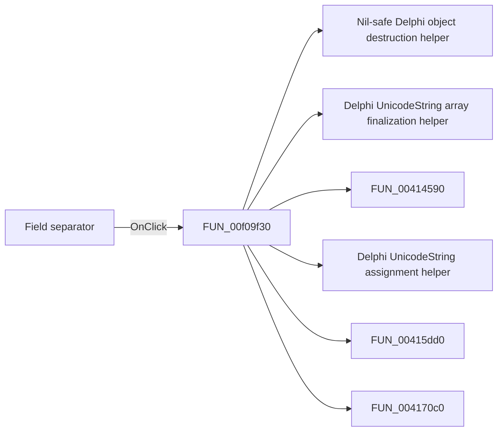

# Field separator

> Analysis status: Pending individual source review.

## Control

| Property | Recovered value |
| --- | --- |
| Form | ImportCurveDialog |
| Component path | ImportCurveDialog.GroupBox1.SeparatorGroup |
| Control class | TRadioGroup |
| Caption | Field separator |
| Hint | Not present in the recovered resource. |
| Text | Not present in the recovered resource. |
| Handler name | SeparatorGroupClick |
| Handler address | 00f09f30 |
| Graph node | `resource:dfm:ImportCurveDialog/ImportCurveDialog.GroupBox1.SeparatorGroup` |
| Handler node | `function:00f09f30` |
| Graph layer | UI |

## What happens when clicked

Pending individual analysis. An agent must read the recovered handler source and its relevant callees before it replaces this text.

## Click flow

## Handler evidence

- Source: [DecompiledSources/Tina16/functions/0000000000F09F30__FUN_00f09f30.c](../../../DecompiledSources/Tina16/functions/0000000000F09F30__FUN_00f09f30.c)
- Recovered role: Import curve preview parser and grid rebuilder
- Current graph summary: Selects the field separator, clamps the skipped-row value, parses source rows, configures the grid, writes localized headings, and fills a bounded preview. It selects voltage or voltage-in-dB headings. Handles 2 Delphi UI events: ImportCurveDialog.GroupBox1.SkipRowsSE.OnChange, ImportCurveDialog.GroupBox1.SeparatorGroup.OnClick.
- Current graph behavior: Selects the field separator, clamps the skipped-row value, parses source rows, configures the grid, writes localized headings, and fills a bounded preview. It selects voltage or voltage-in-dB headings.
- Current graph evidence: Separator, skipped-row, display-format, Volts, dB, and form-show paths call it. It splits rows and writes the recovered import headings.
- Complexity: complex
- Distinct outgoing calls: 20

## Direct calls

- `function:00410f20` — Nil-safe Delphi object destruction helper
- `function:00414560` — Delphi UnicodeString array finalization helper
- `function:00414590` — FUN_00414590
- `function:00414ad0` — Delphi UnicodeString assignment helper
- `function:00415dd0` — FUN_00415dd0
- `function:004170c0` — FUN_004170c0
- `function:0041ddd0` — FUN_0041ddd0
- `function:004b6930` — FUN_004b6930
- `function:0064d0b0` — FUN_0064d0b0
- `function:008483e0` — FUN_008483e0
- `function:00848570` — FUN_00848570
- `function:008486b0` — FUN_008486b0
- `function:00848790` — FUN_00848790
- `function:00848a70` — FUN_00848a70
- `function:0084e3e0` — FUN_0084e3e0
- `function:00b89270` — FUN_00b89270
- `function:00b8e650` — FUN_00b8e650
- `function:00c5a450` — FUN_00c5a450
- `function:00c5a4c0` — FUN_00c5a4c0
- `function:00d309d0` — Delimited text-line splitter

## Resource evidence

- Kind: Not present in the recovered resource.
- Modal result: Not present in the recovered resource.
- Checked state: Not present in the recovered resource.
- List items: ("Space", "Tab", "Comma (,)", "Semicolon (;)")
- Image reference: Not present in the recovered resource.
- Extracted glyph: None.

## Nearby label candidates

Nearby labels are layout candidates only. They are not proof of behavior.

- Rank 1: Skip rows: at distance 32.
- Rank 2: Curves type: at distance 72.
- Rank 3: Display format: at distance 104.

## Analysis limits

- Do not infer behavior from the control class, caption, hint, glyph, or nearby label alone.
- Do not replace the pending status until the handler source and relevant call path provide enough evidence.
