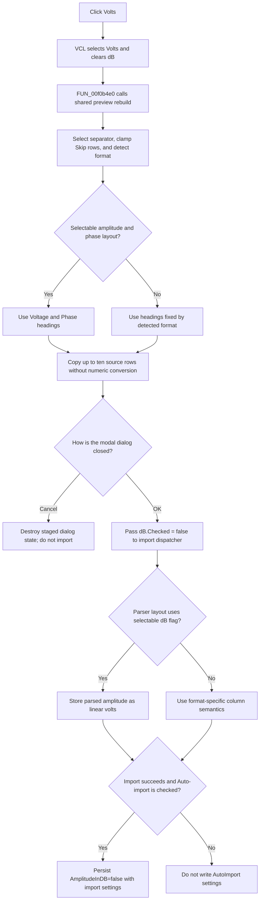

# Use volts for imported AC amplitude

> Analysis status: Source reviewed through radio selection, preview rebuild,
> accepted import conversion, cancellation, and persistence boundaries.

## Control

| Property | Recovered value |
| --- | --- |
| Form | ImportCurveDialog |
| Component path | ImportCurveDialog.GroupBox1.VoltsRB |
| Control class | TRadioButton |
| Caption | Volts |
| Hint | Not present in the recovered resource. |
| Text | Not present in the recovered resource. |
| Handler name | VoltsRBClick |
| Handler address | 00f0b4e0 |
| Graph node | `resource:dfm:ImportCurveDialog/ImportCurveDialog.GroupBox1.VoltsRB` |
| Handler node | `function:00f0b4e0` |
| Graph layer | UI |

## What happens when clicked

This radio button selects linear volts as the amplitude interpretation for an
AC or Discret import whose layout lets the user choose between volts and dB.
It is paired with **dB** under the recovered **AC amplitude:** label. The dB
button is checked in the form resource, so dB is the initial choice. Standard
radio-button processing selects **Volts** and clears **dB** before the click
handler runs.

`FUN_00f0b4e0` contains no condition or state write of its own. It calls the
shared preview parser and grid rebuilder `FUN_00f09f30`. That function reads
the checked state of the Volts control at form offset `0x720`. For selectable
amplitude/phase layouts, it changes each amplitude heading from the localized
**Voltage dB** text to **Voltage** and keeps the adjacent **Phase** heading.
It then copies the source fields into the preview grid. It does not convert the
preview numbers.

The shared rebuild also repeats the complete preview preparation. It selects
the configured separator, clamps **Skip rows** to the source-list range,
splits the selected source row, detects or applies the curve format, rebuilds
the grid shape and headings, and fills at most ten preview rows. Thus a Volts
click can also refresh those derived preview values. It does not read the file
again, create a result, add a curve, close the dialog, or save a setting.

## Effect after OK

The dialog's built-in **OK** button returns modal result `1`; it has no
application click handler. The owning Import command then reads **dB** through
the separate getter `FUN_00f09e70`. Because selecting **Volts** clears that
paired radio button, the value passed as the amplitude-in-dB flag is false.

For the user-selectable AC and Discret magnitude/phase layouts, the import
parsers use this flag before calling the dB-to-linear conversion helper. A
false value stores the parsed amplitude as the linear value. The parser still
converts phase from degrees to radians. Formats whose recovered layout already
fixes the meaning of its columns can select another format-specific branch;
the Volts control does not override such a fixed layout.

The click itself does not write curve metadata. After a successful import, the
outer command can persist `AmplitudeInDB=false` with the file type, skip count,
separator, and file name, but only when **Auto-import for active circuit** is
checked. This setting controls a later auto-import. It is not required for the
current manual import.

## Cancel, repeat, and errors

The built-in **Cancel** button closes the modal dialog without calling the
import dispatcher. The staged radio choice and preview are then destroyed;
no curve or auto-import setting changes.

The handler does not test whether Volts was already selected. If the handler
is invoked again, it repeats the preview rebuild. The recovered handler and
preview function have no local exception handler. A string split, number
control, allocation, or grid error can therefore propagate after the preview
has been partly reconfigured. This click has no rollback because it has not
started the result import.

## Click flow

## Handler evidence

- Source: [DecompiledSources/Tina16/functions/0000000000F0B4E0__FUN_00f0b4e0.c](../../../DecompiledSources/Tina16/functions/0000000000F0B4E0__FUN_00f0b4e0.c)
- Recovered role: Import curve volts display-mode selector.
- Input evidence: The DFM binds `VoltsRB.OnClick` to `00f0b4e0`; the handler
  calls only the shared preview rebuild.
- State evidence: The rebuild reads the Volts control at `0x720`. The accepted
  import reads the paired dB control at `0x728` and forwards its checked state
  as the amplitude-in-dB flag.
- No-op evidence: The click performs no import or persistence. Cancel prevents
  the outer import command from reading the staged choice.
- Complexity: simple.
- Distinct outgoing calls: 1.

## Relevant calls

- [`FUN_00f09f30`](../../../DecompiledSources/Tina16/functions/0000000000F09F30__FUN_00f09f30.c)
  rebuilds the preview and selects Voltage or Voltage dB headings. It is the
  shared function documented by the Field separator control analysis.
- [`FUN_00f09e70`](../../../DecompiledSources/Tina16/functions/0000000000F09E70__FUN_00f09e70.c)
  reads the paired dB checked state for the accepted import. Its canonical
  role belongs to the dB control analysis.
- [`FUN_01a894f0`](../../../DecompiledSources/Tina16/functions/0000000001A894F0__FUN_01a894f0.c)
  owns the modal result, starts the selected import, and conditionally writes
  the active circuit's AutoImport settings.
- [`FUN_013e34c0`](../../../DecompiledSources/Tina16/functions/00000000013E34C0__FUN_013e34c0.c)
  uses the dB flag for selectable AC amplitude/phase rows.
- [`FUN_013e4610`](../../../DecompiledSources/Tina16/functions/00000000013E4610__FUN_013e4610.c)
  uses the same flag for selectable Discret magnitude/phase rows.

## Resource evidence

- The control is a `TRadioButton` captioned **Volts**. It has no recovered
  hint, action, image reference, or glyph.
- Its sibling is a `TRadioButton` captioned **dB** with `Checked=True` in the
  recovered form resource.
- The nearest same-parent label candidate is **AC amplitude:**. The handler,
  preview heading selection, and accepted parser flag confirm that relationship.
- `CurveTypeCB` enables the amplitude label and both radio buttons only for
  the recovered AC and Discret selections.

## Analysis limits

- The internal file-format values have no recovered Delphi enumeration names.
  This article distinguishes selectable and fixed amplitude layouts from the
  enablement logic, preview branches, dispatcher, and parser data flow.
- The recovered code proves value interpretation and optional conversion. It
  does not show a separate unit-name field written into each imported curve.
- Standard VCL radio exclusivity explains the paired checked-state transition;
  the application handler itself does not set either radio button.
