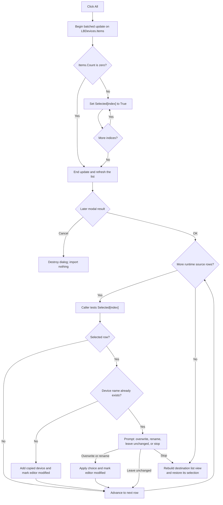

# &All

> Analysis status: Source reviewed. The complete-list selection loop, batched refresh, runtime list mapping, sibling selection commands, modal OK and Cancel boundaries, later import loop, duplicate handling, modified state, and failure limits are supported by recovered code.

## Control

| Property | Recovered value |
| --- | --- |
| Form | ImportDlg |
| Component path | ImportDlg.btnAll |
| Control class | TButton |
| Caption | &All |
| Hint | Not present in the recovered resource. |
| Text | Not present in the recovered resource. |
| Handler name | btnAllClick |
| Handler address | 01782df0 |
| Graph node | `resource:dfm:ImportDlg/ImportDlg.btnAll` |
| Handler node | `function:01782df0` |
| Graph layer | UI |

## What happens when clicked

`FUN_01782df0` requests the selected state for every row in `LBDevices`. It reads `LBDevices.Items.Count`, visits indices `0` through `Count - 1`, and calls the VCL list-box selection setter with `True` for each index. The recovered label above the list explicitly tells the user that Shift+Click and Ctrl+Click provide extended selection.

The handler brackets the loop with the Items begin-update and end-update pair. The update counter suppresses intermediate collection notifications and releases the final refresh when the counter returns to zero. Selection setters that find a row already selected return without a native control update. A repeated **All** click therefore preserves the same selection, although the handler still traverses every item.

The button does not add, delete, reorder, or copy a device record. It changes selection flags in the modal dialog only.

## Runtime list and related controls

The caller constructs the runtime list from devices read from the selected import source. It clears `LBDevices`, adds one display name and source-device object for each entry, and keeps the source collection in the same index order. It then calls the **None** handler before it shows the dialog, so the initial runtime selection is empty. The five design-time sample strings in the DFM are not the records later imported.

The three selection buttons differ only in the requested per-row state:

- **All** sets every row to selected.
- **None** sets every row to not selected.
- **Invert** reads every current selection flag and writes its opposite.

The search edit does not filter or rebuild the list. Its OnChange path finds a matching name and changes the list's current item index. **All** ignores that current index and still applies to the complete `Items.Count` range.

## OK, import, and Cancel boundaries

`OKBtn` is a built-in `bkOK` button without a custom click handler. After the modal result is OK, the caller iterates the dialog rows and tests `Selected[index]`. For each selected row, it reads the source device at the same index and tries to add it to the current device list.

If a name is new, the caller copies the source device into the destination list and sets the editor field at `+0xc90` to 1. The save-confirmation path later reads this field as the modified state. If a name already exists, the caller prompts to overwrite it, add it under a generated new name, leave the existing device unchanged and continue, or stop the remaining loop. Accepted additions and replacements are applied as the loop runs; they are not held in a transaction. Stopping after a duplicate prompt does not roll back devices imported at earlier indices.

If no row is selected, an accepted OK result copies no device record. The caller still runs its normal destination-list rebuild and selection-restoration path. **Cancel** is the built-in `bkCancel` button. A Cancel result skips the import loop and destination mutation, then destroys the dialog.

The **All** handler does not set the modified flag and does not write the source file, destination library, registry, or settings. Only a later accepted import can mark the in-memory device editor modified. A later Save action is required for persistence.

## Empty and error paths

For an empty runtime list, `Items.Count` is zero. The per-row loop is skipped, the matching end-update call still runs, and the click has no selection effect.

The handler has no range error because it derives all indices from the current item count. It has no exception handler, rollback, or `finally` block. The shared VCL selection setter raises an exception if the native list-box selection operation fails. If that happens after some rows were changed, those earlier rows remain selected and the handler does not reach end-update, so the Items update counter can remain elevated. No handler-local error message repairs that partial state.

Errors during the later import are outside this click. The recovered caller can leave earlier accepted imports in place when duplicate resolution stops the loop, and it does not provide a transaction-wide rollback.

## Click flow

## Handler evidence

- [All handler `FUN_01782df0`](../../../DecompiledSources/Tina16/functions/0000000001782DF0__FUN_01782df0.c) brackets a count-based loop and requests selected state 1 for each list-box row.
- [VCL list-box selection setter `FUN_0068bd10`](../../../DecompiledSources/Tina16/functions/000000000068BD10__FUN_0068bd10.c) compares the current row state, performs the native selection operation, and raises if that operation fails.
- [Items begin-update helper `FUN_004b3260`](../../../DecompiledSources/Tina16/functions/00000000004B3260__FUN_004b3260.c) increments the update counter and notifies the collection on the outer transition.
- [Items end-update helper `FUN_004b3390`](../../../DecompiledSources/Tina16/functions/00000000004B3390__FUN_004b3390.c) decrements the update counter and releases the final notification at zero.
- [None handler `FUN_01782e70`](../../../DecompiledSources/Tina16/functions/0000000001782E70__FUN_01782e70.c) provides the false-state sibling and is also called during runtime initialization.
- [Invert handler `FUN_01782ef0`](../../../DecompiledSources/Tina16/functions/0000000001782EF0__FUN_01782ef0.c) reads each state and writes its inverse.
- [Search-change handler `FUN_01783140`](../../../DecompiledSources/Tina16/functions/0000000001783140__FUN_01783140.c) finds a matching name and changes the current item index without changing `Items.Count`.
- [Import dialog caller `FUN_0179ac90`](../../../DecompiledSources/Tina16/functions/000000000179AC90__FUN_0179ac90.c) builds the runtime list, shows the modal dialog, reads each selected flag after OK, resolves duplicate names, updates the destination, and restores the list view.
- [Modified-state setter `FUN_01795670`](../../../DecompiledSources/Tina16/functions/0000000001795670__FUN_01795670.c) writes the editor field at `+0xc90`; the caller invokes it only after an accepted device add or replacement.
- [Save guard `FUN_01795d10`](../../../DecompiledSources/Tina16/functions/0000000001795D10__FUN_01795d10.c) later reads `+0xc90` and offers the save decision, proving that the import marks in-memory state rather than persisting it immediately.
- Recovered role: Select every runtime device row in the Import dialog.
- Current graph summary: Handles 1 Delphi UI event: ImportDlg.btnAll.OnClick.
- Current graph behavior: Batches `LBDevices.Items` notifications, walks the full item count, and requests selected state for every row without importing or persisting a device.
- Current graph evidence: The DFM binds `btnAllClick` to `01782df0`; its source reads the list's Items count and calls the selection setter with 1 for each derived index.
- Complexity: complex
- Distinct outgoing calls: 3

## Direct calls

- `function:004b3260` — Begin the Items batch update.
- `function:0068bd10` — Set one list-box row's selected state.
- `function:004b3390` — End the Items batch update.

## Resource evidence

- Kind: Not present in the recovered resource.
- Modal result: Not present in the recovered resource.
- Checked state: Not present in the recovered resource.
- List items: Not present on the button. `LBDevices` contains five design-time sample items that the caller clears before runtime population.
- Image reference: Not present in the recovered resource.
- Extracted glyph: None.

## Nearby label candidates

The same-parent label is direct dialog instruction text, and the handler confirms its selection context.

- Rank 1: Please select the devices you would like to add to the current device list. Use Shift+Click and/or Ctrl+Click for extended selection. at distance 214.

## Analysis limits

- `TIARA-diz.6.7.678` owns the Invert handler annotation. This article uses its source only for the sibling comparison.
- `TIARA-diz.6.7.679` owns the None handler annotation. This article uses its source and initialization call only for the sibling and initial-state comparison.
- Shared VCL and RTL selection and update helpers remain evidence-only. They are not assigned control-specific roles in this fragment.
- The caller performs the import after the modal dialog returns. This article documents that boundary but does not assign the broad import coordinator to the All control.
- The original Delphi names of the source-device type and destination collection are not recovered. Their roles follow from the same-index display/object population and later selected-index reads.
- The native list-box mode field name is not recovered. The resource instruction proves that this dialog presents extended selection; the setter itself contains both single-select and multi-select native paths.
