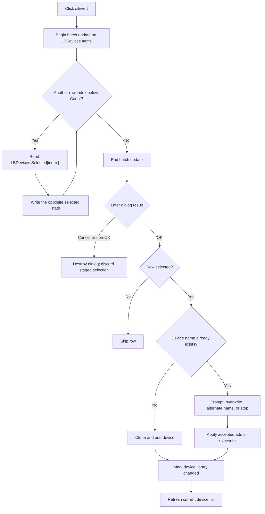

# &Invert

## Control

| Property | Recovered value |
| --- | --- |
| Form | ImportDlg |
| Component path | ImportDlg.btnInvert |
| Control class | TButton |
| Caption | &Invert |
| Handler name | btnInvertClick |
| Handler address | 01782ef0 |
| Graph node | `resource:dfm:ImportDlg/ImportDlg.btnInvert` |
| Handler node | `function:01782ef0` |
| Graph layer | UI |

The resource has no hint, image, or glyph. Its strongest text evidence is the
nearby instruction for `LBDevices`: select the devices to add to the current
device list, with Shift+Click and Ctrl+Click available for extended selection.

## What happens when clicked

`FUN_01782ef0` complements the selection of every row in `LBDevices`. It begins
a batch update on `LBDevices.Items`, reads the item count, and visits indexes
`0` through `Count - 1`. For each index, it reads `Selected[index]` and writes
the opposite Boolean value. It then ends the batch update.

The click changes only list-box selection flags in the open modal dialog. It
does not change an item name, item object, item order, current device library,
dirty state, or file. It does not close the dialog. A second click restores the
selection that existed before the first click.

## Interaction with All, None, and Search

- `&All` (`FUN_01782df0`) selects every row. Invert after All therefore clears
  every selection.
- `&None` (`FUN_01782e70`) clears every row. Invert after None therefore selects
  every row.
- A mixed Shift+Click or Ctrl+Click selection becomes its exact complement.
- Search (`FUN_01783140`) moves the current list selection to a matching item;
  it does not create a filtered row set. Invert still visits the complete
  `LBDevices.Items` collection.

The import caller populates the dialog with one row for each parsed source
device and initially selects each row. It then calls the same None handler
before it shows the dialog. Therefore, the initial visible state has no device
selected. Invert in that initial state selects every source device.

## Import and persistence boundary

`FUN_0179ac90` owns the later import operation. If `ShowModal` returns OK, it
loops over the dialog rows and processes only rows whose selection flag is set.
It clones new devices into the current library. For a duplicate name, it asks
whether to overwrite the existing device or add the source device under a
generated alternate name. Each completed add or overwrite marks the ShapeEdit
device-library state as changed through `FUN_01795670`, and the caller rebuilds
the visible device list.

Cancel or any non-OK modal result skips this destination-list mutation. The
selection is only staged dialog state and is discarded when the dialog is
destroyed. The import path does not call the separate Save or Save As handlers
(`FUN_01795cf0` and `FUN_01795d00`). Thus, OK changes the in-memory device
library and marks it dirty; a separate save command performs durable file
output.

If the source list is empty, Invert performs the update bracket but has no row
to change. OK then imports nothing. If no row is selected, OK also adds or
overwrites nothing.

## Click and commit flow

## Error and partial-state behavior

The Invert handler has no validation, confirmation, exception handler, or
rollback. Its end-update call is not protected by a recovered `finally` block.
If a selection read or write fails during the loop, rows already visited can
remain inverted, later rows can remain unchanged, and the matching end-update
call is not guaranteed to run. No recovered statement reports such an error to
the user.

The later OK import is also not transactional. If duplicate handling tells the
caller to stop, devices imported earlier in the loop remain changed. The trace
does not prove rollback for a later clone, copy, or add failure.

## Handler evidence

- [Invert handler](../../../DecompiledSources/Tina16/functions/0000000001782EF0__FUN_01782ef0.c): brackets the item collection, loops over every item index, reads the current selection, and writes its inverse.
- [All handler](../../../DecompiledSources/Tina16/functions/0000000001782DF0__FUN_01782df0.c) and [None handler](../../../DecompiledSources/Tina16/functions/0000000001782E70__FUN_01782e70.c): use the same row loop to write true or false for every row.
- [Import caller](../../../DecompiledSources/Tina16/functions/000000000179AC90__FUN_0179ac90.c): populates the rows, clears the initial selections, shows the modal dialog, consumes selected rows only after OK, handles duplicates, marks accepted mutations changed, and refreshes the destination list.
- [Selection getter](../../../DecompiledSources/Tina16/functions/000000000068BCA0__FUN_0068bca0.c) and [selection setter](../../../DecompiledSources/Tina16/functions/000000000068BD10__FUN_0068bd10.c): read and write the native list-box selection state.
- [Batch-update begin](../../../DecompiledSources/Tina16/functions/00000000004B3260__FUN_004b3260.c) and [batch-update end](../../../DecompiledSources/Tina16/functions/00000000004B3390__FUN_004b3390.c): increment and decrement the item update counter and notify the owner at the outer transitions.
- [Changed-state setter](../../../DecompiledSources/Tina16/functions/0000000001795670__FUN_01795670.c): writes the state that mutation callers set after an accepted import.
- [Save](../../../DecompiledSources/Tina16/functions/0000000001795CF0__FUN_01795cf0.c) and [Save As](../../../DecompiledSources/Tina16/functions/0000000001795D00__FUN_01795d00.c): route to a separate save worker and are not called by the import path.

## Analysis limits

- The recovered code does not expose Delphi field names for all form offsets;
  `LBDevices` identity is established by the DFM binding and repeated caller
  data flow.
- The dirty-state meaning is established by mutation call sites and separate
  save handlers. The recovered setter itself only writes a byte.
- The recovered import path does not prove atomic rollback after a partial
  destination mutation.
