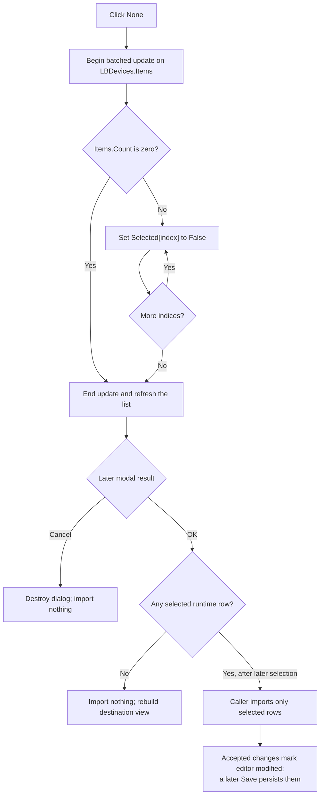

# &None

> Analysis status: Source reviewed. The complete-list clearing loop, batched refresh, initialization use, sibling selection commands, modal OK and Cancel boundaries, later import loop, modified state, and failure limits are supported by recovered code.

## Control

| Property | Recovered value |
| --- | --- |
| Form | ImportDlg |
| Component path | ImportDlg.btnNone |
| Control class | TButton |
| Caption | &None |
| Hint | Not present in the recovered resource. |
| Text | Not present in the recovered resource. |
| Handler name | btnNoneClick |
| Handler address | 01782e70 |
| Graph node | `resource:dfm:ImportDlg/ImportDlg.btnNone` |
| Handler node | `function:01782e70` |
| Graph layer | UI |

## What happens when clicked

`FUN_01782e70` clears the selected state of every row in `LBDevices`. It reads `LBDevices.Items.Count`, visits indices `0` through `Count - 1`, and calls the VCL list-box selection setter with `False` for each index. The recovered instruction label above the list says that the rows are the devices to add to the current device list and that Shift+Click and Ctrl+Click provide extended selection.

The handler brackets the loop with the Items begin-update and end-update pair. The update counter suppresses intermediate collection notifications and releases the final refresh when the counter returns to zero. The selection setter returns without a native control update when a row already has the requested state. A repeated **None** click is therefore idempotent, although the handler still traverses every row.

The handler does not remove a row, change the current item index, copy a device, close the dialog, or persist data. It changes only the dialog's staged selection flags.

## Initialization and related selection commands

The caller clears `LBDevices` and populates it from the selected import source. It stores each display name and source-device object at the same list index. It then calls this **None** handler before showing the modal dialog. The runtime dialog therefore starts with no source device selected. The five sample strings recovered from the DFM are replaced and are not the records later imported.

The three selection buttons operate on the same staged flags:

- **All** writes `True` for every row.
- **None** writes `False` for every row.
- **Invert** reads each row's current state and writes its opposite.

A later **All**, **Invert**, manual extended-selection action, or another **None** click simply updates the same list-box state. The search edit changes the current item index after it finds a matching name; it does not limit the range processed by **None**.

## OK, import, and Cancel boundaries

`OKBtn` is a built-in `bkOK` button without a custom click handler. Only after the modal result is OK does the caller iterate the runtime rows and test `Selected[index]`. It uses the matching source-device object only for a selected row. A **None** selection followed by OK therefore imports no device. The caller still runs its normal destination-list rebuild and selection-restoration path.

If a later action selects rows, the accepted import can add a new device or prompt about a duplicate name. Accepted additions and replacements set the device editor's in-memory modified field. The import loop applies accepted rows as it goes and is not a transaction, so a later duplicate decision can stop the loop without rolling back earlier imports.

`CancelBtn` is a built-in `bkCancel` button. A Cancel result skips the import loop and destination mutation, then destroys the dialog. Clicking **None** itself does not set the modified field and does not write the destination library, source file, registry, or settings. A later Save action is the persistence boundary for accepted in-memory changes.

## Empty and error paths

When the runtime list is empty, `Items.Count` is zero. The row loop is skipped, the matching end-update call still runs, and the click has no selection effect.

All indices come from the current Items count, and the handler does not change that collection inside the loop. It has no local error message, exception handler, rollback, or recovered `finally` path. The shared selection setter raises when the native list-box operation fails. If that happens after some rows were cleared, those earlier changes remain and the handler does not reach the end-update call, so the update counter can remain elevated.

## Click flow

## Handler evidence

- [None handler `FUN_01782e70`](../../../DecompiledSources/Tina16/functions/0000000001782E70__FUN_01782e70.c) brackets a count-based loop and requests selected state 0 for each list-box row.
- [VCL list-box selection setter `FUN_0068bd10`](../../../DecompiledSources/Tina16/functions/000000000068BD10__FUN_0068bd10.c) compares the current row state, performs the native selection operation, and raises if that operation fails.
- [Items begin-update helper `FUN_004b3260`](../../../DecompiledSources/Tina16/functions/00000000004B3260__FUN_004b3260.c) increments the update counter and notifies the collection on the outer transition.
- [Items end-update helper `FUN_004b3390`](../../../DecompiledSources/Tina16/functions/00000000004B3390__FUN_004b3390.c) decrements the update counter and releases the final notification at zero.
- [All handler `FUN_01782df0`](../../../DecompiledSources/Tina16/functions/0000000001782DF0__FUN_01782df0.c) provides the true-state sibling.
- [Invert handler `FUN_01782ef0`](../../../DecompiledSources/Tina16/functions/0000000001782EF0__FUN_01782ef0.c) reads each current selection state and writes its opposite.
- [Search-change handler `FUN_01783140`](../../../DecompiledSources/Tina16/functions/0000000001783140__FUN_01783140.c) finds a matching name and changes the current item index without changing `Items.Count`.
- [Import dialog caller `FUN_0179ac90`](../../../DecompiledSources/Tina16/functions/000000000179AC90__FUN_0179ac90.c) populates the runtime list, invokes **None** before `ShowModal`, reads selected flags after OK, handles duplicate names, updates the destination, and restores the list view.
- [Modified-state setter `FUN_01795670`](../../../DecompiledSources/Tina16/functions/0000000001795670__FUN_01795670.c) writes the editor field at `+0xc90`; the caller invokes it only after an accepted device addition or replacement.
- [Save guard `FUN_01795d10`](../../../DecompiledSources/Tina16/functions/0000000001795D10__FUN_01795d10.c) later reads `+0xc90` and offers the save decision, which proves that an accepted import changes in-memory state before persistence.
- Recovered role: Clear every runtime device selection in the Import dialog.
- Current graph summary: Handles 1 Delphi UI event: ImportDlg.btnNone.OnClick.
- Current graph behavior: Batches `LBDevices.Items` notifications, walks the full item count, and requests an unselected state for every row without importing or persisting a device.
- Current graph evidence: The DFM binds `btnNoneClick` to `01782e70`; its source reads the list's Items count and calls the selection setter with 0 for each derived index. The import caller also invokes the handler before showing the dialog.
- Complexity: complex
- Distinct outgoing calls: 3

## Direct calls

- `function:004b3260` — Begin the Items batch update.
- `function:0068bd10` — Set one list-box row's selected state.
- `function:004b3390` — End the Items batch update.

## Resource evidence

- Kind: Not present in the recovered resource.
- Modal result: Not present on this control. The separate OK and Cancel controls use `bkOK` and `bkCancel`.
- Checked state: Not present in the recovered resource.
- List items: Not present on the button. `LBDevices` contains five design-time sample items that the caller clears before runtime population.
- Image reference: Not present in the recovered resource.
- Extracted glyph: None.

## Nearby label candidates

The same-parent label is direct dialog instruction text, and the handler confirms its selection context.

- Rank 1: Please select the devices you would like to add to the current device list. Use Shift+Click and/or Ctrl+Click for extended selection. at distance 244.

## Analysis limits

- `TIARA-diz.6.7.677` owns the All handler annotation. This article uses its source only for the sibling comparison.
- `TIARA-diz.6.7.678` owns the Invert handler annotation. This article uses its source only for the sibling comparison.
- Shared VCL and RTL selection and update helpers remain evidence-only. They are not assigned control-specific roles in this fragment.
- The caller performs the import after the modal dialog returns. This article documents that boundary but does not assign the broad import coordinator to the None control.
- The original Delphi names of the source-device type and destination collection are not recovered. Their roles follow from the same-index display/object population and later selected-index reads.
- The native list-box mode field name is not recovered. The resource instruction proves that this dialog presents extended selection; the setter itself contains both single-select and multi-select native paths.
