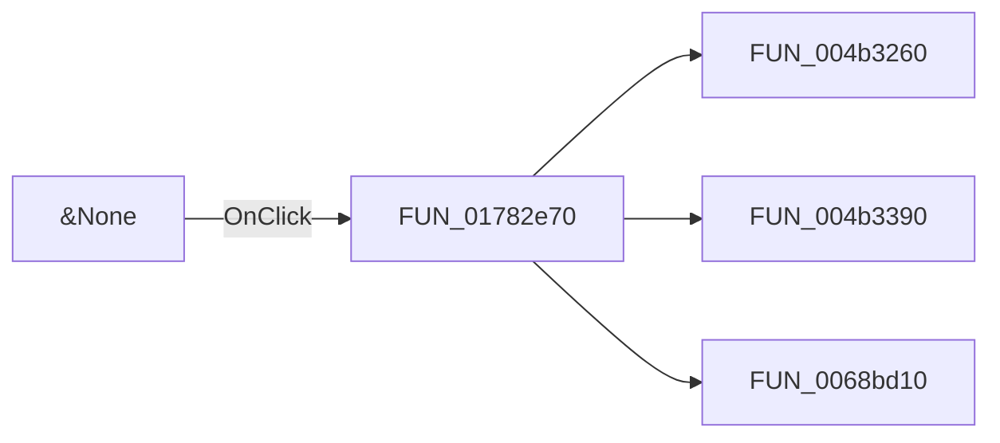

# &None

> Analysis status: Pending individual source review.

## Control

| Property | Recovered value |
| --- | --- |
| Form | ImportDlg |
| Component path | ImportDlg.btnNone |
| Control class | TButton |
| Caption | &None |
| Hint | Not present in the recovered resource. |
| Text | Not present in the recovered resource. |
| Handler name | btnNoneClick |
| Handler address | 01782e70 |
| Graph node | `resource:dfm:ImportDlg/ImportDlg.btnNone` |
| Handler node | `function:01782e70` |
| Graph layer | UI |

## What happens when clicked

Pending individual analysis. An agent must read the recovered handler source and its relevant callees before it replaces this text.

## Click flow

## Handler evidence

- Source: [DecompiledSources/Tina16/functions/0000000001782E70__FUN_01782e70.c](../../../DecompiledSources/Tina16/functions/0000000001782E70__FUN_01782e70.c)
- Recovered role: Not present in the recovered resource.
- Current graph summary: Handles 1 Delphi UI event: ImportDlg.btnNone.OnClick.
- Current graph behavior: Not present in the recovered resource.
- Current graph evidence: Not present in the recovered resource.
- Complexity: complex
- Distinct outgoing calls: 3

## Direct calls

- `function:004b3260` — FUN_004b3260
- `function:004b3390` — FUN_004b3390
- `function:0068bd10` — FUN_0068bd10

## Resource evidence

- Kind: Not present in the recovered resource.
- Modal result: Not present in the recovered resource.
- Checked state: Not present in the recovered resource.
- List items: Not present in the recovered resource.
- Image reference: Not present in the recovered resource.
- Extracted glyph: None.

## Nearby label candidates

Nearby labels are layout candidates only. They are not proof of behavior.

- Rank 1: Please select the devices you would like to add to the current device list. Use Shift+Click and/or Ctrl+Click for extended selection. at distance 244.

## Analysis limits

- Do not infer behavior from the control class, caption, hint, glyph, or nearby label alone.
- Do not replace the pending status until the handler source and relevant call path provide enough evidence.
