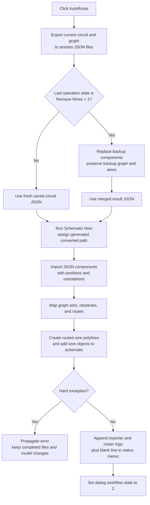

# Rebuild the current circuit with automatic wiring

> Analysis status: Complete for the recovered control boundary. The JSON input, Remove Wires merge branch, component rebuild, in-process router, wire insertion, status output, failure behavior, related controls, and persistence limits are recovered.

## Control

| Property | Recovered value |
| --- | --- |
| Form | ImportFromPicture |
| Form caption | Import From Picture |
| Component path | ImportFromPicture.bAutoRoute |
| Control class | TButton |
| Caption | AutoRoute |
| Handler name | bAutoRouteClick |
| Handler address | 01a2b7d0 |
| Graph node | `resource:dfm:ImportFromPicture/ImportFromPicture.bAutoRoute` |
| Handler node | `function:01a2b7d0` |
| Graph layer | UI |

The recovered resource has no hint, image reference, or extracted glyph for this button. The routing behavior is established by the handler and its JSON export, reload, and router call chain. The adjacent **Value** edit is not read by this click.

## Routing input

The button uses the application's current schematic model. It does not show a file dialog or ask the user to select components, nets, or a routing range.

First, `FUN_01a2b2d0` exports the current schematic twice:

- a complete circuit document to a session-temporary name that ends in `-json-saved.json`;
- a graph document to `VhdlSession0\graph.json`.

The graph export walks current schematic components. It records each component label and class ID, its position and orientation, and its pin coordinates and connectivity. Duplicate labels cause an exception during export. The later router also rejects an empty component label because it cannot map that graph entry back to a live component.

The export calls the shared graph-operation coordinator. According to the current Automatic ERC settings, this coordinator can run ERC and show its separate result form before the export continues. AutoRoute has no private ERC option or result list.

## Remove Wires merge branch

Dialog byte `+0x708` records the last ImportFromPicture operation. Value `1` means that **Remove Wires** ran. In that case, Remove Wires has already saved a pre-removal circuit as `-json-wires-save.json`.

AutoRoute then calls `FUN_01480910` before it rebuilds the schematic. The helper:

1. reads the freshly exported `-json-saved.json` and the pre-removal `-json-wires-save.json`;
2. replaces `circuit.components` in the backup document with a clone of the current component array;
3. removes and reattaches the backup document's own `circuit.graph` object when it exists;
4. writes the merged backup document as `-json-res.json`.

The helper does not copy `circuit.graph` from the fresh export. The graph, wires, and all other top-level and circuit fields come from the pre-removal backup. AutoRoute passes this merged result to the loader. For states `0`, `2`, and `3`, it skips the merge and passes the fresh `-json-saved.json` directly.

## Circuit rebuild and wire creation

The shared loader `FUN_01a2abe0` crosses the main model boundary. It calls the same top-level coordinator as **Schematic Editor > New**, assigns the active document a generated name of the form `*_conv_<counter>.tsc`, parses the selected JSON, and imports its components into the new active schematic. The component import uses the JSON position and orientation data. Its call flags enable component conversion but do not import the JSON `wires` array.

The loader then calls `FUN_019c7ff0` with mode `2`. The router reads `circuit.graph`, maps graph labels and pins to the rebuilt live components, uses component rectangles as obstacles, and reads `AutoRoute_WireWidth` from the `LLMLocalv3` settings section with default value `8`. Its route preparation includes fixed-route, special-pin, connection, and obstacle passes.

For each route with more than one point, the router converts grid points to schematic coordinates. `FUN_019c52f0` passes the polyline to `FUN_019bbfe0`, which constructs a wire through `FUN_01992db0` and adds it to the live schematic collection. Special pins can also create small schematic objects through the same model-add boundary. After routing, the engine invalidates the schematic view, rebuilds graph comparison files, and reports unresolved connections.

This operation therefore rebuilds components and creates new live wire objects. It does not only draw a preview or edit the temporary JSON.

## Status, partial routes, and completion state

The router writes detailed text to its two string collections. Recovered lines include a start timestamp, `started...`, fixed-route and obstacle summaries, `ROUTE SUMMARY: <n> failed route(s)`, per-route results, and `Autoroute: OK` when the final result collection is empty. It also saves a detailed session log as `VhdlSession0\autoroute.txt`.

After the shared loader returns, the click builds a temporary string list from:

- the form's persistent ImportFromPicture log at `+0x738`;
- the router result list at object `+0x10`.

`FUN_01a2a8d0` appends those lines to `pnStatus.eMemo.Lines`, and `FUN_01a2a900` appends one blank separator line. The form has no recovered progress bar. The button is not disabled, and there is no cancel or abort flag in this handler. The route and rebuild calls run synchronously before the memo and state updates.

A failed individual route is a logged result, not necessarily an exception. The router can keep successfully created wires, list failed connections, and return normally. The loader ignores the router's Boolean result. Therefore, the click still sets dialog state `+0x708` to `2` after a normal return with partial route failures.

## Errors and rollback limits

Recovered hard errors include:

- malformed or missing JSON files;
- `Get graph: duplicate label: ...`;
- `Graph information is missing: NetList is required`;
- `Empty label found: autoroute is not possible`;
- allocation, component-conversion, graph-operation, or wire-insertion exceptions.

The click has no local catch, undo group, or model restore operation. State `2` is written only at the end, so an exception leaves the earlier state value. However, earlier work can already have completed: session files can exist, the Schematic New boundary can have run, the converted document path can have changed, components can have been imported, and some wires can have been inserted. The handler does not reopen the pre-click schematic or remove partial wires after such an exception.

The recovered path does not establish whether each low-level component or wire insertion creates an individual Undo record. It does establish that AutoRoute is not enclosed in one explicit undoable transaction.

## Relationship to the other controls

| Control | Proven interaction with AutoRoute |
| --- | --- |
| Load Circuit from JSON | Loads a selected JSON circuit through the same component-import and router path. It supplies the source path used by **Scale circuit**. |
| Remove Wires | Saves the current circuit once, removes the tracked wire objects, clears their collection, refreshes the schematic, and sets state `1`. The next AutoRoute uses the merge branch described above. |
| Scale circuit | Requires a previously loaded JSON path, scales the JSON component coordinates, rebuilds the circuit, and sets state `3`. A later AutoRoute routes that current scaled circuit without the Remove Wires merge. |
| Save Circuit to JSON | Uses the same session filename builder and circuit exporter but does not rebuild or route the schematic. Its visible command also shows the export-success message. |
| Test | Runs a separate hard-coded symbol-image diagnostic. It does not read the AutoRoute state byte or consume its route result. |

State `0` is the initial form value, `1` is Remove Wires, `2` is AutoRoute, and `3` is Scale circuit. The byte is dialog-local workflow state. It is not a circuit-format field.

## Click flow

Individual failed routes follow the normal-return branch. Their failure details appear in the status output, and successful route objects remain in the rebuilt schematic.

## Persistence and repeated clicks

- The click writes fixed session files without a Save dialog or overwrite confirmation. These include saved, merged, graph, graph-comparison, connection, and route-log files. They are working and diagnostic artifacts, not a user-selected circuit save.
- The loader assigns a generated converted `.tsc` path to the active schematic, but this click does not call the recovered final schematic serializer. A later normal circuit Save is the proven durable-document boundary.
- The exact schematic dirty flag after the low-level rebuild is not recovered here. The click does not write or clear one directly.
- FormClose persists only the **Scale circuit** edit value under `ScaleComps` in `LLMLocalv3`. It does not persist workflow state `+0x708`, route logs, or an AutoRoute preference.
- A repeated click has no unchanged-data guard. It exports again, advances the converted-name counter through the shared loader, rebuilds the active schematic, reruns routing, appends more status lines, and writes state `2` again.
- The handler has no explicit null-current-schematic guard. Normal form entry prepares a current converted circuit. If that invariant is not true, downstream graph and loader functions control the error behavior.

## Source evidence

- [AutoRoute handler `FUN_01a2b7d0`](../../../DecompiledSources/Tina16/functions/0000000001A2B7D0__FUN_01a2b7d0.c) proves the export, state-1 merge branch, reload, status collection, and final state `2`.
- [Conditional JSON merge `FUN_01480910`](../../../DecompiledSources/Tina16/functions/0000000001480910__FUN_01480910.c) proves the current-component replacement, backup-graph preservation, and result-file write.
- [Session filename builder `FUN_01a2a060`](../../../DecompiledSources/Tina16/functions/0000000001A2A060__FUN_01a2a060.c) and [circuit JSON exporter `FUN_01a2b2d0`](../../../DecompiledSources/Tina16/functions/0000000001A2B2D0__FUN_01a2b2d0.c) prove the fixed session paths and graph export. Their canonical ownership belongs to `.684`.
- [JSON reload coordinator `FUN_01a2abe0`](../../../DecompiledSources/Tina16/functions/0000000001A2ABE0__FUN_01a2abe0.c), [Schematic New coordinator `FUN_01c75530`](../../../DecompiledSources/Tina16/functions/0000000001C75530__FUN_01c75530.c), and [current-document path updater `FUN_01c97850`](../../../DecompiledSources/Tina16/functions/0000000001C97850__FUN_01c97850.c) prove the rebuilt converted-document boundary. `.682` owns the JSON reload coordinator.
- [Component importer `FUN_019bd5f0`](../../../DecompiledSources/Tina16/functions/00000000019BD5F0__FUN_019bd5f0.c) proves component position, orientation, conversion, and optional wire-import behavior.
- [Router `FUN_019c7ff0`](../../../DecompiledSources/Tina16/functions/00000000019C7FF0__FUN_019c7ff0.c), [route-to-wire adapter `FUN_019c52f0`](../../../DecompiledSources/Tina16/functions/00000000019C52F0__FUN_019c52f0.c), [wire constructor adapter `FUN_019bbfe0`](../../../DecompiledSources/Tina16/functions/00000000019BBFE0__FUN_019bbfe0.c), and [schematic wire insertion `FUN_01992db0`](../../../DecompiledSources/Tina16/functions/0000000001992DB0__FUN_01992db0.c) prove in-process route generation and live model insertion.
- [Status-lines wrapper `FUN_01a2a8d0`](../../../DecompiledSources/Tina16/functions/0000000001A2A8D0__FUN_01a2a8d0.c) and [status-line append `FUN_01a2a900`](../../../DecompiledSources/Tina16/functions/0000000001A2A900__FUN_01a2a900.c) prove the memo output boundary.
- [Remove Wires handler `FUN_01a2b5d0`](../../../DecompiledSources/Tina16/functions/0000000001A2B5D0__FUN_01a2b5d0.c), [Scale circuit handler `FUN_01a2ba80`](../../../DecompiledSources/Tina16/functions/0000000001A2BA80__FUN_01a2ba80.c), [Save Circuit handler `FUN_01a2b4d0`](../../../DecompiledSources/Tina16/functions/0000000001A2B4D0__FUN_01a2b4d0.c), and [Test handler `FUN_01a2bd30`](../../../DecompiledSources/Tina16/functions/0000000001A2BD30__FUN_01a2bd30.c) prove the related-control boundaries.
- [Recovered Delphi resource evidence](../../../DecompiledSources/Tina16/resources/dfm/ui-evidence.json) binds bAutoRoute.OnClick and supplies the form, control, status memo, and sibling-control captions.

## Annotation ownership and limits

- `.680` owns the unique AutoRoute handler, conditional JSON merge, and the two status-memo wrappers.
- `.682` owns the shared JSON load and converted-circuit coordinator. `.684` owns the shared session filename builder and circuit JSON exporter. They are cited but not duplicated here.
- The component importer, router internals, wire constructor chain, graph-operation coordinator, JSON runtime, view invalidation, and Delphi/VCL helpers remain evidence-only.
- The exact user-visible localized messages from unrecovered resources, final schematic dirty flag, and low-level Undo recording are not established. This article keeps those limits explicit.
