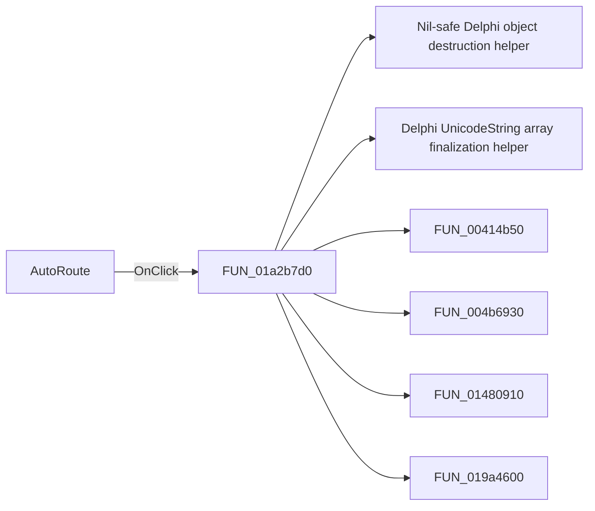

# AutoRoute

> Analysis status: Pending individual source review.

## Control

| Property | Recovered value |
| --- | --- |
| Form | ImportFromPicture |
| Component path | ImportFromPicture.bAutoRoute |
| Control class | TButton |
| Caption | AutoRoute |
| Hint | Not present in the recovered resource. |
| Text | Not present in the recovered resource. |
| Handler name | bAutoRouteClick |
| Handler address | 01a2b7d0 |
| Graph node | `resource:dfm:ImportFromPicture/ImportFromPicture.bAutoRoute` |
| Handler node | `function:01a2b7d0` |
| Graph layer | UI |

## What happens when clicked

Pending individual analysis. An agent must read the recovered handler source and its relevant callees before it replaces this text.

## Click flow

## Handler evidence

- Source: [DecompiledSources/Tina16/functions/0000000001A2B7D0__FUN_01a2b7d0.c](../../../DecompiledSources/Tina16/functions/0000000001A2B7D0__FUN_01a2b7d0.c)
- Recovered role: Not present in the recovered resource.
- Current graph summary: Handles 1 Delphi UI event: ImportFromPicture.bAutoRoute.OnClick.
- Current graph behavior: Not present in the recovered resource.
- Current graph evidence: Not present in the recovered resource.
- Complexity: complex
- Distinct outgoing calls: 11

## Direct calls

- `function:00410f20` — Nil-safe Delphi object destruction helper
- `function:00414560` — Delphi UnicodeString array finalization helper
- `function:00414b50` — FUN_00414b50
- `function:004b6930` — FUN_004b6930
- `function:01480910` — FUN_01480910
- `function:019a4600` — FUN_019a4600
- `function:01a2a060` — FUN_01a2a060
- `function:01a2a8d0` — FUN_01a2a8d0
- `function:01a2a900` — FUN_01a2a900
- `function:01a2abe0` — FUN_01a2abe0
- `function:01a2b2d0` — FUN_01a2b2d0

## Resource evidence

- Kind: Not present in the recovered resource.
- Modal result: Not present in the recovered resource.
- Checked state: Not present in the recovered resource.
- List items: Not present in the recovered resource.
- Image reference: Not present in the recovered resource.
- Extracted glyph: None.

## Nearby label candidates

Nearby labels are layout candidates only. They are not proof of behavior.

- Rank 1: Value:  at distance 476.

## Analysis limits

- Do not infer behavior from the control class, caption, hint, glyph, or nearby label alone.
- Do not replace the pending status until the handler source and relevant call path provide enough evidence.
