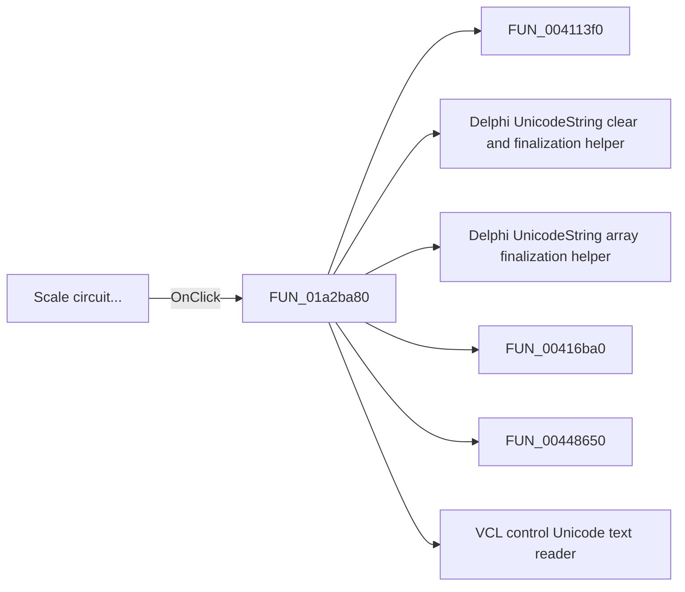

# Scale circuit...

> Analysis status: Pending individual source review.

## Control

| Property | Recovered value |
| --- | --- |
| Form | ImportFromPicture |
| Component path | ImportFromPicture.bChangeCircuit |
| Control class | TButton |
| Caption | Scale circuit... |
| Hint | Not present in the recovered resource. |
| Text | Not present in the recovered resource. |
| Handler name | bChangeCircuitClick |
| Handler address | 01a2ba80 |
| Graph node | `resource:dfm:ImportFromPicture/ImportFromPicture.bChangeCircuit` |
| Handler node | `function:01a2ba80` |
| Graph layer | UI |

## What happens when clicked

Pending individual analysis. An agent must read the recovered handler source and its relevant callees before it replaces this text.

## Click flow

## Handler evidence

- Source: [DecompiledSources/Tina16/functions/0000000001A2BA80__FUN_01a2ba80.c](../../../DecompiledSources/Tina16/functions/0000000001A2BA80__FUN_01a2ba80.c)
- Recovered role: Not present in the recovered resource.
- Current graph summary: Handles 1 Delphi UI event: ImportFromPicture.bChangeCircuit.OnClick.
- Current graph behavior: Not present in the recovered resource.
- Current graph evidence: Not present in the recovered resource.
- Complexity: complex
- Distinct outgoing calls: 16

## Direct calls

- `function:004113f0` — FUN_004113f0
- `function:00414480` — Delphi UnicodeString clear and finalization helper
- `function:00414560` — Delphi UnicodeString array finalization helper
- `function:00416ba0` — FUN_00416ba0
- `function:00448650` — FUN_00448650
- `function:0064dd90` — VCL control Unicode text reader
- `function:0147bce0` — FUN_0147bce0
- `function:0147cfb0` — FUN_0147cfb0
- `function:0147d130` — FUN_0147d130
- `function:0147d210` — FUN_0147d210
- `function:0147fa40` — FUN_0147fa40
- `function:01480530` — FUN_01480530
- `function:019a4600` — FUN_019a4600
- `function:01a2a8d0` — FUN_01a2a8d0
- `function:01a2a900` — FUN_01a2a900
- `function:01a2abe0` — FUN_01a2abe0

## Resource evidence

- Kind: Not present in the recovered resource.
- Modal result: Not present in the recovered resource.
- Checked state: Not present in the recovered resource.
- List items: Not present in the recovered resource.
- Image reference: Not present in the recovered resource.
- Extracted glyph: None.

## Nearby label candidates

Nearby labels are layout candidates only. They are not proof of behavior.

- Rank 1: Value:  at distance 78.

## Analysis limits

- Do not infer behavior from the control class, caption, hint, glyph, or nearby label alone.
- Do not replace the pending status until the handler source and relevant call path provide enough evidence.
