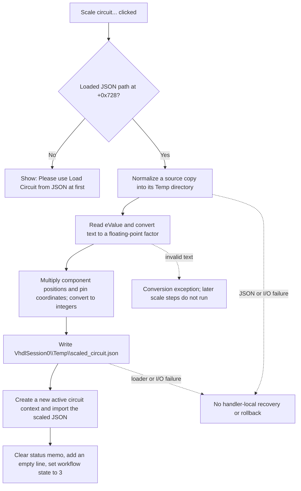

# Scale circuit...

> Analysis status: Evidence-backed source review complete.

## Control

| Property | Recovered value |
| --- | --- |
| Form | ImportFromPicture |
| Component path | ImportFromPicture.bChangeCircuit |
| Control class | TButton |
| Caption | Scale circuit... |
| Related input | `ImportFromPicture.eValue`, beside the `Value:` label |
| Hint | Not present in the recovered resource. |
| Handler name | bChangeCircuitClick |
| Handler address | 01a2ba80 |
| Graph node | `resource:dfm:ImportFromPicture/ImportFromPicture.bChangeCircuit` |
| Handler node | `function:01a2ba80` |
| Graph layer | UI |

## What happens when clicked

`FUN_01a2ba80` scales a circuit that was previously selected with **Load Circuit from JSON...**. It does not scale a source picture. The form keeps that selected JSON path at field `+0x728`. If the field is empty, the handler shows `Please use Load Circuit from JSON at first.` and makes no circuit or status change.

With a JSON path present, the handler first uses `FUN_0147fa40` to parse and normalize a copy of the source. That normalizer removes graph-component entries whose labels do not occur in the circuit component list and writes the normalized document under the source directory's `Temp` child. The original selected JSON file is not overwritten.

The handler reads `eValue` at form field `+0x6D8` and converts its text to a floating-point scale factor with the current Delphi format settings. It passes the `circuit` object and the factor to `FUN_01480530`. The scaler rebuilds the `components` array. For each component, it multiplies both integer fields in `position` by the factor. When a `pins` array exists, it also multiplies both coordinate fields of each pin that has the first coordinate field. Each product is converted back to an integer. The recovered code has no positive-value, nonzero, minimum, or maximum check.

The scaler reattaches the changed `components` array and the existing `graph` object. It does not scale the JSON `graph` or `wires` members. The handler serializes the complete changed document to `<application-data>\VhdlSession0\Temp\scaled_circuit.json` and passes that file to the shared JSON circuit loader `FUN_01a2abe0`.

The shared loader starts a new active circuit context, creates new form-owned conversion and routing objects at `+0x718` and `+0x710`, imports the components from the scaled JSON, initializes its routing data, and requests an application refresh. This is not an in-place coordinate update of the old schematic. After that call returns, the handler clears the status memo, adds one empty line, and sets the form workflow byte at `+0x708` to `3`, the recovered state used after scaling. The click does not call the separate **Remove Wires**, **AutoRoute**, **Save Circuit to JSON...**, or **Test...** handlers.

## Click flow

## State, persistence, and failure boundaries

- The selected source path stays at `+0x728`; scaling does not replace it with the derived path. A later click therefore starts from the selected source JSON again, not from the last `scaled_circuit.json` result.
- `ImportFromPicture.OnCreate` loads the `eValue` text from the `LLMLocalv3/ScaleComps` setting, or assigns a built-in default when the setting is absent. `ImportFromPicture.OnClose` saves the current edit text to the same setting. The value is therefore persisted when the form closes, independently of whether this click succeeds.
- There is no explicit scale-range guard. Zero and negative values reach the scaler. Invalid numeric text raises through the Delphi conversion helper before `scaled_circuit.json` is written or the active circuit is replaced.
- JSON parsing, schema access, serialization, and circuit loading have no local exception handler in `FUN_01a2ba80`. A failure can leave an earlier normalized or scaled temporary file. A failure after the shared loader starts can also leave a partly changed active context. No click-local undo record or rollback path is visible.
- The status memo reset and workflow-state write occur only after the shared loader returns. An earlier failure leaves those two fields unchanged.

## Handler evidence

- Handler: [FUN_01a2ba80](../../../DecompiledSources/Tina16/functions/0000000001A2BA80__FUN_01a2ba80.c)
- Coordinate scaler: [FUN_01480530](../../../DecompiledSources/Tina16/functions/0000000001480530__FUN_01480530.c)
- Source normalizer: [FUN_0147fa40](../../../DecompiledSources/Tina16/functions/000000000147FA40__FUN_0147fa40.c)
- Shared circuit loader: [FUN_01a2abe0](../../../DecompiledSources/Tina16/functions/0000000001A2ABE0__FUN_01a2abe0.c)
- Form create lifecycle: [FUN_01a2a720](../../../DecompiledSources/Tina16/functions/0000000001A2A720__FUN_01a2a720.c)
- Form close lifecycle: [FUN_01a2a660](../../../DecompiledSources/Tina16/functions/0000000001A2A660__FUN_01a2a660.c)

## Resource evidence

- The recovered DFM binds `bChangeCircuit.OnClick` to `bChangeCircuitClick` at `01a2ba80`.
- `eValue` is the only edit on the form and is positioned beside the `Value:` label and above this button. The handler confirms the association by reading form field `+0x6D8`, which the form lifecycle also reads and writes as the `ScaleComps` setting.
- No hint, image reference, embedded glyph, minimum, maximum, or default text was recovered for this control or edit.

## Analysis limits

- The two coordinate member names are referenced as data labels in the recovered scaler, so this article describes them as the paired position and pin coordinate fields instead of inventing source-level names.
- The shared loader and router contain extensive conversion and routing logic. This review follows only the calls made by this control. It does not claim that the unchanged `graph` or `wires` data remains geometrically consistent for every factor.
- The source shows no local transaction. It does not prove whether a higher application layer can recover a prior document after a loader failure.
