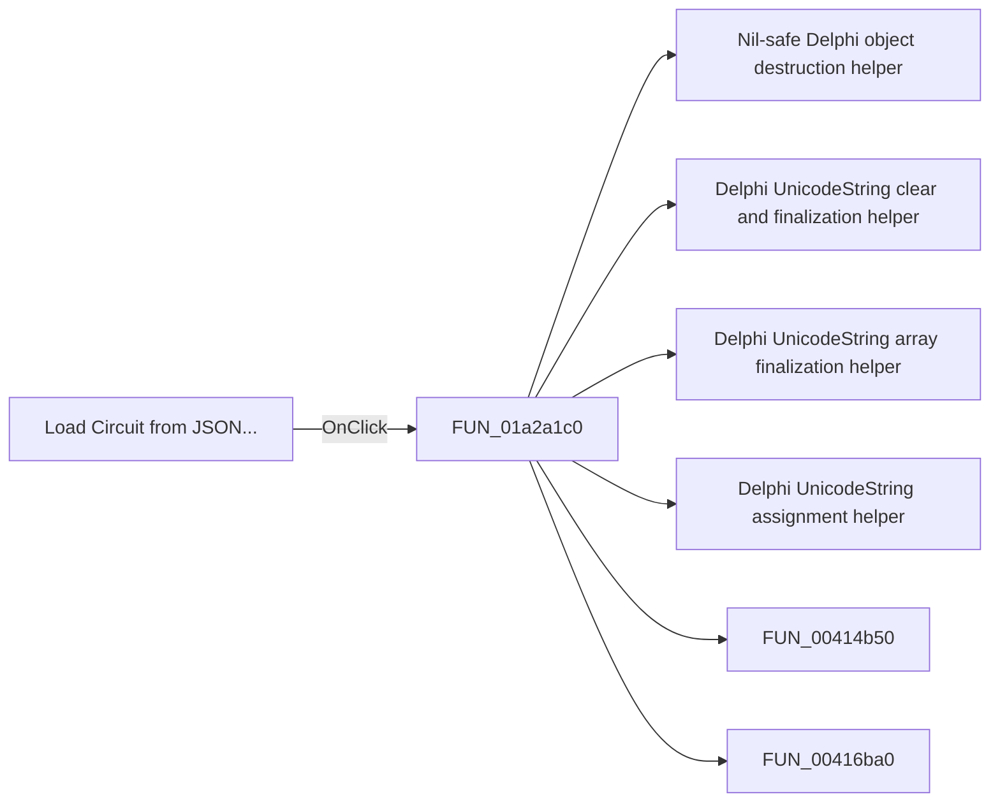

# Load Circuit from JSON...

> Analysis status: Pending individual source review.

## Control

| Property | Recovered value |
| --- | --- |
| Form | ImportFromPicture |
| Component path | ImportFromPicture.bOpenJSON |
| Control class | TButton |
| Caption | Load Circuit from JSON... |
| Hint | Not present in the recovered resource. |
| Text | Not present in the recovered resource. |
| Handler name | bOpenJSONClick |
| Handler address | 01a2a1c0 |
| Graph node | `resource:dfm:ImportFromPicture/ImportFromPicture.bOpenJSON` |
| Handler node | `function:01a2a1c0` |
| Graph layer | UI |

## What happens when clicked

Pending individual analysis. An agent must read the recovered handler source and its relevant callees before it replaces this text.

## Click flow

## Handler evidence

- Source: [DecompiledSources/Tina16/functions/0000000001A2A1C0__FUN_01a2a1c0.c](../../../DecompiledSources/Tina16/functions/0000000001A2A1C0__FUN_01a2a1c0.c)
- Recovered role: Not present in the recovered resource.
- Current graph summary: Handles 1 Delphi UI event: ImportFromPicture.bOpenJSON.OnClick.
- Current graph behavior: Not present in the recovered resource.
- Current graph evidence: Not present in the recovered resource.
- Complexity: complex
- Distinct outgoing calls: 20

## Direct calls

- `function:00410f20` — Nil-safe Delphi object destruction helper
- `function:00414480` — Delphi UnicodeString clear and finalization helper
- `function:00414560` — Delphi UnicodeString array finalization helper
- `function:00414ad0` — Delphi UnicodeString assignment helper
- `function:00414b50` — FUN_00414b50
- `function:00416ba0` — FUN_00416ba0
- `function:004414c0` — FUN_004414c0
- `function:00441920` — FUN_00441920
- `function:00442f70` — FUN_00442f70
- `function:00450070` — FUN_00450070
- `function:004b6930` — FUN_004b6930
- `function:00724270` — FUN_00724270
- `function:00724420` — FUN_00724420
- `function:0072d440` — FUN_0072d440
- `function:0147fa40` — FUN_0147fa40
- `function:014a74d0` — FUN_014a74d0
- `function:0198b200` — FUN_0198b200
- `function:01a2a8d0` — FUN_01a2a8d0
- `function:01a2a900` — FUN_01a2a900
- `function:01a2abe0` — FUN_01a2abe0

## Resource evidence

- Kind: Not present in the recovered resource.
- Modal result: Not present in the recovered resource.
- Checked state: Not present in the recovered resource.
- List items: Not present in the recovered resource.
- Image reference: Not present in the recovered resource.
- Extracted glyph: None.

## Nearby label candidates

Nearby labels are layout candidates only. They are not proof of behavior.

- Rank 1: Value:  at distance 650.

## Analysis limits

- Do not infer behavior from the control class, caption, hint, glyph, or nearby label alone.
- Do not replace the pending status until the handler source and relevant call path provide enough evidence.
