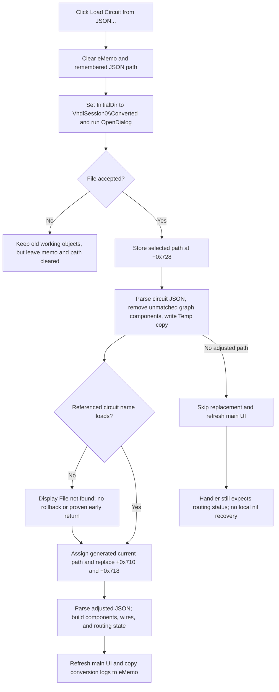

# Load Circuit from JSON...

## Control

| Property | Recovered value |
| --- | --- |
| Form | ImportFromPicture |
| Component path | ImportFromPicture.bOpenJSON |
| Control class | TButton |
| Caption | Load Circuit from JSON... |
| Hint | Not present in the recovered resource. |
| Text | Not present in the recovered resource. |
| Handler name | bOpenJSONClick |
| Handler address | 01a2a1c0 |
| Graph node | `resource:dfm:ImportFromPicture/ImportFromPicture.bOpenJSON` |
| Handler node | `function:01a2a1c0` |
| Graph layer | UI |

The button has no hint, action, image, or glyph. The handler and its callees, not the caption alone, prove that it loads a JSON circuit description and replaces the current conversion workspace.

## Before the file dialog

The click first clears the form's `eMemo` status control and clears the remembered JSON path at form offset `+0x728`. It then sets the existing `TOpenDialog.InitialDir` to `<application data path>\VhdlSession0\Converted` and runs the dialog.

The DFM does not define a filter, title, default extension, options, or initial file name for this dialog. The click handler only sets `InitialDir`. Therefore, the recovered evidence does not prove that the dialog limits the user to `.json` files.

Cancel is not a complete no-op. The old conversion and routing objects remain in form fields `+0x718` and `+0x710`, but the status memo and remembered JSON path stay cleared. The later **Scale circuit...** action tests only this remembered path, so it refuses to run after this cancel even if an earlier converted circuit remains visible.

## Accepted file path and JSON preparation

When the user accepts the dialog, the handler stores the full selected path at `+0x728` before it parses or validates the file. It then runs these steps:

1. It parses the selected JSON and reads the `circuit` object, `circuit.graph.components`, `circuit.components`, and `circuit.metadata.circuit_name`.
2. It builds a list of component identifiers from `circuit.components`.
3. It removes graph-component entries whose `label` is not in that list.
4. It creates a `Temp` directory below the selected file's directory and writes this adjusted JSON with the original file name into that directory.
5. It creates an empty circuit-document object and tries to load the circuit file named by `metadata.circuit_name`.
6. It changes the referenced circuit name's extension to `.tsc` and passes the adjusted JSON path, loaded circuit object, and derived circuit name to the conversion coordinator.

This preparation does not overwrite the selected JSON file. It does create an adjusted copy under the sibling `Temp` directory.

## Working-circuit replacement

The conversion coordinator `FUN_01a2abe0` performs the application-visible replacement when the adjusted JSON path is not empty:

- It derives a base directory and circuit name from the referenced `.tsc` name, or uses the form's configured path or `temp.tsc` fallback when no name is supplied.
- It increments a process-global conversion number and assigns a current circuit path with the pattern `<base><name>_conv_<number>.tsc`.
- It sends that path to the main circuit window.
- It creates a new routing/circuit state object in form field `+0x710` from the loaded circuit object.
- It creates a new JSON-to-circuit conversion state object in field `+0x718`.
- It loads the complete adjusted JSON file as text, parses it, and converts `circuit.components`, `circuit.wires`, metadata, and bounds into the current model. The converter can add messages for components that it cannot convert.
- It builds the routing/graph state from the same adjusted JSON.
- It refreshes the main application UI.

The function assigns the generated `.tsc` path to the current document, but this call path does not prove that it writes that `.tsc` file at click time. The adjusted JSON copy is the file write that is explicit in this path.

After conversion, the handler builds the visible status text from the form log list at `+0x738` and the routing object's log list at `+0x10`. The shared status helpers owned by TIARA-diz.6.7.680 copy those lines to `eMemo` and append a blank line.

## Later actions and persistence

This click changes the active application workspace immediately. It is not staged behind an OK button, and the form has no OK or Cancel buttons.

- **AutoRoute** first exports the current circuit to a generated JSON file. It can merge a saved wire snapshot, then calls the same conversion coordinator to rebuild the workspace from the result.
- **Scale circuit...** reparses the path stored at `+0x728`, scales the JSON component data, writes `VhdlSession0\Temp\scaled_circuit.json`, and calls the same conversion coordinator.
- **Save Circuit to JSON...** does not use a save dialog in its recovered handler. It exports the current circuit model to a generated `*-json-saved.json` path below `VhdlSession0\Temp`.
- **Test...** is not an import check. Its recovered routine creates 21 fixed symbol documents and writes JPEG files to a hard-coded development directory, then displays `Symbols saved`. It does not read `+0x710`, `+0x718`, or the selected JSON path.

The selected JSON path and the two working objects are form-instance state. Form close persists only the separate scale value from `eValue` under `ScaleComps/LLMLocalv3`; it does not persist the selected JSON path. Disk artifacts from JSON adjustment, Save, AutoRoute, or Scale can remain after the form closes.

## Error and partial-state paths

- If the JSON has no usable `graph` node, the preparation helper does not produce the adjusted JSON path. In the recovered flow, the handler displays `File not found: <name>` for the empty circuit name and still reaches the conversion coordinator. The coordinator skips replacement for an empty adjusted path but refreshes the main UI. The handler then expects `+0x710` when it builds status text. A new form has that field set to nil, and no local recovery is visible for this case.
- If `metadata.circuit_name` is empty or the referenced circuit cannot be loaded, the handler displays `File not found: <name>`. The recovered control flow does not show a return or rollback after this message; it continues toward conversion.
- The selected path is stored before JSON preparation and circuit loading. A parse or load failure can therefore leave `+0x728` nonempty. The later Scale action treats that path-only state as if Load had run and tries the file again.
- JSON preparation can write the adjusted copy before later model conversion fails. The coordinator also assigns the generated current path and new objects before it parses and converts all JSON content. No transaction or rollback is present in the recovered source.
- The handler has no local catch with a user message for malformed JSON, disk-write failure, or conversion exceptions. Delphi cleanup scaffolding frees local strings and lists, but it does not prove restoration of the earlier workspace.
- Repeating a successful click creates another conversion number, replaces `+0x710` and `+0x718`, updates the current circuit path, and refreshes the UI again. The coordinator does not show explicit disposal of the previous objects before these assignments, so their lifetime cannot be established from this function alone.

## Click flow

## Evidence

- [Open JSON click handler](../../../DecompiledSources/Tina16/functions/0000000001A2A1C0__FUN_01a2a1c0.c): clears the memo and path, configures and runs the dialog, stores the accepted path, prepares JSON, loads the referenced circuit, starts conversion, and rebuilds status text.
- [JSON graph preparation](../../../DecompiledSources/Tina16/functions/000000000147FA40__FUN_0147fa40.c): reads `circuit_name`, removes graph components that do not match the circuit component list, creates `Temp`, and writes the adjusted JSON copy.
- [JSON-to-working-circuit coordinator](../../../DecompiledSources/Tina16/functions/0000000001A2ABE0__FUN_01a2abe0.c): assigns the generated circuit path, replaces the two form objects, parses the adjusted JSON, invokes component/wire and routing conversion, and refreshes the main UI.
- [Component and wire converter](../../../DecompiledSources/Tina16/functions/00000000019BD5F0__FUN_019bd5f0.c): reads `circuit.components`, `circuit.wires`, metadata, and bounds and converts them into the model.
- [AutoRoute handler](../../../DecompiledSources/Tina16/functions/0000000001A2B7D0__FUN_01a2b7d0.c) and [Scale handler](../../../DecompiledSources/Tina16/functions/0000000001A2BA80__FUN_01a2ba80.c): prove later reuse of the same coordinator and the selected-path guard.
- [Save handler](../../../DecompiledSources/Tina16/functions/0000000001A2B4D0__FUN_01a2b4d0.c), [export helper](../../../DecompiledSources/Tina16/functions/0000000001A2B2D0__FUN_01a2b2d0.c), and [generated-path helper](../../../DecompiledSources/Tina16/functions/0000000001A2A060__FUN_01a2a060.c): establish the separate generated JSON export path.
- [Test handler](../../../DecompiledSources/Tina16/functions/0000000001A2BD30__FUN_01a2bd30.c) and [test routine](../../../DecompiledSources/Tina16/functions/0000000001A2C180__FUN_01a2c180.c): show that Test exports fixed symbol JPEGs and does not validate this loaded state.
- [Form creation](../../../DecompiledSources/Tina16/functions/0000000001A2A720__FUN_01a2a720.c) and [form close](../../../DecompiledSources/Tina16/functions/0000000001A2A660__FUN_01a2a660.c): establish the initial nil object fields and the narrow `eValue` persistence boundary.

## Limits

- The recovered source does not provide original Delphi names for form fields `+0x710`, `+0x718`, `+0x728`, or `+0x738`. Their roles come from their writers and consumers.
- The character encoding accepted by the JSON text loader is not explicit in the recovered source.
- The missing-file branch contains reconstructed Delphi exception scaffolding. The visible calls prove the message and lack of rollback, but they do not prove a safe recovery after every failure.
- Generic file-dialog accessors, JSON runtime helpers, circuit loaders, converters, main-window refresh code, and the shared status helpers have wider ownership. They remain evidence here and are not assigned new graph roles by this article.
