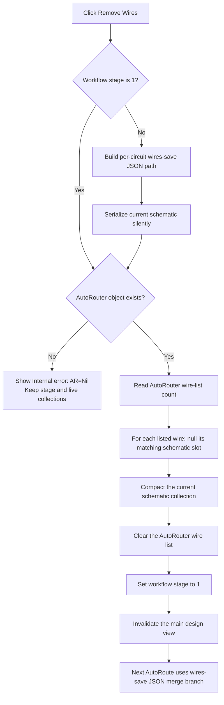

# Remove the AutoRouter wire set from the current schematic

> Analysis status: Complete. The handler saves a workflow snapshot, unlinks the AutoRouter-owned wire references from the live schematic, clears the routing list, and invalidates the main design view.

## Control

| Property | Recovered value |
| --- | --- |
| Form | ImportFromPicture |
| Component path | ImportFromPicture.bRemoveWires |
| Control class | TButton |
| Caption | Remove Wires |
| Hint | Not present in the recovered resource. |
| Text | Not present in the recovered resource. |
| Handler name | bRemoveWiresClick |
| Handler address | 01a2b5d0 |
| Graph node | `resource:dfm:ImportFromPicture/ImportFromPicture.bRemoveWires` |
| Handler node | `function:01a2b5d0` |
| Graph layer | UI |

## What happens when clicked

`FUN_01a2b5d0` uses two private form fields:

- offset `+0x708` is a workflow-stage byte;
- offset `+0x710` is the current AutoRouter object. Its field at `+0x08`
  holds the wire-reference list that this command processes.

The handler performs these operations in order:

1. If the stage is not `1`, it derives a
   `%s-json-wires-save.json` path under the runtime
   `VhdlSession0\Temp` directory. It silently serializes the current
   schematic to that file. The `%s` part comes from the current circuit path.
2. It tests the AutoRouter field at `+0x710`. If it is null, it displays
   **Internal error: AR=Nil** and stops the mutation path.
3. It captures the number of entries in the AutoRouter wire list. For each
   entry, it gets the wire object, obtains the current schematic collection,
   and asks the collection to find that exact object. A match is replaced by
   a null slot.
4. It compacts the current schematic collection. This removes the null slots
   and keeps the remaining objects in their previous order.
5. It invokes the AutoRouter wire list's virtual clear operation.
6. It sets the workflow stage to `1` and invalidates the main design view.

The command does not discover wires by geometry, net name, object type, or the
current UI selection. Its removal set is exactly the list held by the current
AutoRouter object.

## Model mutation and object ownership

The collection removal helper nulls the matching current-schematic slot. The
compactor then closes these gaps. If a listed object is not present, the
helper returns without changing a slot; the handler shows no error for that
case.

This click path does not call the richer schematic delete wrapper
`FUN_0198b6d0`, an object destructor, an endpoint cleanup routine, or the
normal multi-object delete and undo coordinator `FUN_019a5170`. It therefore
proves that wire references leave the live schematic collection and the
AutoRouter work list. It does not prove when the detached wire objects are
freed or whether another owner retains them.

No component list is iterated or cleared, and the handler does not write a
component field. The later AutoRoute merger reads `circuit.components`
separately from the wire snapshot. This confirms that this handler changes the
routed-wire set, not the component data.

## AutoRoute interaction

The stage value links this command to **AutoRoute**:

- Form creation initializes the stage to `0`.
- Remove Wires sets it to `1` after a successful list mutation.
- AutoRoute always saves the current schematic as `%s-json-saved.json`.
  When the stage is `1`, it also reads the wire snapshot, replaces that
  snapshot's `circuit.components` value with the components from the current
  saved schematic, writes `%s-json-res.json`, and reloads that result through
  the shared circuit loader.
- AutoRoute then sets the stage to `2`.

Thus, **Remove Wires** does not route anything itself. It creates the
wire-snapshot and live-model state that makes the next AutoRoute click take
the merge-and-reload branch.

A repeated Remove Wires click while the stage is already `1` does not write a
new snapshot. The AutoRouter list was cleared by the first successful click,
so the normal repeated path processes zero entries, compacts the schematic,
sets stage `1` again, and invalidates the view. If another operation changes
the stage, a later click writes the same per-circuit snapshot path again and
can replace its earlier contents.

The sibling **Test...** handler does not read the stage, AutoRouter object, or
wire list. Its recovered path exports symbol images and is independent of
wire removal.

## UI output, undo, and persistence

- A successful click invalidates the global main design view through
  `FUN_01ca2aa0` and the view object's virtual method at slot `+0x188`.
- The handler does not update the Import From Picture status memo, button
  captions, enabled states, or selections.
- There is no confirmation dialog.
- There is no recovered undo record, document-modified setter, or automatic
  save of the main circuit document.
- The JSON wire snapshot is the only direct file persistence in this click
  path. It is a workflow input for AutoRoute, not a registered undo item.
- The sibling **Save Circuit to JSON...** command can serialize the later live
  schematic state, but Remove Wires does not call that user-visible save path.
- The stage byte is in form memory. Form creation resets it; this handler does
  not write the stage to settings or a document.

## Error and partial-state behavior

- When the stage is not `1`, backup serialization occurs before the
  AutoRouter null check. An `AR=Nil` click can therefore write the snapshot
  and then report the error. It does not set stage `1` or invalidate the view.
- The handler does not test a serializer success result. A serializer
  exception occurs before collection mutation, and there is no local catch.
- There is no local rollback around the per-wire loop. An exception after one
  or more slots are nulled can leave a partial mutation before compaction,
  list clearing, stage update, and invalidation.
- A missing wire match is a silent per-entry no-op. An empty AutoRouter list
  still reaches compaction, list clear, stage update, and view invalidation.

## Click flow

## Evidence

- [Remove Wires handler `FUN_01a2b5d0`](../../../DecompiledSources/Tina16/functions/0000000001A2B5D0__FUN_01a2b5d0.c) contains the snapshot guard, AutoRouter null guard, wire-list loop, compaction, list clear, stage update, and view invalidation.
- [Temporary-path resolver `FUN_01a2a060`](../../../DecompiledSources/Tina16/functions/0000000001A2A060__FUN_01a2a060.c) combines the current circuit-derived name, supplied filename template, and `VhdlSession0\Temp` directory.
- [JSON serializer `FUN_01a2b2d0`](../../../DecompiledSources/Tina16/functions/0000000001A2B2D0__FUN_01a2b2d0.c) serializes the current schematic and suppresses the success message when its final argument is `1`.
- [Schematic detach helper `FUN_0198b6a0`](../../../DecompiledSources/Tina16/functions/000000000198B6A0__FUN_0198b6a0.c) finds the requested object and replaces its collection slot with null.
- [Collection compactor `FUN_00b95360`](../../../DecompiledSources/Tina16/functions/0000000000B95360__FUN_00b95360.c) removes null slots while preserving the order of the surviving pointers.
- [Richer schematic delete wrapper `FUN_0198b6d0`](../../../DecompiledSources/Tina16/functions/000000000198B6D0__FUN_0198b6d0.c) performs ownership and relationship work that the Remove Wires handler does not call.
- [Normal multi-object delete coordinator `FUN_019a5170`](../../../DecompiledSources/Tina16/functions/00000000019A5170__FUN_019a5170.c) records delete commands and invokes the undo coordinator; this path is absent from Remove Wires.
- [AutoRoute handler `FUN_01a2b7d0`](../../../DecompiledSources/Tina16/functions/0000000001A2B7D0__FUN_01a2b7d0.c) tests stage `1`, consumes the wire snapshot, reloads a result, and sets stage `2`.
- [AutoRoute JSON merger `FUN_01480910`](../../../DecompiledSources/Tina16/functions/0000000001480910__FUN_01480910.c) replaces the wire snapshot's `circuit.components` data with the current saved component data before it writes the result.
- [Form initializer `FUN_01a2a720`](../../../DecompiledSources/Tina16/functions/0000000001A2A720__FUN_01a2a720.c) initializes the AutoRouter pointer to null and the stage byte to `0`.
- [Main-view invalidation wrapper `FUN_01ca2aa0`](../../../DecompiledSources/Tina16/functions/0000000001CA2AA0__FUN_01ca2aa0.c) dispatches to [the view refresh method wrapper `FUN_0064e770`](../../../DecompiledSources/Tina16/functions/000000000064E770__FUN_0064e770.c).
- [Test handler `FUN_01a2bd30`](../../../DecompiledSources/Tina16/functions/0000000001A2BD30__FUN_01a2bd30.c) calls the independent [symbol-image export routine `FUN_01a2c180`](../../../DecompiledSources/Tina16/functions/0000000001A2C180__FUN_01a2c180.c).
- Recovered form and control resources: [ui-evidence.json](../../../DecompiledSources/Tina16/resources/dfm/ui-evidence.json)

## Direct calls and annotation limits

- The graph places `FUN_01a2b5d0` in the **UI** layer and records nine direct
  callees.
- This Bead owns only unique handler `FUN_01a2b5d0`.
- The Save JSON sibling owns the shared temporary-path and JSON-serialization
  helpers. Shared collection, load, status, and view-refresh helpers remain
  evidence only here.
- The recovered resource supplies the caption **Remove Wires**, but no hint,
  action, image, glyph, or control-state value. The source and the AutoRouter
  data flow establish the removal target.
- The original Delphi class and field names for offsets `+0x708` and `+0x710`
  are not recovered. This article uses functional names only where callers and
  consumers establish their roles.
