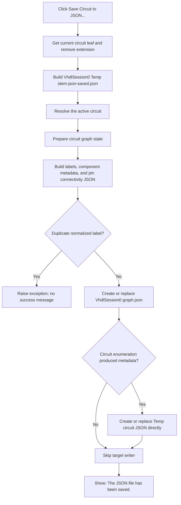

# Save Circuit to JSON...

## Control

| Property | Recovered value |
| --- | --- |
| Form | ImportFromPicture |
| Component path | ImportFromPicture.bSaveToJSON |
| Control class | TButton |
| Caption | Save Circuit to JSON... |
| Handler name | bSaveToJSONClick |
| Handler address | 01a2b4d0 |
| Graph node | `resource:dfm:ImportFromPicture/ImportFromPicture.bSaveToJSON` |
| Handler node | `function:01a2b4d0` |
| Graph layer | UI |

The resource has no hint, action, image, or glyph. The caption suggests a user-selected Save operation, but the recovered source proves that this button does not open a Save dialog.

## What happens when clicked

[FUN_01a2b4d0](../../../DecompiledSources/Tina16/functions/0000000001A2B4D0__FUN_01a2b4d0.c) performs three application operations:

1. It calls [FUN_01a2a060](../../../DecompiledSources/Tina16/functions/0000000001A2A060__FUN_01a2a060.c) with the fixed template `%s-json-saved.json`.
2. It calls [FUN_019a4600](../../../DecompiledSources/Tina16/functions/00000000019A4600__FUN_019a4600.c) to get the current active circuit.
3. It passes that circuit and the generated path to [FUN_01a2b2d0](../../../DecompiledSources/Tina16/functions/0000000001A2B2D0__FUN_01a2b2d0.c), with success-message suppression clear.

There is no SaveDialog, OpenDialog, path editor, overwrite question, cancellation branch, or modal-result check. After both JSON writes return normally, the exporter shows `The JSON file has been saved.`. The message does not include the path.

## Deterministic session path

The shared filename builder reads the application's current circuit path, extracts its leaf name, removes the extension, substitutes that stem into the caller's template, and prefixes the result with the recovered session directory:

```text
<session-root>\VhdlSession0\Temp\<circuit-stem>-json-saved.json
```

For example, a current circuit leaf `example.tsc` produces `example-json-saved.json` under `VhdlSession0\Temp`. The JSON loader owned by `.682` assigns a numbered `*_conv_N.tsc` current-circuit path when it replaces the Import From Picture workspace. After that load, this save name is derived from the converted current-circuit name, not directly from the original selected JSON filename.

The builder does not test whether the current circuit name or session root is empty. It only constructs a string. Directory creation and file creation occur later in the JSON writer.

## Exact exported model data

The exporter first invokes the shared graph-generation path for the active circuit. It then constructs two JSON documents.

### Internal graph document

The first document is always sent to this fixed path before the requested target is written:

```text
<session-root>\VhdlSession0\graph.json
```

Its recovered root is `graph`, with a `components` array. Each graph component contains:

- numeric `classID`;
- a label;
- a `pins` array of numeric connectivity or graph-node identifiers.

An empty component label becomes `AutoLab0`, `AutoLab1`, and so on. Labels are normalized to lowercase for duplicate detection. A duplicate normalized label raises an exception whose recovered text starts with `Get graph: duplicate label:`.

### Saved circuit document

When circuit enumeration reports available graph data, the target document has a `circuit` root with these recovered members:

- `metadata`, including `circuit_name` derived from the current circuit path;
- `components`, an array of component metadata;
- `graph`, the same graph object described above.

Each component metadata entry contains:

- the component label;
- a textual component `type` derived from `classID`;
- numeric `value`, which this exporter writes as `0` for every component;
- `position`, with two integer coordinate members;
- `orientation`, with numeric `mirrored` and `direction` values;
- `pins`, with each pin's numeric ordinal as `name` and its two integer coordinates.

The recovered exporter does not construct an explicit `wires` JSON member. Circuit connectivity in this export is represented by each graph component's pin-node identifiers. The saved target is therefore a circuit metadata and connectivity snapshot, not a byte-for-byte project file.

## File creation, overwrite, and partial results

[FUN_0147d210](../../../DecompiledSources/Tina16/functions/000000000147D210__FUN_0147d210.c) serializes each JSON object to text in memory, derives and creates the target directory tree, and opens the target through the Delphi file-create path. File-create semantics replace or truncate an existing file of the same name. There is no separate temporary target followed by an atomic rename.

The ordering creates these boundaries:

- A duplicate-label or other JSON-construction exception occurs before either writer call, so that failure does not come from a partially serialized in-memory document.
- The internal `VhdlSession0\graph.json` file is written before the richer `Temp\*-json-saved.json` file. If the second write fails, the internal graph file can already contain the new export.
- A directory, open, encoding, or write failure propagates as an exception. A failure after file creation can leave an empty, truncated, or partially written file.
- Neither writer has a rollback, backup, or verification read. The click handler does not inspect a return status.
- If circuit enumeration does not enter the metadata branch, the code still writes the internal graph document but does not call the target-document writer. The outer exporter nevertheless reaches the success message after a normal return.

The active-circuit resolver can return null when the main application object is absent. The click handler has no guard. The lower graph preparation reports an internal error for a null circuit, while the later enumerator dereferences the supplied circuit. This path has no local recovery.

## Interaction with Load, Remove Wires, and AutoRoute

This save is a snapshot operation. It does not load the saved JSON back into the form, remove wires, start routing, change the status memo, or change the Import From Picture workflow-stage byte.

- **Load Circuit from JSON...**, owned by `.682`, uses a user-facing Open dialog and replaces the working conversion and routing objects. It does not consume this generated file unless the user later selects it as input.
- **Remove Wires**, owned by `.683`, uses the same filename builder and exporter before the first wire-removal stage. It writes a distinct silent snapshot named `<circuit-stem>-json-wires-save.json`, then removes the AutoRouter wire objects and records workflow stage `1`.
- **AutoRoute**, owned by `.680`, silently exports the current circuit to the same `<circuit-stem>-json-saved.json` path used by this button. If the workflow is at the post-removal stage, AutoRoute combines that current export with the wires-save backup into `<circuit-stem>-json-res.json`, reloads the selected result through the `.682` conversion path, updates the status memo, and records stage `2`.

Because manual Save and AutoRoute use the same generated target, the later operation replaces the earlier snapshot. The manual Save itself does not set the stage and does not cause AutoRoute to run.

## Export flow



## Evidence

- [Save click handler](../../../DecompiledSources/Tina16/functions/0000000001A2B4D0__FUN_01a2b4d0.c): supplies `%s-json-saved.json`, resolves the active circuit, and calls the exporter with success messages enabled.
- [Session filename builder](../../../DecompiledSources/Tina16/functions/0000000001A2A060__FUN_01a2a060.c): extracts the current circuit stem, formats the caller template, and concatenates the `VhdlSession0\Temp` path.
- [Circuit JSON exporter](../../../DecompiledSources/Tina16/functions/0000000001A2B2D0__FUN_01a2b2d0.c): prepares graph state, selects the fixed internal graph path, invokes the JSON constructor and writer, and shows the success message.
- [JSON model constructor](../../../DecompiledSources/Tina16/functions/00000000019C42E0__FUN_019c42e0.c): proves the exact recovered keys, component iteration, generated and duplicate labels, metadata values, geometry, pin connectivity, graph-first write order, and conditional target write.
- [JSON file writer](../../../DecompiledSources/Tina16/functions/000000000147D210__FUN_0147d210.c): serializes to text, creates directories, and writes directly through the file-create stream.
- [Active-circuit resolver](../../../DecompiledSources/Tina16/functions/00000000019A4600__FUN_019a4600.c): returns the current circuit when the main application object is available and otherwise returns null.
- [Load JSON handler](../../../DecompiledSources/Tina16/functions/0000000001A2A1C0__FUN_01a2a1c0.c), [Remove Wires handler](../../../DecompiledSources/Tina16/functions/0000000001A2B5D0__FUN_01a2b5d0.c), and [AutoRoute handler](../../../DecompiledSources/Tina16/functions/0000000001A2B7D0__FUN_01a2b7d0.c): establish the independent load path and the shared snapshot paths used by the later workflow stages.
- [Recovered UI evidence](../../../DecompiledSources/Tina16/resources/dfm/ui-evidence.json): binds `bSaveToJSON.OnClick` to `01a2b4d0` and confirms that the control has no hint, action, image, or glyph.

## Limits

- The absolute value of `<session-root>` is runtime global state. The recovered source proves only the appended `VhdlSession0` paths.
- Three JSON key strings for the component label and the two coordinates remain data constants in the decompilation. Their roles are proven by producer and consumer data flow, but this article does not invent unrecovered spellings.
- The graph-generation call can update lower graph state before serialization. No source-proven project modified flag, undo record, document save, or Import From Picture stage change occurs in this click handler.
