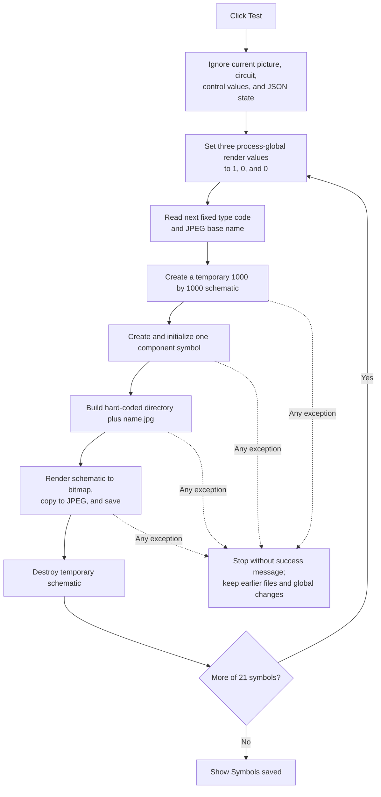

# Test...

> Analysis status: Source reviewed. The button is a fixed developer training-image exporter, not a test of the current imported picture or circuit. Its symbol set, output path, JPEG pipeline, success message, global-state changes, overwrite behavior, and partial-failure limits are supported by recovered code and static data.

## Control

| Property | Recovered value |
| --- | --- |
| Form | ImportFromPicture |
| Component path | ImportFromPicture.bTest |
| Control class | TButton |
| Caption | Test... |
| Hint | Not present in the recovered resource. |
| Text | Not present in the recovered resource. |
| Handler name | bTestClick |
| Handler address | 01a2bd30 |
| Graph node | `resource:dfm:ImportFromPicture/ImportFromPicture.bTest` |
| Handler node | `function:01a2bd30` |
| Graph layer | UI |

## What happens when clicked

`FUN_01a2bd30` calls `FUN_01a2c180`. The callee ignores the form instance and does not read the current picture, reconstructed circuit, component-value editor, loaded JSON, saved JSON path, or AutoRoute result. It has no validation branch and returns no test result.

Instead, the callee exports a fixed symbol-image corpus to this hard-coded developer directory:

`C:\Attila\Devel Files\Projects\Python\tesstrain\Symbols JPG\`

It loops over 21 static component type codes and matching base names:

| Type code | JPEG file | Type code | JPEG file | Type code | JPEG file |
| ---: | --- | ---: | --- | ---: | --- |
| 5 | `voltmet.jpg` | 6 | `ampmet.jpg` | 7 | `wattmet.jpg` |
| 8 | `resmet.jpg` | 9 | `res.jpg` | 10 | `cap.jpg` |
| 11 | `ind.jpg` | 13 | `csource.jpg` | 14 | `vsource.jpg` |
| 15 | `cgen.jpg` | 16 | `vgen.jpg` | 21 | `opamp.jpg` |
| 23 | `diode.jpg` | 24 | `btnpn.jpg` | 25 | `btpnp.jpg` |
| 26 | `enmos.jpg` | 27 | `epmos.jpg` | 28 | `dnmos.jpg` |
| 29 | `dpmos.jpg` | 30 | `njfet.jpg` | 31 | `pjfet.jpg` |

For each entry, it creates a temporary 1000 by 1000 schematic object, constructs one component from the fixed type code, initializes that component's parameter payload, and adds it to the temporary schematic. It formats `<base-name>.jpg`, combines it with the hard-coded directory, renders the schematic to a bitmap, copies the bitmap into a JPEG image object, saves that object to the fixed path, and destroys the temporary schematic.

After all 21 iterations complete, it shows a message box with `Symbols saved`. It does not display the generated files in Import From Picture, update a test-status control, select a result, or close the form.

## Inputs and sibling-control interaction

The output is fully determined by the embedded type-code array, embedded name array, hard-coded directory, global component catalog, and renderer. There is no control input to validate. In particular:

- **Load Circuit from JSON...** can replace the form's current circuit, but Test does not read it.
- **Save Circuit to JSON...** serializes form state, but Test does not call that path or write JSON.
- **Remove Wires**, **AutoRoute**, and **Scale circuit...** change the form's working circuit, but Test does not use those results.
- The nearby **Value:** label identifies another form control. Test does not read that label or its associated editor.

The current reconstructed circuit and its component model remain unchanged by the recovered Test path. The exporter uses a new temporary schematic for every output file.

## File and global-state effects

There is no folder picker, save dialog, path validation, directory creation, or overwrite confirmation. The JPEG save path opens a create-mode file stream. An existing file with the same fixed name can therefore be replaced directly.

Before each export, `FUN_01a2c180` writes three process-global rendering values to 1, 0, and 0 at the recovered locations `PTR_DAT_02004010[0x816]`, `PTR_DAT_02004010[0x814]`, and `*PTR_DAT_02003038`. The renderer reads the first two. The exporter does not restore any of these values when it completes. Their original Delphi field names and all later effects are not recovered, so this article does not assign a more specific meaning.

The generated JPEG files are immediate external output. They are not staged for a modal OK action, tied to the form's JSON persistence, or tracked by an Import From Picture dirty flag.

## Error and partial-state behavior

The exporter has no preflight validation, per-file status result, catch block, rollback, or cleanup that deletes earlier output. If the hard-coded directory is absent or inaccessible, component construction fails, rendering fails, or a JPEG cannot be created, the underlying operation raises an exception. The final `Symbols saved` message is then not reached.

Because files are written one at a time, an error after one or more successful iterations leaves those earlier JPEG files in place. The current iteration may also have opened or replaced its target before a later encoding failure. The explicit temporary-schematic destruction appears after the save call, so an exception during that call can bypass that destruction in the recovered path. The three global rendering writes also remain applied. There is no retry, alternative directory, or handler-local error message.

## Click flow

## Handler evidence

- [Test wrapper `FUN_01a2bd30`](../../../DecompiledSources/Tina16/functions/0000000001A2BD30__FUN_01a2bd30.c) calls the fixed exporter and only manages compiler-generated local cleanup around it.
- [Training-symbol exporter `FUN_01a2c180`](../../../DecompiledSources/Tina16/functions/0000000001A2C180__FUN_01a2c180.c) contains the hard-coded directory, fixed 21-entry loop, component type/name tables, render call, explicit temporary-object destruction, and final `Symbols saved` message.
- [Temporary schematic constructor `FUN_0198b200`](../../../DecompiledSources/Tina16/functions/000000000198B200__FUN_0198b200.c) initializes the temporary object to 1000 by 1000.
- [Component constructor `FUN_01cf1750`](../../../DecompiledSources/Tina16/functions/0000000001CF1750__FUN_01cf1750.c) resolves a fixed type code through the component catalog and initializes one component instance.
- [Component payload initializer `FUN_01d38290`](../../../DecompiledSources/Tina16/functions/0000000001D38290__FUN_01d38290.c) initializes all parameter entries for the new component.
- [Schematic JPEG writer `FUN_01b25a80`](../../../DecompiledSources/Tina16/functions/0000000001B25A80__FUN_01b25a80.c) creates a bitmap and JPEG object, renders the temporary schematic, assigns the bitmap to the JPEG, and calls its file-save method.
- [Schematic renderer `FUN_019904f0`](../../../DecompiledSources/Tina16/functions/00000000019904F0__FUN_019904f0.c) reads the recovered global render values and draws the temporary schematic into the supplied bitmap.
- [Graphic file-save implementation `FUN_006022b0`](../../../DecompiledSources/Tina16/functions/00000000006022B0__FUN_006022b0.c) opens a create-mode file stream and sends the JPEG data to it.
- Recovered role: Run the developer training-symbol JPEG export from Import From Picture.
- Current graph summary: Handles 1 Delphi UI event: ImportFromPicture.bTest.OnClick.
- Current graph behavior: Ignores the form's working data and exports 21 fixed single-component schematic JPEGs to a hard-coded developer path before reporting success.
- Current graph evidence: The DFM binds `bTestClick` to `01a2bd30`; that wrapper calls only `01a2c180`, whose source uses fixed arrays and strings rather than form fields.
- Complexity: complex
- Distinct outgoing calls: 4

## Direct calls

- `function:00417580` — Initialize compiler-managed local storage.
- `function:01a2c180` — Export the fixed training-symbol JPEG set.
- `function:00414560` — Finalize six managed UnicodeString locals.
- `function:00417740` — Finalize compiler-managed local storage.

## Resource evidence

- Kind: Not present in the recovered resource.
- Modal result: Not present in the recovered resource.
- Checked state: Not present in the recovered resource.
- List items: Not present in the recovered resource.
- Image reference: Not present in the recovered resource.
- Extracted glyph: None.

## Nearby label candidates

Nearby labels are layout candidates only. The source does not read the candidate below.

- Rank 1: Value:  at distance 109.

## Analysis limits

- `TIARA-diz.6.7.680` through `TIARA-diz.6.7.684` own the JSON, Remove Wires, AutoRoute, and Scale circuit control paths. Test calls none of those handlers or their form-state coordinators.
- Generic circuit construction, component construction, rendering, JPEG, file-stream, message-box, and Delphi cleanup helpers remain evidence-only. They are not assigned Test-specific annotations in this fragment.
- The static component codes and names were recovered from the referenced runtime-image data arrays. The abbreviated names are preserved exactly; expanded marketing or component names are not inferred.
- The three process-global fields are described by address and observed values because their Delphi names are not recovered.
- The fixed path names a Python `tesstrain` directory, but no Python process, script, model, inference engine, or training command is started by this code.
