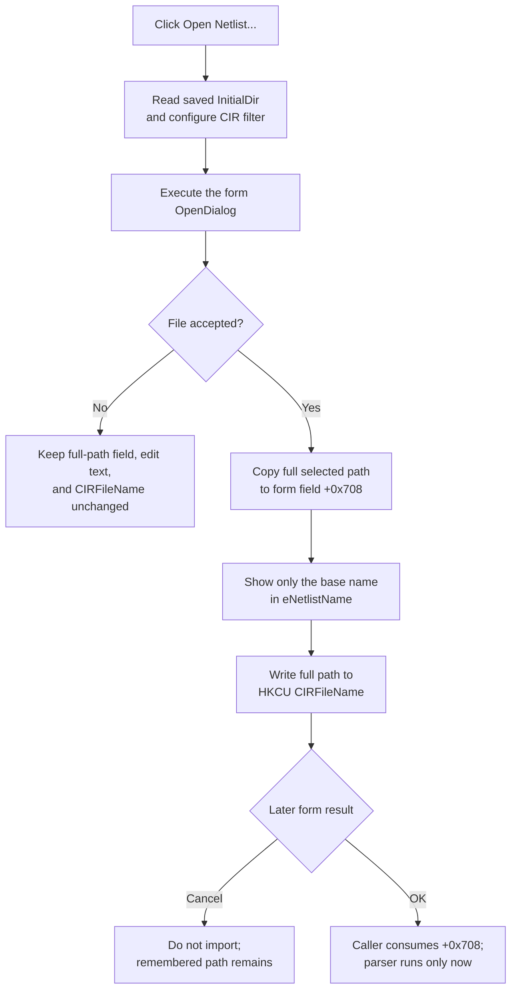

# Open a SPICE netlist

## Control

| Property | Recovered value |
| --- | --- |
| Form | ImportPictureExt |
| Form caption | Import Circuit From Picture |
| Component path | ImportPictureExt.bOpenNetlist |
| Control class | TButton |
| Caption | Open Netlist... |
| Handler name | bOpenNetlistClick |
| Handler address | 01a2cbe0 |
| Graph node | `resource:dfm:ImportPictureExt/ImportPictureExt.bOpenNetlist` |
| Handler node | `function:01a2cbe0` |
| Graph layer | UI |

The resource has no hint, action, image, or glyph for this button. The adjacent **Netlist:** label supports the control association, but the handler proves the file-selection behavior.

## File-dialog setup

The click uses the form-owned `TOpenDialog`. Before it opens the dialog, it reads the `InitialDir` string from the current-user TINA registry key. When that value exists, it assigns it to the dialog. The sibling **Open Picture...** command is the recovered writer of this shared initial-directory value; **Open Netlist...** reads it but does not update it.

The handler then configures these two values for every invocation:

- filter: `Spice netlist file (cir)|*.cir`;
- default extension: `cir`.

It does not assign a default file name, title, filter index, or dialog options. The recovered evidence therefore does not establish the exact shell validation options or whether the dialog requires an existing file independently of normal `TOpenDialog` behavior.

## Accepted selection

When the user accepts the dialog, the handler reads `OpenDialog.FileName` three times and performs these changes in order:

1. It copies the complete selected path to the form string at `+0x708`.
2. It extracts the last path component and displays only that base name in `eNetlistName`.
3. It writes the complete path to the `CIRFileName` registry value under the current-user TINA product key.

The click does not open, parse, or validate the selected netlist. It also does not close the form or set a modal result. Its output is a remembered full path for the later import.

`eNetlistName` is a `TEdit`, but it has no recovered change event. The modal caller reads form field `+0x708`, not the edit text. Therefore, manually changing the visible text does not update the netlist path that the later import consumes.

## Cancel and dialog lifecycle

Canceling the file dialog leaves `+0x708`, `eNetlistName`, and `CIRFileName` unchanged. The handler has already refreshed the dialog filter, default extension, and possibly `InitialDir`, but it makes no application-state change on that branch.

When this form is created, its `OnCreate` handler reads `CIRFileName`. If the value exists, it restores the complete path to both `+0x708` and `eNetlistName`, then selects the edit text. This creates a small display difference: the restored value is the full path, while a new accepted selection displays only the base name.

The form's **OK** and **Cancel** controls use their built-in modal results:

- **Cancel** prevents the caller from starting the picture import. It does not undo a `CIRFileName` value already written by this button.
- **OK** makes the caller use the hidden full picture and netlist paths. A missing picture path stops the import with `Picture file is not selected!`. A missing netlist path shows `Netlist file is not selected!`, but the recovered caller still continues. A later model-capability check can then reject a missing netlist.

When a netlist path is present, the later import path loads and parses the selected file, converts recovered components and connections to `VhdlSession0\graph.json`, and loads that graph for image recognition. These operations occur only after modal acceptance; they are not part of this click handler.

## Persistence and errors

The selected path is persisted at file-dialog acceptance, before modal OK. Closing the form with Cancel therefore prevents the import but keeps the selected path for the next form instance. The click does not write `InitialDir`, a recent-file list, the active circuit, or the picture path.

The handler has no local catch, validation result, or rollback:

- If the registry key cannot be opened, the shared write helper can return without storing `CIRFileName`; the in-memory field and edit text remain updated.
- Because the handler updates `+0x708` before the visible edit and registry value, a later exception can leave a partial in-memory change.
- File access and netlist-format errors occur later, after modal OK, in the parser and import coordinator. This handler cannot report or recover from them.
- Repeating the click replaces `+0x708`, the visible base name, and `CIRFileName` after each accepted selection. There is no unchanged-path guard.

## Click flow

## Source evidence

- [Open Netlist handler `FUN_01a2cbe0`](../../../DecompiledSources/Tina16/functions/0000000001A2CBE0__FUN_01a2cbe0.c) proves the initial-directory read, CIR filter and extension, accepted-result guard, full-path field, base-name display, and `CIRFileName` write.
- [Form creation `FUN_01a2d150`](../../../DecompiledSources/Tina16/functions/0000000001A2D150__FUN_01a2d150.c) proves that a saved full path is restored to the hidden field and visible edit when the dialog opens again.
- [Current-user setting reader `FUN_01b256f0`](../../../DecompiledSources/Tina16/functions/0000000001B256F0__FUN_01b256f0.c) and [writer `FUN_01b258f0`](../../../DecompiledSources/Tina16/functions/0000000001B258F0__FUN_01b258f0.c) prove the registry root, product-key boundary, missing-value behavior, and string-value persistence.
- [Modal caller `FUN_01a5bb80`](../../../DecompiledSources/Tina16/functions/0000000001A5BB80__FUN_01a5bb80.c) proves the picture and netlist checks, Cancel boundary, and use of the hidden full paths after OK.
- [Import coordinator `FUN_01a5b280`](../../../DecompiledSources/Tina16/functions/0000000001A5B280__FUN_01a5b280.c) and [netlist-to-graph converter `FUN_019dc380`](../../../DecompiledSources/Tina16/functions/00000000019DC380__FUN_019dc380.c) prove that file parsing and graph generation are deferred until the accepted form result.
- [Recovered Delphi resource evidence](../../../DecompiledSources/Tina16/resources/dfm/ui-evidence.json) supplies the component classes, captions, modal button kinds, nearby label, and event binding.

## Annotation ownership and limits

- `.686` owns only the control-specific handler `FUN_01a2cbe0`.
- The current-user setting helpers, shared form creation, modal launcher, import coordinator, and netlist parser have wider ownership. They are evidence here and are not assigned new graph roles by this article.
- The original Delphi names for fields `+0x6D8`, `+0x6F8`, and `+0x708` are not recovered. Their roles come from the component binding and their writers and consumers.
- The recovered dialog options do not prove the shell's existence checks. The parser's encoding rules and complete supported SPICE syntax are outside this control boundary.
